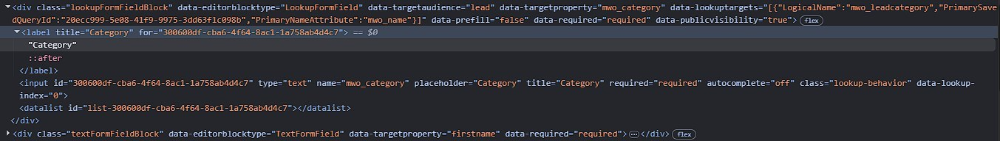
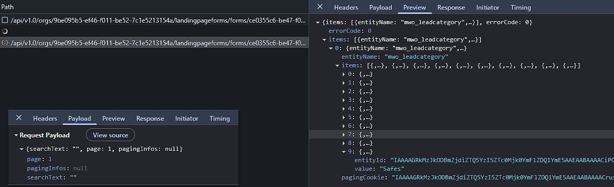
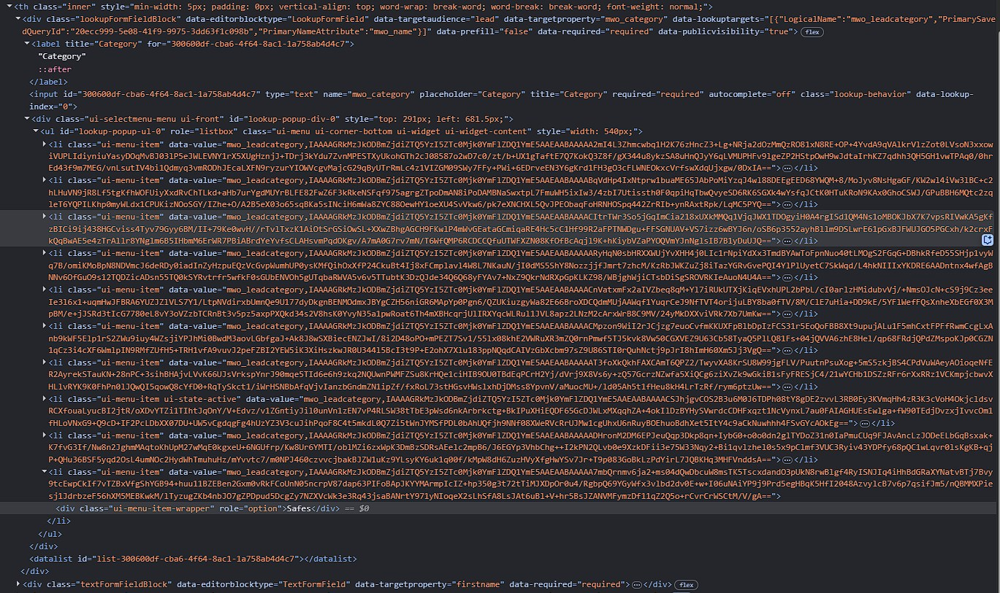
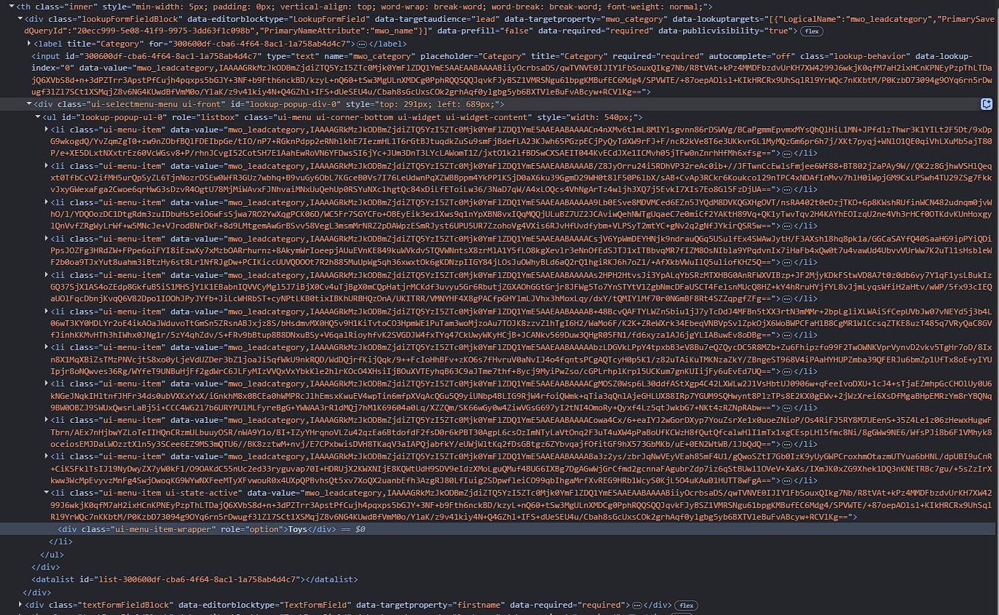
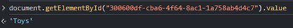

I recently was tasked to prefill Marketing Forms based on query parameters and while this is relatively straight forward for normal field, as always, lookups are kind of special. 

And to make matters worse, I was absolutely unable to find anything about this online, so here we go.

To have something visual for this article, the requirement may sound something like this "When someone clicks the Contact Us button on the Toys page, the category of the request should be prefilled with Toys, they should not have to select it manually again". This can be solved with copying the form and setting a default value, however, this won't scale well if you have many categories and maybe even combinations, for example for different countries.

## What happens in Lookup fields?
To start the investigation I tried to find out what happens when I use the lookup as a user. Because when you first inspect the HTML, the lookup has no elements, but when I click on it, it certainly has! And yes, as soon as I click on the field, the Chrome Dev Tools (F12) will show a request for given lookup and the response is 10 records, if I scroll down, the next 10 are retrieved.  







Also the input element in the HTML now has children! While the name should be pretty clear, the `data-value` is not. 
Applying a Base64 decode at least reveals, some guid, but it's not the guid of the record and seems to be the same for all elements in the list. Decoding with a BinaryFormatter deemed it to be an illegal format, at least without further preprocessing.  
Fortunately for my case: The name was unique anyways and therefore was sufficient for selecting the correct record. I would assume this is the most common case for the readers as well, because if there are duplicate names, how would the user of the form know which one to select?
When the user now selects a record, the data-value of the selected option is copied into the data-value of the input element.

``` JS
data-value="mwo_leadcategory,IAAAAGRkMzJkODBmZjdiZTQ5YzI5ZTc0Mjk0YmFlZDQ1YmE5AAEAABAAAAA7mbQrnmv6ja2+ms04dQwDbcuW8msTK5TscxdandO3pUkN8rwBlgf4RyISNJIq4iHhBdGRaXYNatvBTj7Bvy9tcEwpCkIf7vTZBxVfgShYGB94+huu11BZEBen2Gxm0vRkFCoUnN05ncrpV87dap63PIFoBApJKYYMArmpIcIZ+hp350g3t72tTiMJXDpOr0u4/RgbpQ69YGyWfx3vlbd2dv0E+w+I06uNAiYP9j9Prd5egHBqK5HfI2048AzvylcB7v6p7qsifJm5/nQBMMXPiesj1JdrbzeF56hXM5MEBKwkM/lTyzugZKb4nbJO7gZPDpud5DcgZy7NZXVcWk3e3Rq43jsaBANrtY971yNIoqeX2sLhSfA8LsJAt6uBl+V+hr5BsJZANVMFymzDf11qZ2Q5o+rCvrCrWSCtM/V/gA==";

recorid="98954879-9a47-f011-877a-0022488278a7";

// Base64 of the value after the comma
decoded=`
���dd32d80ff7be49c29e74294baed45ba9������;+k8um˖k+sZӷI
G"4*!ёiv
jN>/mpL)
B_(XxPYlfd*9Wj<h
I)!wH7N#	\:NK`lvvӫ&?O^pj+#m8W"|t0ω#ԗko7W3$3S;dNO7 g.eu\ZM;k{#HI<.@~A@5Sl]jgd9¾Y 3
`;
```



## Setting a Lookup
So, given a name, we can find the record in the list of options, then navigate one element up to get the data-value and copy it over into input element. Sounds doable, but there is still a problem: If the user has not interacted with the lookup yet, no options will be loaded. First idea is to fake a click, but due to the limit of 25 records retrieved even faking a scroll will soon get to its limit, especially if you have something like 1000+ options. Instead we can fake the user typing a search word to get the list down to less then 25 elements - well if names are unique, it will be 1 element - and then select from the resulting list. So with that, code would start to look like this:

``` JS
function setMyLookup(newVal) {
    var lookupField = document.querySelector('input[name=mwo_category]');

    field.value = value;
    field.dispatchEvent(new Event('keyup')); 

    // ...
}
```
The `keyup` event signals to the MS form logic that there was something entered to the input, meaning someone searched for a value and thus it will fire the search request to the server.

But now we still face the problem, that we don't know when the request is finished and the MS form logic has populated the lookup with the options. We will solve this with an `MutationObserver`. This is something that will observe an HTML element for changes and once observed, will call a function. On the inside we can check whether the observed mutation indeed included the option we wanted to select.

``` JS
function setMyLookup(newVal) {
    var lookupField = document.querySelector('input[name=mwo_category]');

    field.value = newVal;
    field.dispatchEvent(new Event('keyup')); 

    const lookupContainer = field.closest('div.lookupFormFieldBlock');

    const observer = new MutationObserver(() => {
        if (trySetMyLookupValue(lookupContainer, field, newVal))
            observer.disconnect();
    });

    observer.observe(lookupContainer, { childList: true, subtree: true });

    if (trySetMyLookupValue(lookupContainer, field, newVal))
        observer.disconnect();
}
```

We are creating the MutationObserver and register it to observe the enclosing `div` here, with its `childList` and `subtree` to also capture changes to the options. Whenever one of those objects changes, we want to execute `trySetMyLookupValue` (which we will discuss soon) and if it is successful, we want to disconnect the observer to avoid hogging browser resources. Not disconnecting could also lead to some problems with the user setting a value manually etc. Finally we are checking manually once, just in case the options were already loaded, e.g. because the user already interacted or the new search value is the same as the old one.

``` JS
trySetMyLookupValue(lookupContainer, lookupField, newVal) {
    const ul = lookupContainer.querySelector('ul');
    if (!ul) 
        return false;

    const matchingLi = Array.from(ul.querySelectorAll('li')).find(li => {
        const optionDiv = li.querySelector('.ui-menu-item-wrapper');
        return optionDiv && optionDiv.textContent?.trim() === newVal;
    });
    if (matchingLi) {
        const dataValue = matchingLi.getAttribute('data-value');
        if (dataValue) {
            lookupField.setAttribute('data-value', dataValue);
        }
        return true;
    }
    return false;
};
```

In `trySetMyLookupValue` we are first checking if the list (`ul`) is present at all, if not, there are no items loaded yet. Next we are checking the divs (identified by the class `.ui-menu-item-wrapper`) inside the list items (`li`) for one that matches our option. Remember that this code matches by name here.  
If a match is found, the data-value is copied from the option to the lookups input field to ensure that the submission of the form will include the selected option. 
Only if an option was found, this function will return `true` and thus disconnects the observer. 

## Reading the selected option
This one is much easier! Of course based on the previous knowledge we would need to compare the data-value to the options to find the selected option and then navigate to the div with the name.  
But there is a much easier way for this: You can simply read the value of the input field. It contains the name of the selected option as well and you can react to changes simply by using an onChange handler.

``` JS
function checkMyLookupChanged(matchedVal) {
    var lookupField = document.querySelector('input[name=mwo_category]');

    if (field.value === matchedVal) {
        // ... the logic
    }
}

document.querySelector('input[name=mwo_category]').addEventListener('change', () => checkMyLookupChanged('Toys'))
```



## Summary
As always, lookups are a little more tricky.  
To work with lookups in frontend scripting you first need to understand that the selectable values are not preloaded with the form. Instead they are retrieved on the fly as the user uses the field by clicking (first 10), scrolling (next 10) or typing (up to 10 matching the text fragment).  

To set a value, you can fake the user searching by setting the input field value to the desired name and then dispatching the `keyup` event. Now observe the changes to containing `div` element to be notified once the list has finished loading. Finally, find the value in the list of options and copy over the data-value property.

To read a value, you can simply read the value property. When the user selects an option, this will also trigger a change event which you can listen to.