In the Copilot for Sales series we already covered [the settings](/post/copilot/outlook/admin/) and [OOTB experience for the Email sidepane](/post/copilot/outlook/sidepane/). But we did not cover yet how changing the form settings will affect the user experience. In this article we will enable the Lead table for Outlook and play around with the different switches to determine the effects.

## Enabling the table
When we select the _Add a new record type_ button, the Lead will be found because it does have a relationshipt to Account, Contact or Opportuntity - in fact to all of them. This is what we get presented when selecting the relationships which will be relevant for the displayed cards in the sidepane. 

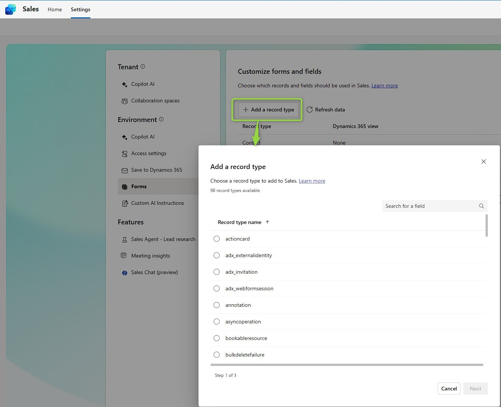
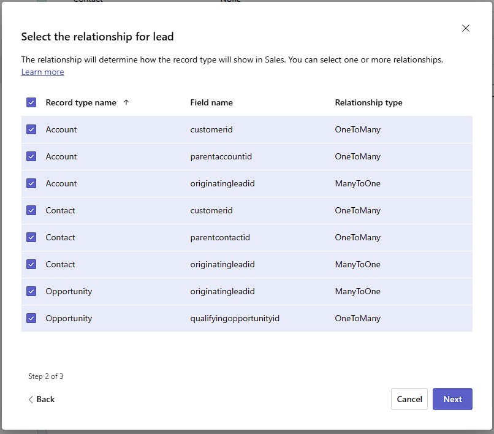

The next step is actually in [make.powerapps.com](https://make.powerapps.com/) where I create a new view for the Lead with all the fields I want to have on the form. I've named this one "Outlook" to associate it accordingly but this is preference. Note that this view will also be shown in your Dynamics Model Driven App if you chose to display all views, as soon as you start using Copilot for Sales I think it's time to think about what views you want in your app and select accordingly. In terms of fields you want to divert from other views, on Lead views usually show the combined "Name" field which is not editable, so it won't be in Outlook either... And I applied no filter and instead show the status reason field, allowing users to find also qualified or disqualified leads.

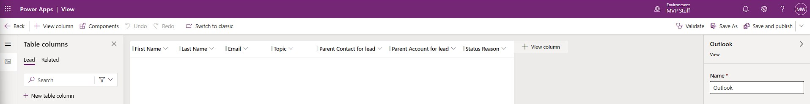

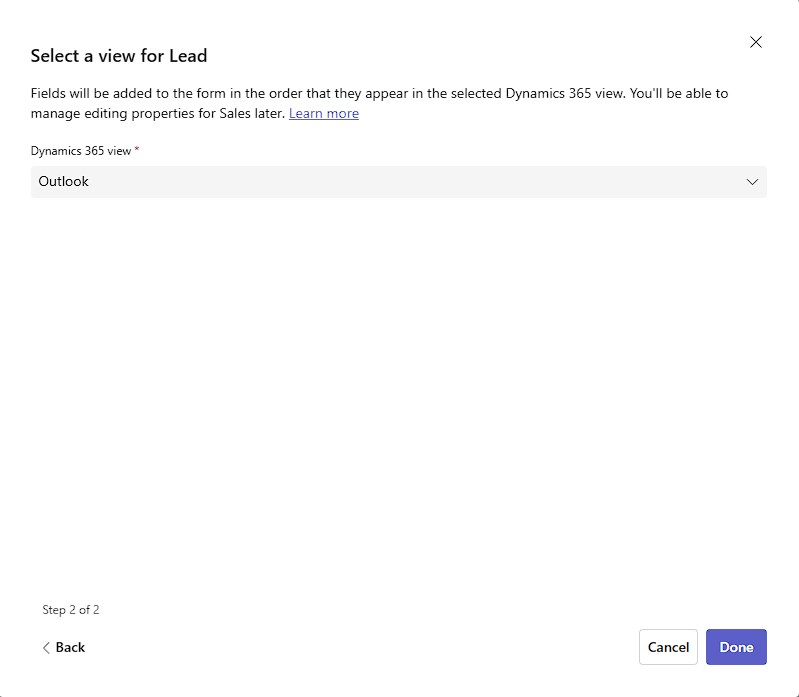
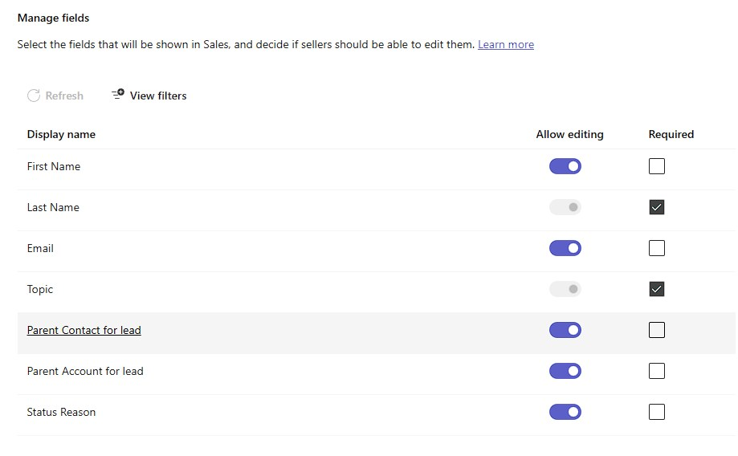

Don't forget to hit _Publish_ now!

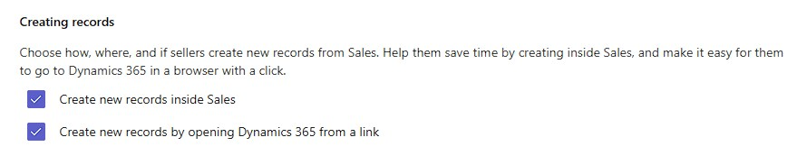
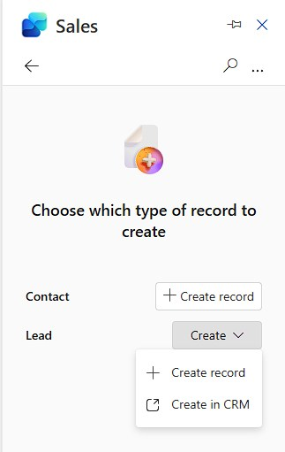

If you enabled both create options, the user has to go trough an extra step before they arrive at the form, you might want to enable only one method.

## Require field
In this case it makes sense to require the firstname and emailaddress as well, since we can assume that the user can extract this from the current email. Remember that you cannot turn of required fields that are already required by Dynamics/your customization, but we can require additional ones.

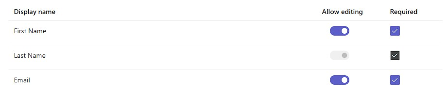

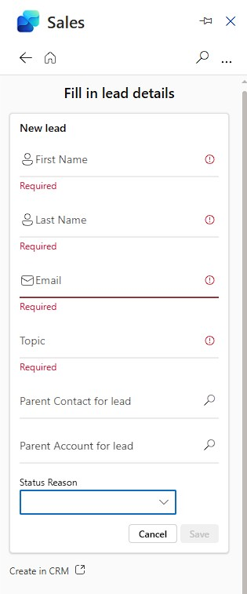

This works as expected. There is apparently no smart prefilling of the Email Address. A few more observations here:

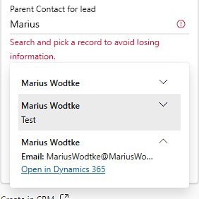
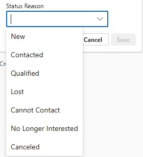

A nice touch that I didn't notice before: The empty Parent Account for lead field is hidden in the card, which makes it more readable if you happen to have many optional fields.  
If I edit the lead again and remove the First Name, we can see it still being required on the edit form.

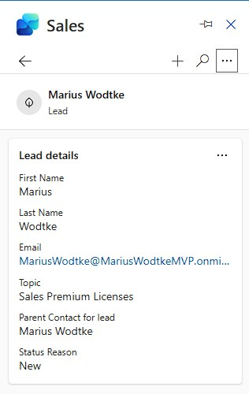
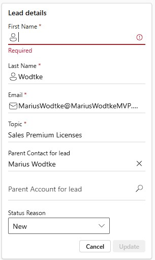

## Disable editing for fields
I already moaned about the status reason field which I want for the Key Fields but editing can lead to problems. Let's disable it!

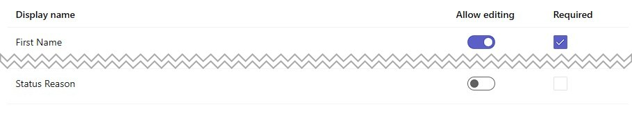

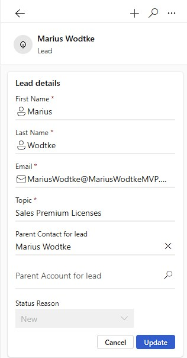
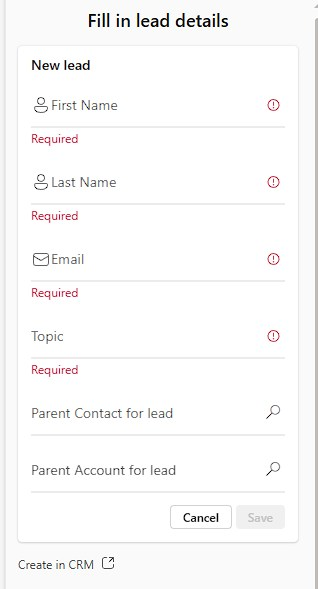

That's a great success!

## Disable editing at all
Also pretty straight forward. If you disable editing, the edit button vanishes from the Lead card.
However, important note: Although you cannot edit the required fields anymore after you disable editing, they still apply, so First Name and Email are still required on the creation now. This is probably an oversight/bug, but you can work around it by temporarily enabling editing to manipulate those required fields and then disable it again.

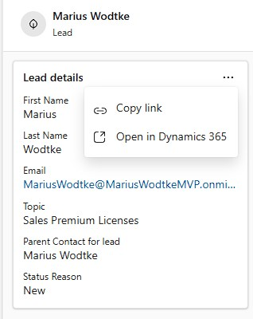

## Disable creation
We have kind of seen this one already, since it is OOTB disabled for Account and Opportunity; and for Contact, creating in Dynamics is disabled, giving us a simple create button instead of a dropdown. So one more thing to test: What happens if we only allow creation in Dynamics?

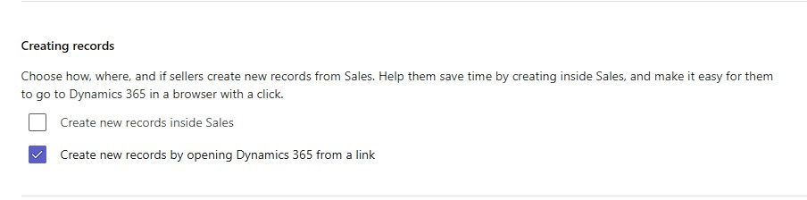
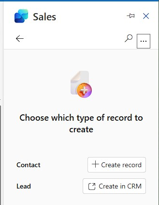

And thats a really nice outcome! The button now is essentially a link to the Dynamics with the parameters `&forceUCI=1&pagetype=entityrecord&etn=lead`. If you have problems with the Outlook forms, like my concerns with the Status Reason field (which we solved differently here!), you can still supply the users with a quick link in Outlook so they don't have to navigate through the MDA, this might be a good time saver for them.

## Key Fields
Until now I have searched this lead multiple times, but since I haven't configured any Key Fields (there is a maximum of 2) only the primary field Name was shown. I have selected Status Reason and Topic here and then first tested with the Lead we've previously used. Since I then noticed both fields are in the same row I changed the values to rather long ones to see what happens. The learning is simple: put the shorter field first, otherwise the user may only see the first one. Also notice that I don't have an option to unfold, but there is a tooltip if the record is hovered.

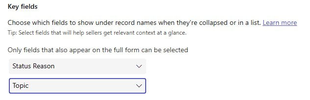

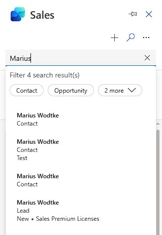
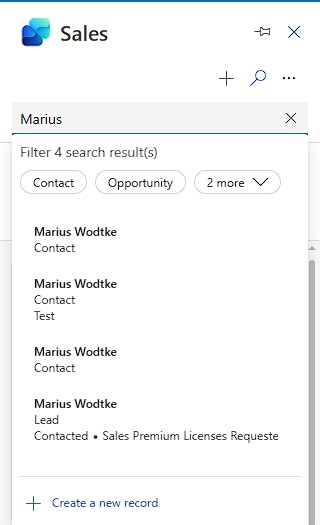
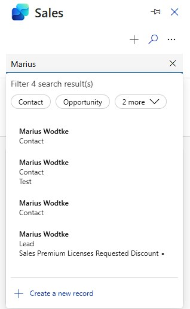

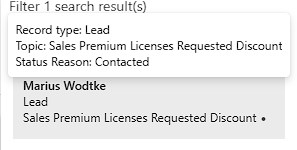

## Summary
To add a new table to the forms in Copilot for Sales, the table needs to have a relationship to Account, Contact or Opportunity. If this relationship is indirect, you first need to add the intermediary table (you may disable create/edit on this one). You determine what fields are on the form with the selected view, where the filters matter for the search and the fields matter for the form.

Fields will be required on both create/edit forms. If editing is disabled for a field, it will vanish from the create form. This may be interesting if you don't want to allow a field to be set but still want to display it in the search. This can be achieved with the Key Fields, but using a field as a Key Fields also means it needs to be present on the form.

Finally you want to decide wether creation and editing is allowed with those very simple forms available in Outlook. If you have reasons to disable creation in Outlook, you can still display a quick link to jump to the Dynamics creation form with all it's Business Rules, JS, PCFs, ... But you should decide between the methods as leaving both enabled requires an extra click from the user.