In [the first article](/post/copilot/outlook/admin/) of this series we've deployed the "Sales" app to our Outlook users and explored the settings a bit. However, to understand the settings for the features better we certainly should understand what the app looks like to our users because that allows us to understand the consequences of our administrative actions.

## Opening the app
Once the app was deployed, it should be visible to the users after a few minutes; or up to 48 hours per the documentation, but usually they set absurdly high numbers here to avoid support cases that resolve themselves an hour later.

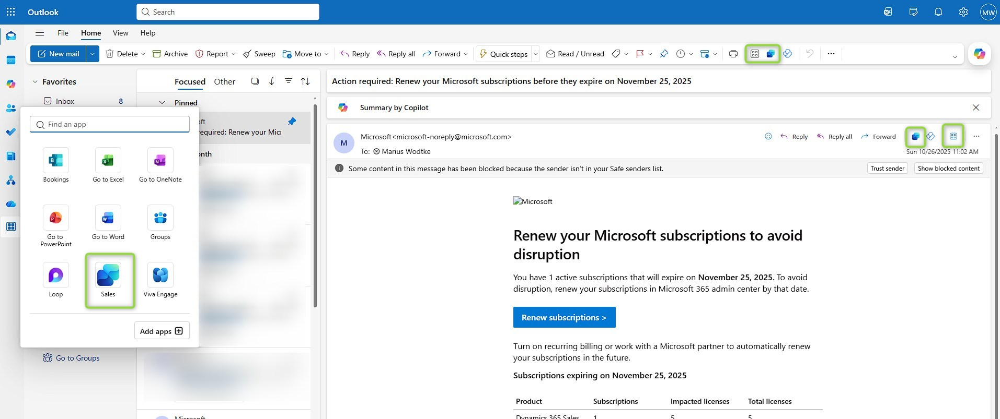

Then, the app is accessible in both toolbars of the email itself and the general one at the top. You may also use the apps button to find it. The apps button in the left toolbar also offers the Sales app, however, this button does not open the sidebar with actions for the email but the fullscreen app that offers learning paths and the environment switcher.

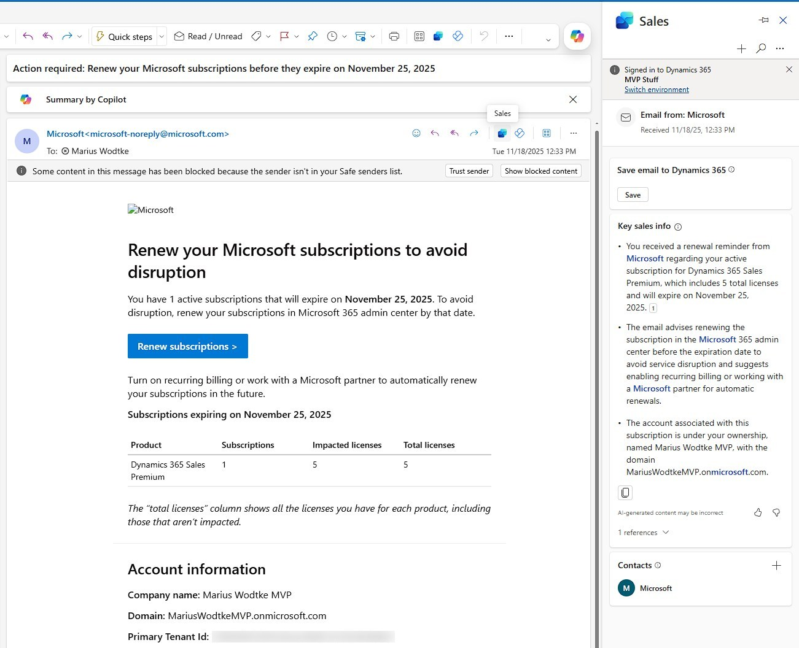

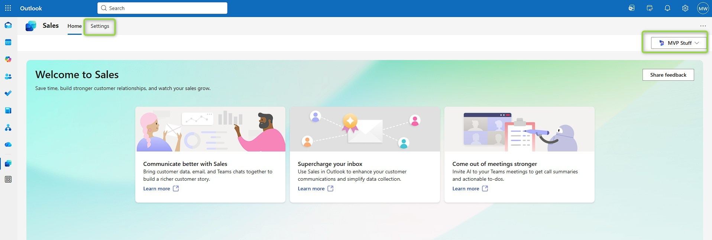

## Saving the email
For this one simply click the save button and select a regarding object. This can be the contact, but with the search box I can also find an opportunity that I've created for this matter.

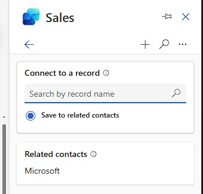
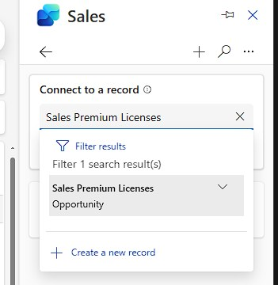

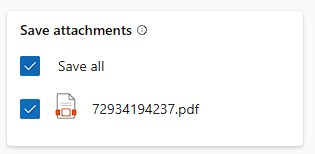

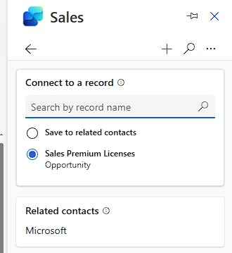
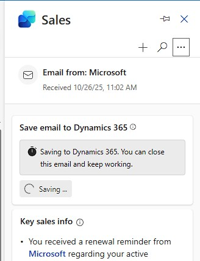

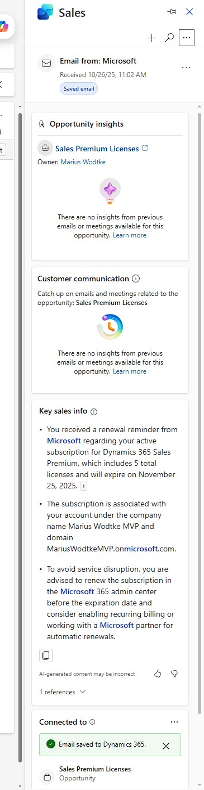

After saving is done new sections will open with more insights, as this is the first email for this opportunity there is not much to be gained here at the moment.

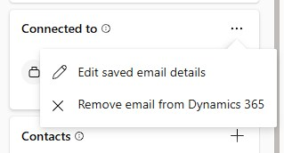
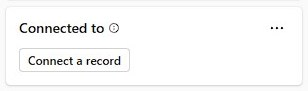

## Creating a new Contact
With the plus in the top right corner the user can also create records. By the OOTB form settings, this is currently only enabled for Contacts. If you remember back to [the initial article about the settings](/post/copilot/outlook/admin/) you will recognize the required fields here. Also notice that all fields are editable in this view. The email field will not be editable when later editing the record, however the forms don't make this well visible, a lock symbol or gray background is not present!

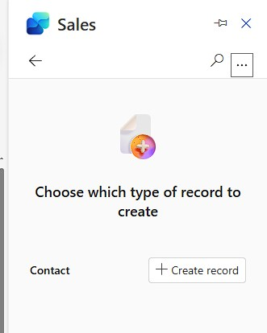

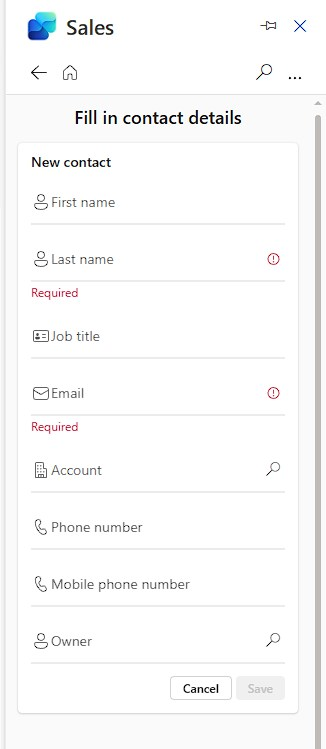

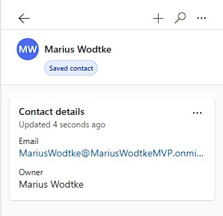

## Searching an existing Record
Records with configured forms can also be searched, viewed and edited. This will direct you to a screen that looks really similar to the create form above, but some fields may not be editable depending on your settings.

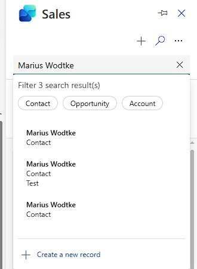
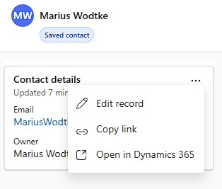

## Connected Records
The connected records at the bottom behave a little different! They will also show the cards and in the three dots you will find the edit, that will behave the same, but for Opportunity we get an additional AI summary that looks a lot like the ones inside Dynamics. And for the Contact we get up to 10 other emails in our mailbox (they don't need to be saved to Dynamics) plus a notes field that is apparently not saved to Dynamics and there lends itself to private notes. For everything else you might want to include the description field to the form.

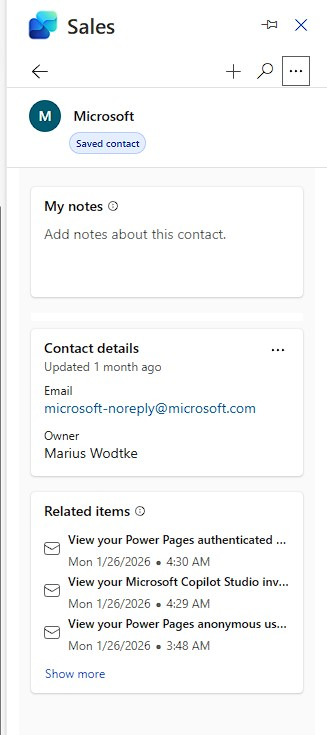
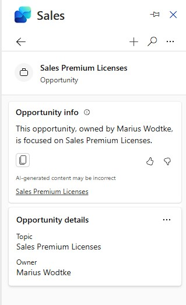

## AI Insights
Sorry, but this one needs a revisit once I have my Teams back up... Reassuring that these are enabled in the Access Settings and saving 5 more emails to the Opportunity yields no summary in these.

For the email below it would have been nice to be informed about the the 5 licenses running out end of november, that is mentioned in the initial email because this specific email has a totally different focus.  
But at least we can see one change here: The summary got the fact that this email is linked to an opportunity now and gives me a quick glance about it.

## Summary
Without any additional configuration the Copilot for Sales app allows the user to save emails to Dynamics and connect them to other objects like Opportunities, those connections can later be changed. If creation is configured even new records can be created, OOTB this is the case for Contacts. If emails included attachments those will also be saved, this is controllable by the user.  
A lot of these behaviors like available tables and fields are changeable by administrators in the settings and we will explore these changes further in this series.

Although not all AI features worked for me in this exploration, Copilot for Sales summarizes emails helping the seller to quicker understand longer email chains. 