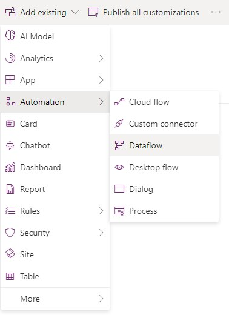
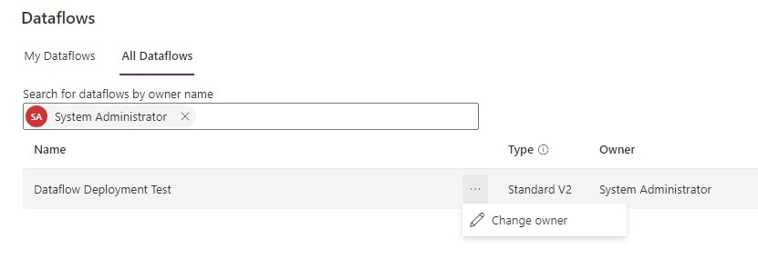
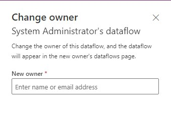
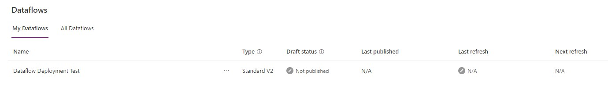
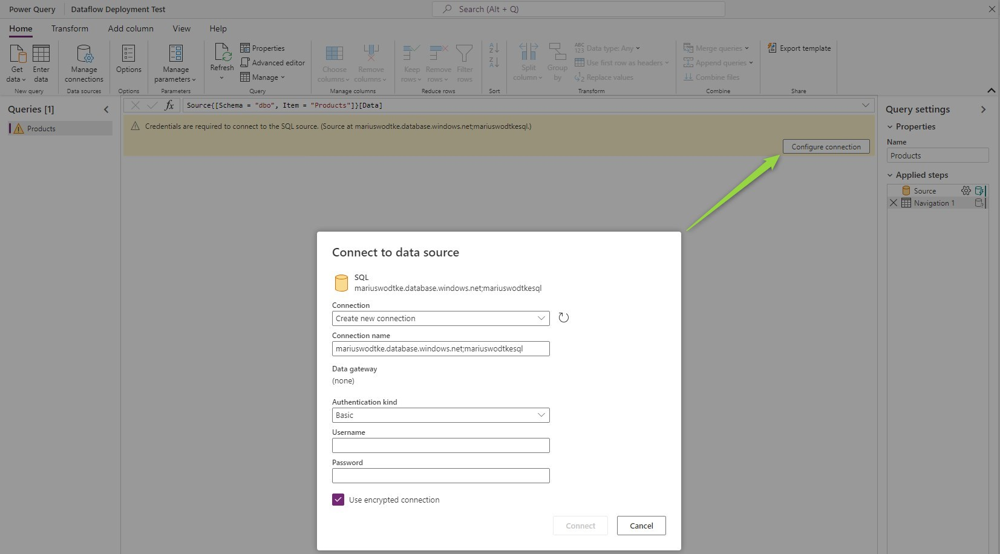
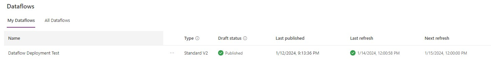
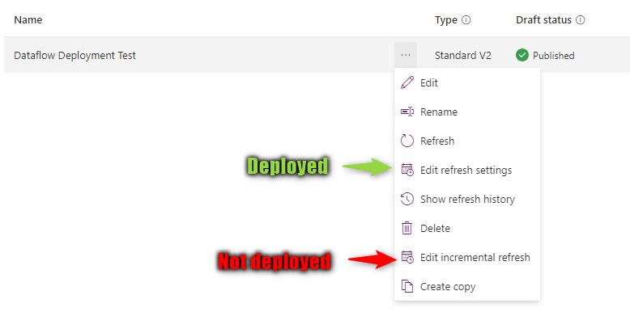

In the [first shot of Dataflows](/post/my-first-shot/dataflows), we've explored the feature and imported products from an Azure SQL database. But a feature without deployment is merely a PoC. 

## Dataflows in Solutions
Luckily, we can just add dataflows to solutions! We can not create them inside a solution, or edit them, this has to happen in the dataflows section of the Maker Portal. But after preparing the dataflow there, we can just select _Add Existing_->_Automation_->_Dataflow_ in our solution.

## What is not transported?
So that's it, add it, deploy it and it will run? Sadly not. The connection to the database is not transported with the solution. That's of course good news as the opposite behavior would mean a secret like a password is included in the solution. But that means we will have to do some manual work. 

First, you find the deployed dataflow in the dataflows section of the maker portal. If another user imported the solution you can reassign the dataflow by finding the importing user and then selecting _Change Owner_ (you need to be a System Administrator for that). And if you don't know who first imported the dataflow, you can check the owner column in the solution that contains the dataflow.

  

Next, you need to edit the dataflow. The _Transform_ screen will welcome you with a warning to connect to the data source. Here, the secret values need to be reentered.
Now step through the rest of Wizard. If you also deployed the target entity, the mappings should be already set.

Another thing that is not included in the solution is the incremental refresh settings. That's less intuitive but needs to be considered if the defaults were changed. These values are at least unlikely to change, so most probably you only need to set these up with the first deployment alongside the connection.

## Watch out!
A dataflow can only be edited by its owner. And we can change the owner if we are admin. But guest users and application users (a.k.a. App Registrations or S2S apps) are not found by the dataflows view "All Dataflows"! That means if the dataflow was first imported by a guest user, it can only be edited to set the connection by this user. If it was imported by an application user - usually via an automated pipeline - it's even worse, since there is no UI Login for that application, the connection cannot be set at all. 

Even upgrading the solution to a version without the dataflow will not resolve this. For me, this still left a trace in the system, although it was not visible in the Default Solution anymore. Another import with a regular user made the dataflow show up with the old owner again. The only solution that worked was to create a copy of the dataflow in the source environment and import that to the target environment. 

For this new import, I've used a separate solution that is not included in the automated pipeline. Instead, it is transported manually now. 

If this is not an option, for example, due to company policies, a Dataflow Template might be an option to include in the solution. After the deployment, an administrator would create the dataflow from that template, which I can not see much benefit to handing them the solution and configuring the connection after the import.

## Summary
You can include dataflows to solutions. The connection to the data source will not be included and will have to be set after the first import as a post-deployment step. Make sure you are not importing the solution with an application user and I also strongly advise against a guest user for the import, you might lose control because you can't reassign the dataflow. If necessary, create a separate "manual" solution for dataflows if you are at risk of these import errors.

Check out [the official article of Microsoft on solution awareness](https://learn.microsoft.com/en-us/power-query/dataflows/dataflow-solution-awareness) to make sure you have the latest version of [the limitations](https://learn.microsoft.com/en-us/power-query/dataflows/dataflow-solution-awareness#known-limitations).
