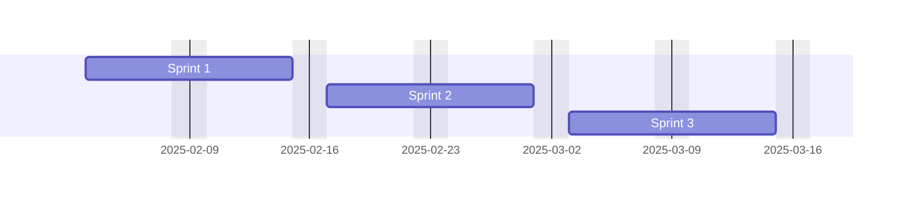
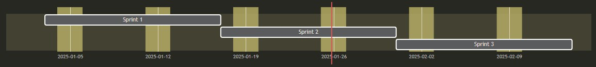
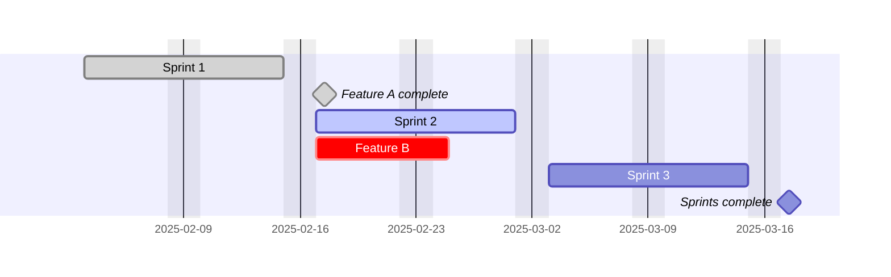
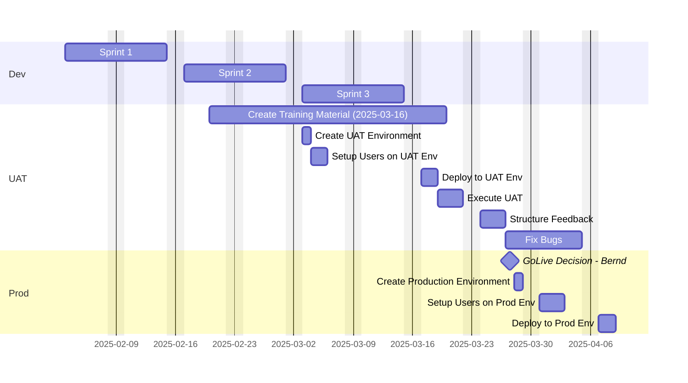
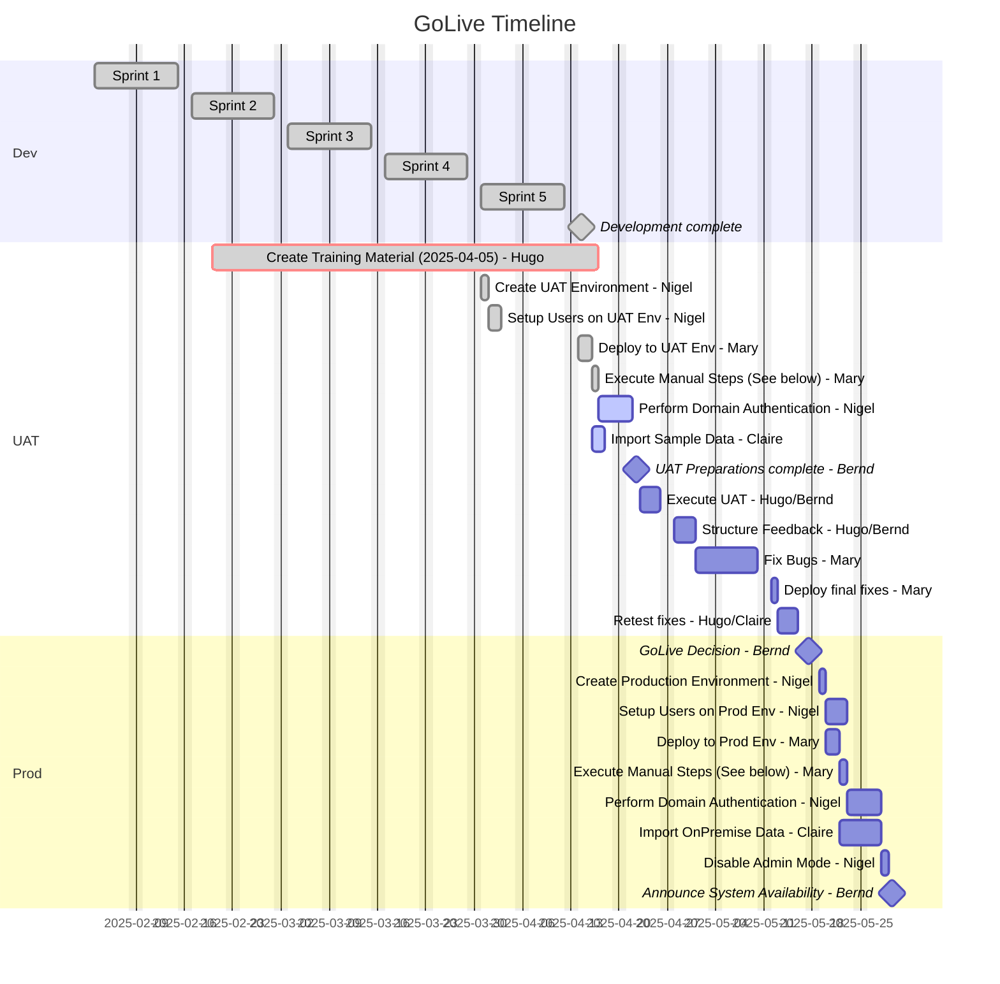

There is more to a project than just customizing/coding correctly, we all know that. But as I'm a technician, I always look out for things in Azure DevOps that may help me succeed. And one of those things is [Mermaid diagrams](https://mermaid.js.org/), which you can use in Azure DevOps Wikis by enclosing them in a code block like this:

```bash
::: mermaid
<diagram type>
<diagram content>
:::
```

They are super useful to for example include flow diagrams in documentation. This has the great benefit that the source of the diagram is directly in the article and can be changed in the article should some details change.  
Of course a real tool like MS Visio is more powerful and could export an image to be embedded, but you would also have to link to the SharePoint (or similar) location where the diagram source is stored and you expect everyone to have access there and the necessary tool and so on. My experience says that it is likely people will then not adapt the diagrams and just leave them as they were, over time leading to incorrect documentation. 

But I did not want to use this article to argue for the general use of mermaid with Azure DevOps, instead I wanted to discuss a more creative way of using them: A gantt chart can help us to visualize and track the progress towards a GoLive.  
Of course there are actual tools for that like MS Project, but who has access to those? Everyone who has a stake, or just the project leads?
I my projects the Wiki is much more accessible and therefore a good place to collaborate and make progress visible.

A gantt chart works like this



```bash
::: mermaid
gantt
    dateFormat YYYY-MM-DD
    excludes weekends

    Sprint 1: s1, 2025-02-03, 10d
    Sprint 2: s2, after s1, 10d
    Sprint 3: s3, after s2, 10d
:::
```

So it nicely renders out blocks for the events and obeys the given order ("after s1"). We first give a display name, then a double colon, an id, then the date or an order (which you should definitely prefer!) and a duration.  
It will also render a marker for the current date, I will provide that as a picture as it will vanish once we are outside of the date period in the diagrams.



The next thing we are going to introduce are states, these are before the id.



```bash
::: mermaid
gantt
    dateFormat YYYY-MM-DD
    excludes weekends

    Sprint 1: done, s1, 2025-02-03, 10d
    Feature A complete: done, milestone, fa, after s1, 1d
    Sprint 2: active, s2, after s1, 10d
    Feature B: crit, fb, after s1, 6d
    Sprint 3: s3, after s2, 10d
    Sprints complete: milestone, sc, after s3, 1d
:::
```

So we can mark active, completed and tasks in danger. Milestones receive a special symbol and can also be marked completed.

One more concept are sections, these help to differentiate parts of the project. Usually they are "independent", like a production setup is not directly tied to User Acceptance Testing (UAT), of course if UAT fails, it will have effects on the production timeline, but the setup is likely to have an almost independent timeline.



```bash
::: mermaid
gantt
    dateFormat YYYY-MM-DD
    excludes weekends

    section Dev
        Sprint 1: s1, 2025-02-03, 10d
        Sprint 2: s2, after s1, 10d
        Sprint 3: s3, after s2, 10d
    
    section UAT
        Create Training Material (2025-03-16): ctm, 2025-02-20, 20d
        Create UAT Environment: cue, after s2, 1d
        Setup Users on UAT Env: sue, after cue, 2d
        Deploy to UAT Env: due, after s3 cue, 2d
        Execute UAT: uat, after due, 3d
        Structure Feedback: feedback, after uat, 3d
        Fix Bugs: bugs, after feedback, 7d

    section Prod
        GoLive Decision - Bernd: milestone, gld, after feedback, 1d
        Create Production Environment: cpe, after gld, 1d
        Setup Users on Prod Env: spe, after cpe, 3d
        Deploy to Prod Env: dpe, after cpe bugs, 2d
:::
```

So, we now have different lanes, where some lanes start before others are finished. Someone from the business might start the user documentation while developers are still developing and the administrator is free to setup a new environment while others are still fixing stuff. Also notice here that some tasks have multiple dependencies, the last one counts!

For all possible elements, check [the official documentation](https://mermaid.js.org/syntax/gantt.html).

Now towards some "best practices":
- Give yourself some time, of course a deployment only takes a day, but assigning it 2d produces buffer. Think about these ranges as latest end. And if the predecessors are done, a task that has not reached its earliest start may be completed already!
- If you know who will do a task, write it down, e.g. "GoLive Decision - Bernd"
- If you need to move a task, write done the original date, e.g. "Create Training Material (2025-03-16)" where the duration was extended beyond that planned end date. 
- Don't number IDs. Ok, I've used it here for the sprints, but for everything else, it makes it harder to insert new tasks to the middle.

And now we just need to encourage everyone to set their tasks active and done, maybe also crit if they want to raise something in the synchronization meetings.

And here is a bigger table as a final sample, have fun creating your own GoLive plan with Azure DevOps Wikis and Mermaid diagrams.

BTW, I think this looks better in light mode than in dark!



```bash
::: mermaid
gantt
    title GoLive Timeline
    dateFormat YYYY-MM-DD
    excludes weekends

    section Dev
        Sprint 1: done, s1, 2025-02-03, 10d
        Sprint 2: done, s2, after s1, 10d
        Sprint 3: done, s3, after s2, 10d
        Sprint 4: done, s4, after s3, 10d
        Sprint 5: done, s5, after s4, 10d
        Development complete: done, milestone, dc, after s5, 1d
    
    section UAT
        Create Training Material (2025-04-05) - Hugo: done, crit, ctm, 2025-02-20, 40d
        Create UAT Environment - Nigel: done, cue, after s4, 1d
        Setup Users on UAT Env - Nigel: done, sue, after cue, 2d
        Deploy to UAT Env - Mary: done, due, after s5 cue, 2d
        Execute Manual Steps (See below) - Mary: done, ems, after due, 1d
        Perform Domain Authentication - Nigel: active, pda, after ems, 3d
        Import Sample Data - Claire: active, isd, after due, 2d
        UAT Preparations complete - Bernd: milestone, upc, after ems isd pda, 1d
        Execute UAT - Hugo/Bernd: uat, after upc, 3d
        Structure Feedback - Hugo/Bernd: feedback, after uat, 3d
        Fix Bugs - Mary: bugs, after feedback, 7d
        Deploy final fixes - Mary: dff, after bugs, 1d
        Retest fixes - Hugo/Claire: rf, after dff, 3d

    section Prod
        GoLive Decision - Bernd: milestone, gld, after rf, 1d
        Create Production Environment - Nigel: cpe, after gld, 1d
        Setup Users on Prod Env - Nigel: spe, after cpe, 3d
        Deploy to Prod Env - Mary: dpe, after cpe bugs, 2d
        Execute Manual Steps (See below) - Mary: emsp, after dpe, 1d
        Perform Domain Authentication - Nigel: pdap, after emsp, 3d
        Import OnPremise Data - Claire: iod, after dpe, 4d
        Disable Admin Mode - Nigel: dam, after iod pdap, 1d
        Announce System Availability - Bernd: milestone, asa, after dam, 1d
:::
```