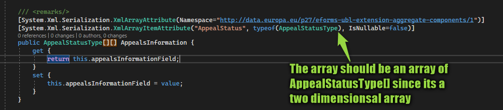

In [the first post](/post/eForms-scharp/introduction) of this series we already explored the swaggers of the eForms APIs. But when exploring the functions you probably quickly came to the point "ok, but what do I upload here now?". While the swagger documents the parameters of the APIs it does not document the content of the files(/base64) to upload.

## Classes from schema
But [eForms SDK](https://github.com/OP-TED/eForms-SDK) to the rescue: It contains the folder _schemas_ which, as the name suggests, contains the schema in the form of xsd files. For generating C# classes there is the xsd.exe which was installed for you with Visual Studio. First copy the schemas into your project, then rightclick the folder and select _Open in Terminal_ and then we can use something like `xsd /c xyz.xsd` to generate the classes for this schema. If you now try this with a file of the schemas you will quickly notice that this does not work because the .xsd of eForms (/maindoc) reference xsds of UBL in the /common folder and xsd.exe cant resolve this. You can however pass multiple files to xsd.exe so we could simple pass all the .xsd in the schema subfolders, that gives us a rather long statement in the console which is hard to repeat should the schema change in the future. But luckily you can also define a parameters file that holds the options for us so we can simply execute `xsd /c /p:parameters.xml` to generate the classes for a dozen xsds. The _parameters.xml_ looks something like this:
```
<xsd xmlns='http://microsoft.com/dotnet/tools/xsd/'>
	<generateClasses language='CS' namespace='myNameSpace.Schemas'>
		<schema>.\maindoc\UBL-ContractNotice-2.3.xsd</schema>
		<schema>.\common\UBL-CommonBasicComponents-2.3.xsd</schema> 
		<schema>.\common\UBL-CommonExtensionComponents-2.3.xsd</schema> 
		<schema>.\common\UBL-ExtensionContentDataType-2.3.xsd</schema> 
        ...
	</generateClasses>
</xsd>
```
One missing feature of xsd for me: It will always name the resulting .cs like te last .xsd file, which is not very descriptive since the file will contain a multitude of classes, so I like to rename it.

## Sample repo
Of course this series of articles comes with [a repository](https://github.com/Kunter-Bunt/eForms-CSharp-Sample) to store the full code, for example the [parameters.xml](https://github.com/Kunter-Bunt/eForms-CSharp-Sample/blob/main/eForms-CSharp-Sample-App/schemas/parameters.xml) of which there is only an extract in this article. You might also find further tricks like the [GenerateModels.ps1](https://github.com/Kunter-Bunt/eForms-CSharp-Sample/blob/main/eForms-CSharp-Sample-App/schemas/GenerateModels.ps1) which also renames the resulting file accordingly.

## Building a model
When you want to publish a notice there are three root types that we want to instantiate: `ContractNoticeType` for announcing tenders, `ContractAwardNoticeType` for announcing the winner and maybe `PriorInformationNoticeType` for pre-announcing a tender. And we can simply write `new ContractNoticeType()` now and then start to fill in the data from what the user entered to our actual app. For the sample repo this will be static data from a `NoticeModel`. One advice here: Due to the XML structure with UBL, the mapping will be quite verbose. Therefore do not start to map like this:
```
var notice = new ContractNoticeType 
{ 
    UBLExtensions = new UBLExtensionType[]
    {
        new UBLExtensionType
        {
            ExtensionContent = new ExtensionContentType
            {
                Item = new EformsExtension 
                {
                    NoticeSubType = new NoticeSubTypeType
                    {
                        SubTypeCode = new SubTypeCodeType
                        {
                            listName = "notice-subtype",
                            Value = $"{(int)model.NoticeType}"
                        }
                    }
                }
            }
        }
    }
};
```
Instead try to make functions that split up the mapping to reduce your christmas tree. In the sample code above, the _notice-subtype_ specifies what type of tender it is, e.g. a concession, a regular contract or a military contract. Each subtype has its own requirements of fields, so it does not make much sense here to go over the must fields I explored in my project since they might be very different for you. But let me at least point you to the [_notice-types_](https://github.com/OP-TED/eForms-SDK/tree/develop/notice-types) folder of the SDK which contains a json definition for the fields of each subtype form. These are quite long, but might be helpful. A larger application could parse those JSONs to render forms. Or the descriptions can be used to determine what a "Field BT-702(b) missing" message from the Validation API means ("Notice Official Language").

Aside from that we will at least need `UBLVersionID = new UBLVersionIDType { Value = "2.3" }` and `CustomizationID = new CustomizationIDType { Value = "eforms-sdk-1.6" }` (of course the versions might have changed by the time you read this). 

## Serializing
So now that we have a draft of what we think is a notice but we cannot pass our model to eForms directly, instead we need to pass it as serialized XML. For that C# offers the `XmlSerializer` class. There is just one trick I want to show you here: By default the element will contain the namespace of the element but we can make these namespaces known globally like this.
```
var ns = new XmlSerializerNamespaces();
ns.Add("cbc", "urn:oasis:names:specification:ubl:schema:xsd:CommonBasicComponents-2");
...
var serx = new XmlSerializer(eform.GetType());
serx.Serialize(stringWriter, eform, ns);
```
With that everything of the CommonBasicComponents will just have the prefix cbc.
And thats it, because of the namespace fuzz I encapsulated the serialization in [its own service](https://github.com/Kunter-Bunt/eForms-CSharp-Sample/blob/main/eForms-CSharp-Sample-App/services/SerializeNoticeService.cs) in the sample which returns a byte array which can be saved to a local file for viewing for now.

> **_NOTE:_**  You might run into an issue with the AppealStatusType which is a two dimensional array. This is not generated correctly in my version of xsd, resulting in weird errors like "Serializing JavaScript is not supported", just adding `[]` to the XmlArrayAttributes type was enough to fix this. 

## Summary
To get an XML we first transformed the schema files (.xsd) of the eForms SDK into a .cs file with all the classes necessary to build a notice, award or priorinformation. Then we mapped our own application model to the models of eForms and finally serialized the model into an XML file. 

Next up will be to validate that model for which we will use the Validation API of eForms. But thats the topic of [the next post](/post/eForms-scharp/validating)!