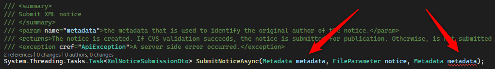
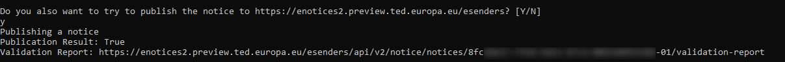

Oh, you're back! So this means you've progressed with the validation from [the last article](/post/eForms-scharp/validating) so much, that you are ready to publish a first notice. Well, at least to the preview environment.

# Generating a client
So again, new API, same game, lets use [NSwag Studio](https://github.com/RicoSuter/NSwag) to generate a client. I do assume you have read [the last article](/post/eForms-scharp/validating), so you are already familiar with the options of NSwag. And actually the settings are quite similar here, so you can start off with a copy of your old config and just change the _Specification Url_, _Namespace_, _Class Name_ and _Output file path_. To recall, the swagger is found [here](https://enotices2.preview.ted.europa.eu/esenders/swagger-ui/) and the according specification url is https://enotices2.preview.ted.europa.eu/esenders/api/v2/notice/v3/api-docs/public.

You can also work of the configuration of the sample app of course, it is found [here](https://github.com/Kunter-Bunt/eForms-CSharp-Sample/blob/main/eForms-CSharp-Sample-App/clients/PublicationApi.nswag).

But no matter how much we fiddle with the settings there is always a problem with the output. Again NSwag can't interpret the description correctly, it renders the metadata property which is specified as part of the body as well as parameter in the OpenApi specification twice... Seems like those APIs really dont like to be generated, I wonder whether the specifications were created by hand or if its just NSwag simply being buggy here. In this instance I have edited the resulting client by hand since only four function signatures need to be edited. But of course this is a nuisance since it needs to be done everytime we regenerate the client.



So then there is also a difference to the Validation API in that the API Key is not a parameter but shall be passed as the Authorization header. Again weird, that its not consistent between the APIs, but its not a problem, we can simply set the header like this: `PublicationHttpClient.DefaultRequestHeaders.Authorization = new AuthenticationHeaderValue("Bearer", ApiKey);`. And here the [ClientFactory](https://github.com/Kunter-Bunt/eForms-CSharp-Sample/blob/main/eForms-CSharp-Sample-App/client/ClientFactory.cs) that did nothing much for the Validation API is very handy here because it alleviates the programm code from worrying about the Authorization header, it is already injected when the client is generated!

# Calling the API
Now lets take our notice XML and publish the notice. You probably want to double check your url to contain a _.preview._ now to not accedentially publish something to the real plattform.

```
var publicationClient = factory.GetPublicationClient();
var metadata = new Metadata
{
    NoticeAuthorEmail = "sam@ple.app",
    NoticeAuthorLocale = "en",
};
var notice = new FileParameter(new MemoryStream(serializedNotice), $"{mappedNotice.ID.Value}.xml", "text/xml");
var publicationResponse = await publicationClient.SubmitNoticeAsync(notice, metadata);
```

So with the generated client straight forward again, this time instead of a byte array a File Parameter is requested, but the transformation can be achieved quickly with a MemoryStream.
What you get back is a success indicator and a url with the validation result. So even if you have previously used the Validation API, the Publication API will still check your notice and you can use the url for the Validation Report endpoint to double check the results. They will be also emailed to you.



> **_NOTE:_** For my testing I have created an account with the EU in the [introduction article](/post/eForms-scharp/introduction). This one does receive 403 errors when trying to publish a notice. Even on the preview instance! For publishing notices you need to pass an authorization process with the EU first, so for the screenshot I had to resort to an API Key from the project.

# Summary
It's done! A notice published and may it be only to the preview environment! So lets recap, in [the beginning](/post/eForms-scharp/introduction) we started by finding the API specifications and created an account with the EU. Then, with the help of [the eForms SDK](https://github.com/OP-TED/eForms-SDK) we [created our first notice XMLs](/post/eForms-scharp/generating). After that we [refined our output](/post/eForms-scharp/validating) with the Validation API. And finally in this article we generated a client for the Publication API, fixed the errors from the auto generation and uploaded our validated notice to the service. 

With this the series comes to an end, I hope the read was helpful for your journey with eForms and thanks for stopping by!

You will find all the code of this series in [the repository of the sample app](https://github.com/Kunter-Bunt/eForms-CSharp-Sample), happy browsing there as well.