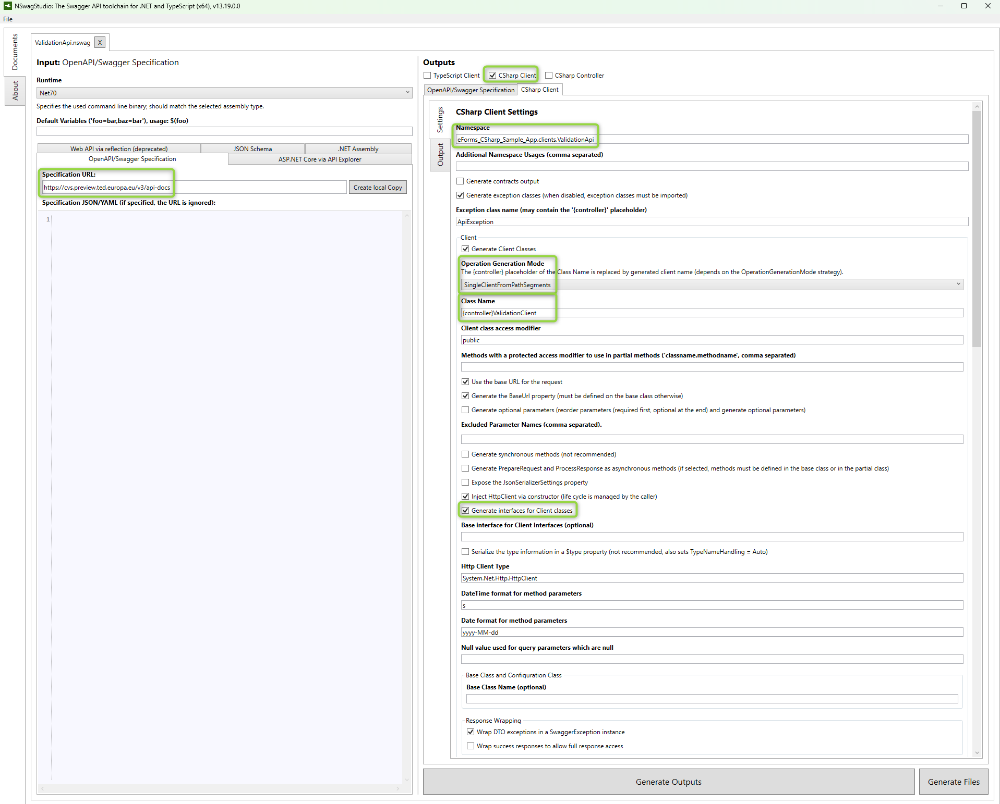
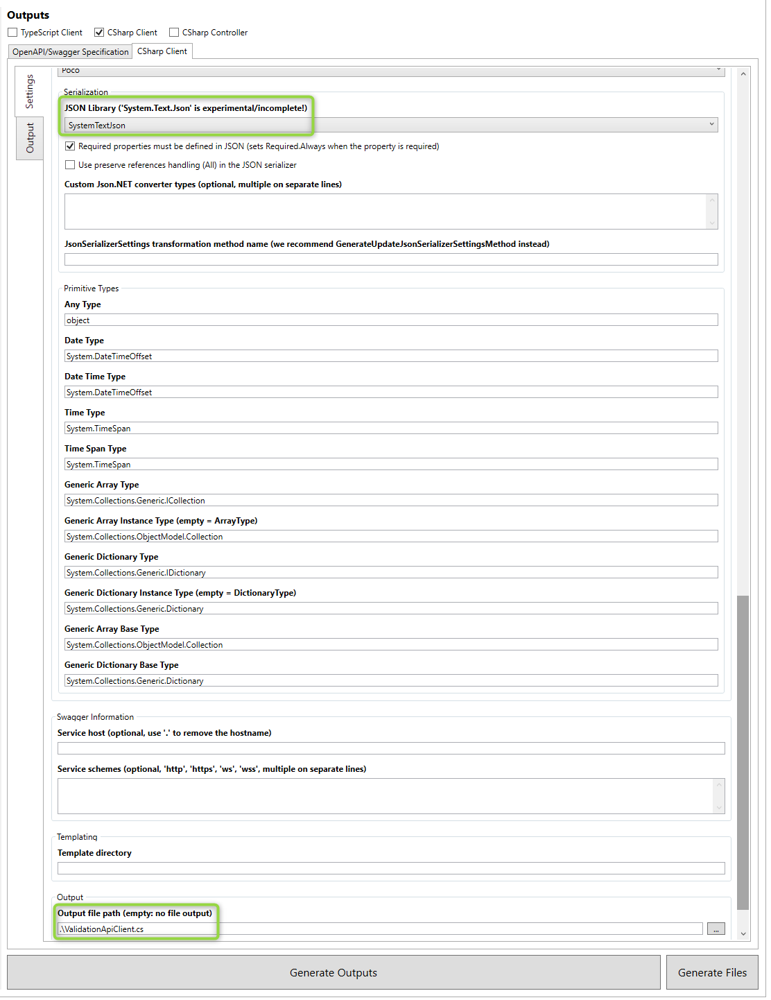
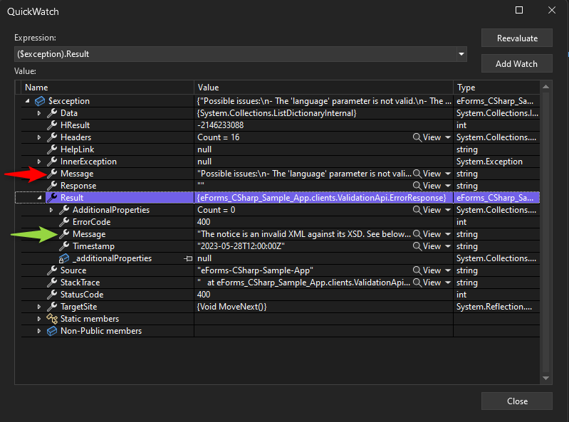
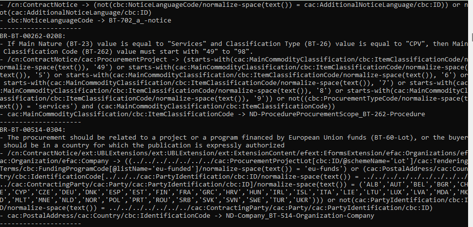

In [the last post](/post/eforms-csharp/generating), we've generated and serialized a notice. In [the introduction](/post/eforms-csharp/introduction), we've also already discussed that there is an [API for formally validating notices](https://cvs.preview.ted.europa.eu/swagger-ui/index.html). So let's see what our mapping is missing!

## Generating a client
For interacting with an API that already has an open API definition (here provided by Swagger) I like to use [NSwag Studio](https://github.com/RicoSuter/NSwag) to generate a client. In the studio, you enter the URL of the definition and then set the checkbox for _CSharp Client_ and then click _Generate Outputs_ to see the resulting Client class. From here the output usually needs some tuning. In the pictures below you can see what settings I have changed personally to fix the namespace, switch the serializer, combining all operations into one client and so on. When the output holds to the eyes I like to save the [.nswag](https://github.com/Kunter-Bunt/eForms-CSharp-Sample/blob/main/eForms-CSharp-Sample-App/clients/ValidationApi.nswag) to the folder where I'd like to have the .cs in the end. This makes it easy to reload the file and tweak settings or simply reproduce the output for a newer version of the API. Finally, specify the file name as a relative path and finally, click _Generate Outputs_ to generate the output as .cs.





So then I like to also build a small factory around it. That lets me manipulate the underlying HttpClient easily to add things like required headers. You can find the reference [here](https://github.com/Kunter-Bunt/eForms-CSharp-Sample/blob/main/eForms-CSharp-Sample-App/client/ClientFactory.cs). For the sample app, I've inserted the baseUrl via app settings and let the user insert the API Key manually via the console as this is a secret that I don't want to upload to the repository. If possible, consider _Azure Key Vault_ for storing secrets like this.

## Calling the CVS
Next up: Calling the Validation API - or Central Validation Service (CVS). 
``` c#
var factory = new ClientFactory(config, apiKey);
var client = factory.GetValidationClient();

var request = new InputNoticeValidation
{
    EFormsSdkVersion = mappedNotice.CustomizationID.Value,
    Language = "en",
    ValidationMode = InputNoticeValidationValidationMode.Static,
    Notice = serializedNotice
};
var response = await client.V1NoticesValidationAsync(factory.ApiKey, request);
```

## Interpreting the response
With a pre-generated client, this is quite straightforward to make the API call. However, the response is an XML file and as with the upload, this is untyped. As I did not find a matching schema right away in [the SDK](https://github.com/OP-TED/eForms-SDK) I used the _Paste XML As Classes_ feature of Visual Studio (Edit -> Paste Special) to generate something that is deserializable. 

> **_NOTE:_**  Depending on how much you have mapped at this stage you might get 400 responses from the service which will pop up as ApiExceptions. It is important to note that the definition of the API states that this is caused by the parameters like Language and Version, which is also printed to the Exception Message. But make sure to check the Result as well, here the real response from the service is noted, in the picture below you can see that the actual error is regarding the XML itsel! It is missing required properties. 



Sadly there is another problem: The definition of the API which returns an application/xml content is not interpreted by NSwag as an XML File being returned because there is no schema given for this. I had to edit the return value [here](https://github.com/Kunter-Bunt/eForms-CSharp-Sample/blob/main/eForms-CSharp-Sample-App/clients/ValidationClient.cs#LL193C34-L193C34):
``` c#
return new FileResponse(status_, headers_, new System.IO.MemoryStream(System.Text.Encoding.UTF8.GetBytes(await response_.Content.ReadAsStringAsync())), client_, response_);
```
Now we can read the response and with a simple XML deserialization against our _Paste XML As Classes_ class we can also check the result for validation errors (schematronoutputFailedassert) and output those in a structured way. The sample app uses extension methods here to provide a small footprint in the main logic.
``` c#
var schematronoutput = response.DeserializeAsShematron();

if (schematronoutput.HasErrors())
{
    Console.WriteLine("Validation Errrors:");
    Console.WriteLine(schematronoutput.BuildErrorString());
}
else
    Console.WriteLine("No Validation Errors!");
```

## Fixing up the mapping
Now this part I have to leave up to you of course, but the response does provide guidance. The validation errors do have a description and where to find the element that failed validation. Often you will also find things like Regexes that need to be matched and so on. 



So while I can't tell you what your notices will need and exploring all subtypes would take quite some time the Validation results can be mapped easily to the elements being failed and allowing for mostly easy fixes. Unless of course you simply do not have the data being required like a NUTS3 code that might need to be passed but is not entered by your user nor can be hard coded. 

Just one thing I can offer as a little help (at least it helped me): The SDK contains [some examples here](https://github.com/OP-TED/eForms-SDK/tree/develop/examples), maybe something matches your needs or by chance, there is a sample for your subtype?

## Summary
In this post, we generated a client, called the validation API with our previously generated and serialized XML, fixed the response output and finally filtered and interpreted errors.

At this stage, you probably have a lot to do because I don't expect your initial mapping to hold up against the Central Validation Service (CVS). In the next post we will publish a notice (at least to the preview stage), but until then we should have our mapping sorted out! 