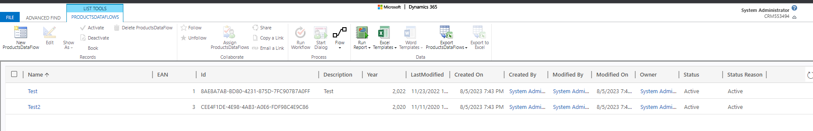

This time I will do my first experiments with Dataflows. Spoiler alert: There are quite some options left that would need a separate article, so at first glance this seems to be a powerful feature.

# Prerequisites 
As data source the same Azure SQL Database will be used that we already used for [the External Table post](/post/my-first-shot/externaltable). If you do not have a table ready, that post describes how it was set up in Azure with minimal cost. For reference, this is what the tables structure looks like:

# Creating the Dataflow
On make.powerapps.com, ensuring you are on the correct environement, selct Dataflows from the left menu. For me it was hidden in the _More_ flyout. If you cant find it there either, try _Discover all_ as this menu shows all Power Platform components. Still not finding it? Check that your environment has a database, this is required as a Dataflow will persist records to a dataverse table.

After giving our Dataflow a name, the next screen will present the selection of sources. There is a great variety of connectors, but for this first shot the trusty SQL table will do. When I entered my server and database the wizard recognized that I have a Connection to this database aleady and preselected it, nice! Therefore I will refer you to [the External Table post](/post/my-first-shot/externaltable) here as well.

Now we select the table we want to import and then we can transform the data. This is very intersting as with the External Table the data hat to be exactly right in the source database, this time around we can tweak it. As this is the "first shot" article, I have done the minimum here and only used _Add Table from Examples_ to add a year column that extracts from the last modified column. 

And once we are done Transforming, for which you can spend days if the data is not already in the shape we need it, its time to select the destination.
First I took a Products table I created sometime earlier and tried the _Auto Map_ feature.

That worked well everywhere where the names matched, the id fields were not automatically mapped because they are named differently than in the database. So be prepared to do the mapping manually if your database uses more technical names.

The other option is to create a new entity. I resorted to this to start from clean ground when evaluating the records, but take a look at the publisher prefix!
So then I exited the wizard to recreate the dataflow in a solution, but I did not find it in the menu in the solution, only Dataflow Template was available or importing an existing Dataflow. I think thats something to revisit when looking at deployment of these, but this side track had a nice learning: When I exited the wizard the system saved my Dataflow as unpublished so I could edit it to finally create my fresh entity.

The last dialog is about when the import will happen, on demand or scheduled. Theoretically the wizard allows you to go down to minutes, but depending on the size of your data this will not be enought to insert/update it in Dataverse. I chose daily here, probably a common choice. 

# The Result
That will be a quick section: No problem here! At the end of the wizard, select publish, it will take a few minutes. Then open the Advanced Find, look for the entity you mapped or created and the data should be there. 

Everything looks fine here, all the data, including our custom "Year" column was transported. The creator/owner of these records might be interesting in use cases outside an experiment: I never had to select who this should be, so apperently its just the owner of the Dataflow. For a development environment that might be fine, but a production environment should probably have a service user here. Again something to look out for when trying to deploy a dataflow.

Since the entity being filled with data here is a regular entity, you can integrate it to Model Driven Apps, create forms and so on. You could even add new records or edit existing ones. Although keep in mind that the changed data will be overwritten with the next execution of the dataflow. But adding additional fields that are not mapped from source would stay intact and also new records (unless you selected the option to delete records not present in source).

# Summary
Dataflows import data to regular Dataverse tables. They achieve this with definitions that are much like PowerBI, giving us many online resources on how to transform data before loading it to Dataverse. In contrast to External Tables, Dataflows create an editable copy of the data. This also means that the data is not real time and is only as fresh as the last refresh.

There is much to still explore here: Different column types like Choice and Currency. Relationships within the source or to Dataverse. Deployment topics like Dataflows vs Dataflow Templates. But for todays experiment this is enough. Keep your eyes peeled for more Dataflow content!