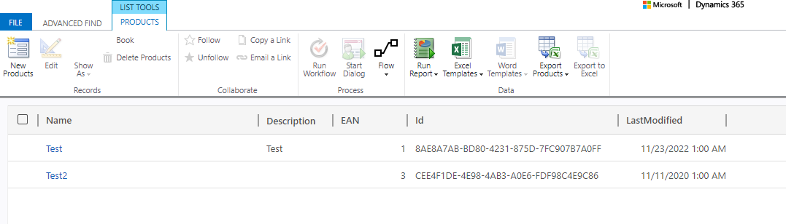

So this week I've looked into the "[Virtual Entities](https://learn.microsoft.com/en-us/dynamics365/customerengagement/on-premises/customize/create-edit-virtual-entities?view=op-9-1)", or as they are now called "External Tables" again. The problem the first time around was that it worked with the OData connector if you did everything right, but any minor mistake in configuring the attributes immediately broke the whole interface and debug information was not present. And in mistake I mean something like the server defines a string attribute and you create that as an optional string field in Dynamics; it needs to be required because it is not nullable...

Nevertheless, there is a beautiful new interface for configuring this now and it should also map the fields automatically, theoretically eliminating the human error here.

## The Server
The new interface has only _Sharepoint_ and _SQL Server_ on offer for now. And Sharepoint lists needing to be integrated frankly just has not happened to me yet, so I went with the SQL Server. It is interesting because it can handle big amounts of data better than Dynamics (e.g. mass inserts) and a lot of applications can already write an SQL Database. Furthermore, there are synchronization features to OnPremise Servers and you can even integrate External Tables to the SQL Server as well, making it kind of a gateway to other databases.

In Azure, I created an _SQL Server_ and an _SQL Database_ on the server. For the pricing tier, I chose serverless, cranked everything to its bare minimum and set auto-pause to one hour to reduce the cost to an absolute minimum. I always have that server running for SQL experiments and with its low usage and only a couple MB of occupied storage, it cost me less than one Euro last month. This is of course no advice on pricing, you would have to calculate that [here](https://azure.microsoft.com/de-de/pricing/details/azure-sql-database/single/), but it gives you at least an idea of how low the cost for a PoC can be.


With [SSMS](https://learn.microsoft.com/en-us/sql/ssms/download-sql-server-management-studio-ssms?view=sql-server-ver16) I created a new table, according to the requirements for being integrated as an external table.

## Table Requirements
I did not find direct requirements for the SQL tables, only the somewhat vague [general limitations for external tables](https://learn.microsoft.com/en-us/power-apps/developer/data-platform/virtual-entities/get-started-ve#limitations-of-virtual-tables) and [the docs for OData tables](https://learn.microsoft.com/en-us/dynamics365/customerengagement/on-premises/customize/virtual-entity-odata-provider-requirements?view=op-9-1). But with the variety of field types those were not a problem, with SQL I could imagine that you can have something with the bigger integer types that would not work. 

But the real requirement is that you need a Guid column. Often other data sources do not have this, they use an integer key or something similar. You can use those as alternate keys but the primary key for Dynamics is still the Guid, you need it. Fortunately, you can let the SQL Server generate that Guid for you, here is an example: `ALTER TABLE [dbo].[Products] ADD  CONSTRAINT [DF_Products_Id]  DEFAULT (newid()) FOR [Id]` where Id is defined as `[Id] [uniqueidentifier] NOT NULL`. This can be integrated into any table and it will be fit for purpose.

But consider this: What if this table is not the source of the data but it's rather copied there from somewhere else? Maybe as a straight copy or as an enriched dataset. No matter, you could get into a situation where you want to empty the table and fill it again from the source, but that will regenerate the Guids! All existing relationships with Lookups to the external table and all N:N relationships to it will be broken. So make sure to generate the Guid in the "real source" already. The other option to prevent this is to make an extra table with the Guid and the alternate key and then join them in a view. If you drop and reload the real table this matching table will persist and thus the Guids persist. But this adds overhead to manage the second table, so it might also be an option to only use this as a measure for the drop: Generate this helper table before you need to drop the main data table, then reimport the data and overwrite the newly generated Guids with the saved Guids from the helper table, matching by the alternate key. 

For reference, this is my table for tests:
```
CREATE TABLE [dbo].[Products](
	[Name] [nvarchar](50) NULL,
	[EAN] [int] IDENTITY(1,1) NOT NULL,
	[Description] [varchar](50) NULL,
	[Id] [uniqueidentifier] NOT NULL,
	[LastModified] [datetime] NOT NULL,
 CONSTRAINT [PK_Products] PRIMARY KEY CLUSTERED 
(
	[Id] ASC
)WITH (STATISTICS_NORECOMPUTE = OFF, IGNORE_DUP_KEY = OFF, OPTIMIZE_FOR_SEQUENTIAL_KEY = OFF) ON [PRIMARY]
) ON [PRIMARY]
GO

ALTER TABLE [dbo].[Products] ADD  CONSTRAINT [DF_Products_Id]  DEFAULT (newid()) FOR [Id]
GO
```

## Creating The External Table
Some pictures say more than a thousand words, let them speak and we will discuss the problems I've encountered afterwards.





## The Learnings
My experiment did not go that smoothly of course. The first issue was that I tried the _Service Principle_ authentication method. Creating the connection went pretty fine and the connection showed as connected, but no matter how often I tried and how many refreshes I did, it would never show up as an existing connection in the wizard. 

That was not too problematic for me in this case, since I had no security department in my neck. I've simply created a local login for the _SQL Server Authentication_. This is the script to do it:
```
-- In the master database
CREATE LOGIN MyUserName   
    WITH PASSWORD = 'MyPassword123!';  
GO  

CREATE USER MyUserName FOR LOGIN MyUserName;  
GO  

-- In the database that has the data you want to connect to
EXEC sp_addrolemember 'db_owner', MyUserName
GO
```

And that showed up as seen on the screenshots above.

But there was another error:


Googling around I then found [this thread](https://powerusers.microsoft.com/t5/Building-Power-Apps/Server-doesn-t-exist-for-external-table/td-p/2095631) and simply setting the _Manually Manage Connection Reference_ from the _Advanced Options_ in the first step of the wizard was enough to fix the issue (that's step 2 of the solution from the thread).


This little trick just needs to be known I guess, while the first issue might be more problematic in bigger corporations where the SQL Server Login might raise security concerns. 

## Summary
So in total, I think Microsoft made a good step forward in easing the integration of external data with the new experience of external tables. The whole feature is not quite there yet, it's not as easy as using something like a Power Automate Dataverse Connector or creating a regular table but the new wizard is a leap forward and we can see that MS cares about this feature and is willing to push it forward. 
