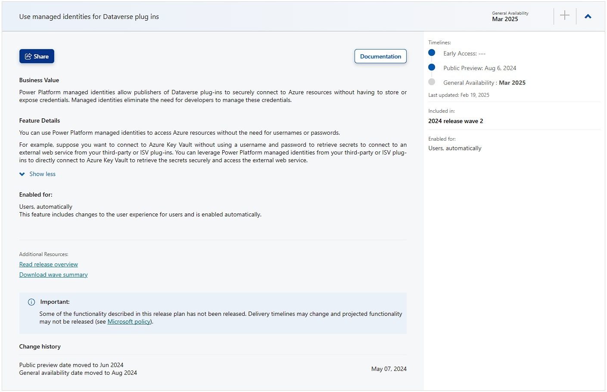
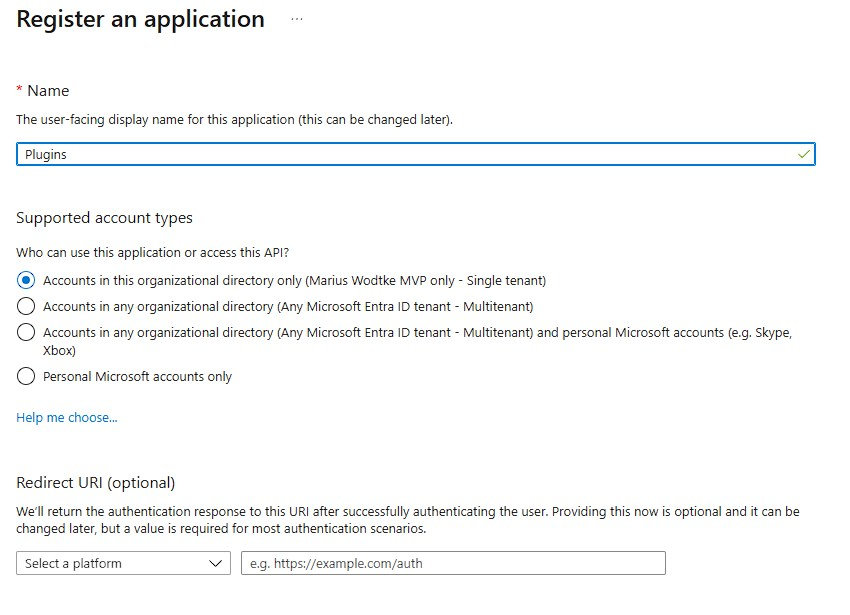
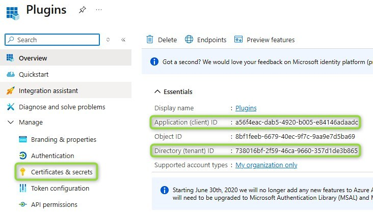
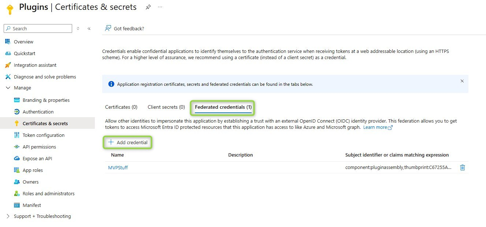
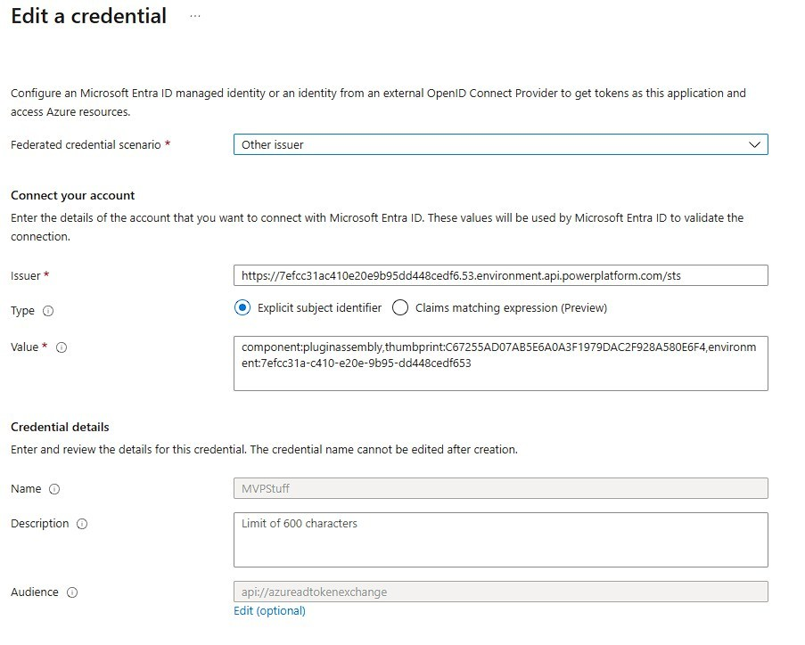
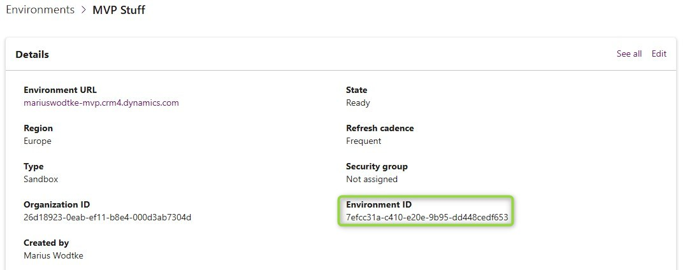
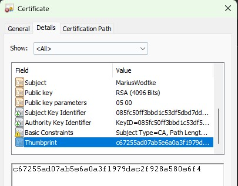
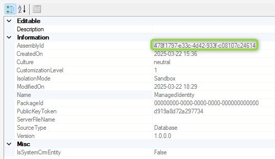
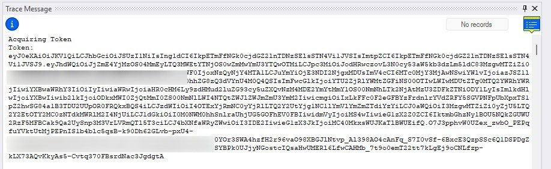

For over a year I have been following the feature "Use managed identities for Dataverse plugins" and after multiple delays it should finally become generally available and I had some time this weekend to implement a first attempt to test it out.



## General idea
You create an App Registration/Service Principle in Azure and an identity in Dataverse to represent it.
We connect this Dataverse identity with the Plugin Assembly where we would like to use it. _In a classical Username/Password situation, this connection would determine the Username used_.
And then we sign the Plugin Assembly with a Certificate, _this would be the Password_. Finally the `IServiceProvider` can resolve an `IManagedIdentityService` that will create JWTs for accessing resources.

And this is super exiting! While the tokens will only work with services that have OAuth2 authentication and even then might still have problems with cross-tenant situation (or a million other reasons), this opens a significant bootstrap: Azure KeyVault.  
In Dataverse we don't have a really secure storage for secrets, I argue that even things like the Secure Configuration of Plugins is not as secure as the name suggests. 
But even with a legacy ERP system only supporting Username and Password I can now store these in a KeyVault, enable the App Registration to read them and then retrieve the values in a Plugin to integrate that system without exposing those credentials. 

[Microsoft already has documentation on this](https://learn.microsoft.com/en-us/power-platform/admin/set-up-managed-identity) and I suggest also considering it, because such a new feature might receive some changes. In this article we will however have more pictures and some tips for problems not explained in the official version.

## The App Registration
In the Azure Portal, navigate to EntraId and select Add -> App Registration at the top. Then enter a better name than I did (your company probably has a convention for AppReg naming) and hit register.



From the Overwiew we will need the AppId and TenantId in the next section, you can copy them now or come back when you need them. We will jump to _Certificate & Secrets_ next.


Here we need a new credential in Federated Credentials. This means someone else (the PowerPlatform) will validate the credentials and can request a token for this AppRegistration.


Now we need a certificate, this can be any certificate. MS suggests against self-signed certificates for production use cases, however I don't know how this makes it more secure, since only the thumbprint is checked. If you have an explanation, I would be glad if you comment it (there is a switch to enable comments on the bottom left). 
For creating a self-signed certificate I usually ask Google for "windows create self signed certificate" and then take an article leveraging _OpenSSL_ since I can't remember the commands by heart. This reminds me, that I should leverage a CoPilot for this question in the future, saving a minute. Whatever way you get it: You need a pfx certificate with the private key included, also generating the public part as cer/crt file is helpful.

For the credential values: 
- The name may have any value, however it cannot be changed later. I think using the certificate name(/subject) and thumbprint might be a good name, because it both reflects situations like multiple developers having different certificates as well as "the same" certificate (by subject) having 2 credentials because one certificate is nearing expiration.
- For the issuer you want to get Environment ID from the Power Platform Admin Center. It is found in the Environment Details. Then we want to remove all hyphens and split off the last two character/numbers by a dot. So "7efcc31a-c410-e20e-9b95-dd448cedf653" becomes "7efcc31ac410e20e9b95dd448cedf6.53". Now we embed this to the sts-url which is "https://7efcc31ac410e20e9b95dd448cedf6.53.environment.api.powerplatform.com/sts" in this sample.
- For the value we will also need the thumbprint of the certificate. You can get it by inspecting the cer/crt files details. **Important: Value is case sensitive, in my case the thumbprint needed to be in upper-case!** And for this value we also need the environment id in its unmodified version, the final value looks like "component:pluginassembly,thumbprint:C67255AD07AB5E6A0A3F1979DAC2F928A580E6F4,environment:7efcc31a-c410-e20e-9b95-dd448cedf653" where you of course need to replace the values in thumbprint and environment.
- **The audience is also case-sensitive. In my testing it needed to be all lower-case!** So the default value "api://AzureADTokenExchange" becomes "api://azureadtokenexchange". The error message in this regard was quite good as it specified that the requested audience (api://azureadtokenexchange) was not matched with EntraId. 







## Plugin Code
Since my goal was to generate a token at all and I did not have a concrete project use case, you will find a very minimal code sample. But this is very nice after the extensive setup, we can get away with 2-3 lines of code to get a valid token. 

First we use the `IServiceProvider` to resolve the `IManagedIdentityService`.  
Then we define a scope with a list of strings. With newer OAuth versions they scrapped the resource, which would be "https://vault.azure.net/", with the scope further detailing the actions you want to take within the resource. If you don't have that you can usually just append ".default", however, there might be resources preventing that, requiring you to specify your intents and this is exactly the situation where you would use the list part of this parameter.
And lastly we can use the `AcquireToken` with the given scope(s) to get a token that we would then use to access the resource with something like a `HttpClient`.

``` C# {hl_lines=[8,10,11]}
public class Class1 : IPlugin
{
    public void Execute(IServiceProvider serviceProvider)
    {
        var trace = serviceProvider.Get<ITracingService>();
        trace.Trace($"Acquiring Token");

        var managedIdentity = serviceProvider.Get<IManagedIdentityService>();

        var scope = new List<string> { "https://vault.azure.net/.default" };
        var token = managedIdentity.AcquireToken(scope);

#if DEBUG
        trace.Trace($"Token: {token}");
#endif
    }
}
```

AFTER building and BEFORE uploading the assembly we need to sign it with a certificate. The following command assumes that we have the Developer Powershell in Visual Studio in the bin/Debug (or bin/Release) folder, with the certificate being present in the same folder: `signtool sign /f myCertificate.pfx /p myPW /fd SHA256 myProject.dll`. Here everything with the _my_ prefix needs your own values.

After that, everything runs like a normal Plugin Assembly.

## Managed Identity Association
We have an App Registration in Azure and the signed Plugin Assembly now. Next we need to tell Dataverse how it should connect the two.
First we need to create a record in the managedidentity table. For this we will need the AppId and TenantId from the AppRegs Overview page. I've used Postman to create the record, but there also seems to be a tool in the XrmToolbox (Plugin Identity Manager). 

``` http
POST https://mariuswodtke-mvp.crm4.dynamics.com/api/data/v9.2/managedidentities

{
    "applicationid":"a56f4eac-dab5-4920-b005-e84146adaadc",
    "managedidentityid":"a56f4eac-dab5-4920-b005-e84146adaadc",
    "credentialsource":2,
    "subjectscope":1,
    "tenantid":"738016bf-2f59-46ca-9660-357d1de3b865"
}
```

I've set the managedidentityid to the AppId here as well, MS generally does not like it when you assign guids not generated by the platform, but I hope there will never be that many Managed Identity records that it would lead to partitioning inefficiencies.

Next we associate the Managed Identity record with the plugin Assembly by setting the respective lookup. We will need the managedidentityid and the pluginassemblyid for this, the latter I grabbed from the details section of the Plugin Registration Tool.

``` http
PATCH https://mariuswodtke-mvp.crm4.dynamics.com/api/data/v9.2/pluginassemblies(478f1797-e33c-4d42-933f-c08107c24614)

{
    "managedidentityid@odata.bind": "/managedidentities(a56f4eac-dab5-4920-b005-e84146adaadc)"
}
```



And that's it, we created all necessary credentials and joined them in Dataverse, now we need to run the plugin and check the results.

## Resulting Token


As you saw in the code sample above, I printed the token to the tracelogs for debug builds. For production this is of course not ideal, but for the initial tests it helps in identifying issues. Websites like [jwt.ms](https://jwt.ms/) can decode the token, to check values like the audience and appId to clarify 401 errors received from target resources. So here is a sample of a (now expired) token I was able to generate.

``` JS {hl_lines=[7,13]}
{
  "typ": "JWT",
  "alg": "RS256",
  "x5t": "JDNa_4i4r7FgigL3sHIlI3xV-IU",
  "kid": "JDNa_4i4r7FgigL3sHIlI3xV-IU"
}.{
  "aud": "cfa8b339-82a2-471a-a3c9-0fc0be7a4093",
  "iss": "https://sts.windows.net/738016bf-2f59-46ca-9660-357d1de3b865/",
  "iat": 1742668105,
  "nbf": 1742668105,
  "exp": 1742672005,
  "aio": "k7RgYPDft6dY2dl8+ik3puM7L7+sWrrUUrOpWHado3CwUbu83D8A",
  "appid": "a56f4eac-dab5-4920-b005-e84146adaadc",
  "appidacr": "2",
  "idp": "https://sts.windows.net/738016bf-2f59-46ca-9660-357d1de3b865/",
  "idtyp": "app",
  "oid": "8911b4f4-2b4e-46ce-b854-ebeebffe7bc6",
  "rh": "1.AEsAvxaAc1kvykaWYDV9HeO4ZTmzqM-ighpHo8kPwL56QJNGAQBLAA.",
  "sub": "8911b4f4-2b4e-46ce-b854-ebeebffe7bc6",
  "tid": "738016bf-2f59-46ca-9660-357d1de3b865",
  "uti": "43CV3HaJykiHcPnF8XDWAA",
  "ver": "1.0",
  "xms_ftd": "Kflhs7-A9NMBFFQe6G1y0PBjOPke2Jzw3uk-TfA9yOw",
  "xms_idrel": "7 16",
  "xms_rd": "0.42LlYBJi9AYA"
}.[Signature]
```

Did you notice the Guid in the audience as well? I remember getting back a named audience for KeyVault, but verifying with Postman, I also got the guid. Likely this is the id of the KeyVault Service.

## Summary
Finally we have the bootstrap for secrets in Plugins! We got that a while back for Power Automate with the secrets option for Environment Variables, but Low-Code also has it's limits and whenever we need High-Code, we should have an option now. 

The App Registration approach already offers many options for integrating with Azure Resources and APIs that leverage OAuth2. For everything else Azure KeyVault can store the needed credentials and we can securely access them with the Managed Identity.

After a somewhat cumbersome setup (which might be improved through community tools like the "Plugin Identity Manager"), usage in code is remarkably easy and performance was quite good as well. With a warmed up environment the executions took about 100ms, I expected worse.

To make it happen you will need a certificate with a private key (.pfx), an App Registration in EntraId with  Federated Credentials pointing to the certificate and Environment. Then you can sign the Plugin Assembly with the certificate and connect it with a record in the managedidentity table, holding a reference to the App Registration. Once all this is set up, you can create a token for an Azure resource like Key Vault with only 2-3 lines of code.