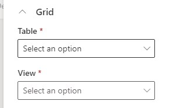
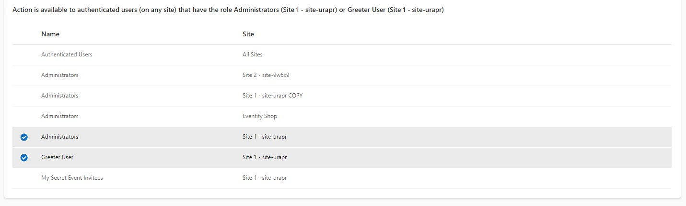

I recently wanted to solve a suboptimal experience with a subgrid on the [Power Pages Action Configuration](/post/power-pages/custom-api/) entity and thought I would build on my first shot with a [React PCF](/post/my-first-shot/pcf-react/), trying a [dataset PCF](https://learn.microsoft.com/en-us/power-apps/developer/component-framework/reference/dataset) for the first time.

Unlike "normal" PCF which bind to fields, as the name says, dataset PCFs bind to a dataset. Dataset we could also call list or grid, so in theory this is perfect to customize the experience of my subgrid.

## ControlManifest differences
The `ControlManifest.Input.xml` is where you specify the bindings. A regular PCF will specify one or more `property` nodes in the `control`.

``` XML
<manifest>
    <control namespace="PowerPagesActionsRoleSelector" constructor="PowerPagesActionsRoleSelector" version="0.0.5" display-name-key="PowerPagesActionsRoleSelector" description-key="PowerPagesActionsRoleSelector description" control-type="virtual" >
        <property name="isrestrictedtoauthenticated" display-name-key="Restrict to Authenticated Users" description-key="Boolean wether only authenticated users are allowed" of-type="TwoOptions" usage="bound" required="true" />
        ...
    </control>
</manifest>
```

The dataset PCF will use a `data-set` with `property-set` nodes inside. The `data-set` also resides in the `control`
``` XML
<manifest>
    <control namespace="PowerPagesActionsRoleSelector" constructor="PowerPagesActionsRoleSelector" version="0.0.5" display-name-key="PowerPagesActionsRoleSelector" description-key="PowerPagesActionsRoleSelector description" control-type="virtual" >
        <data-set name="powerpagecomponentdataset" display-name-key="Power_Page_Component_Dataset">
            <property-set name="componentname" display-name-key="componentname_Name" description-key="componentname_Desc" of-type="SingleLine.Text" usage="bound" required="true" />
        </data-set>
        ...
    </control>
</manifest>
```

You can pregenerate such a manifest by using the `--template dataset` parameter when using `pac pcf init`.

When customizing the form, you can select it from the _Components_ Workspace, pull it to the form and will be obliged to select the table and view for the dataset. Next would be to select the bound _componentname_, you can skip that, the data of the view will be delivered to you anyways, but a `property-set` might make it easier to implement generic components. 



## The catch
There is a problem for my subgrid though. You can't mix a bound `property` with `data-set`! But that's exactly what I was trying to achieve, selecting something in the subgrid should manipulate fields on the form (or vice versa). 

But when you try to use both nodes as shown below, the PCF won't be selectable in a form. Meaning we will need a different solution.

``` XML
<manifest>
    <control namespace="PowerPagesActionsRoleSelector" constructor="PowerPagesActionsRoleSelector" version="0.0.5" display-name-key="PowerPagesActionsRoleSelector" description-key="PowerPagesActionsRoleSelector description" control-type="virtual" >
        <property name="isrestrictedtoauthenticated" display-name-key="Restrict to Authenticated Users" description-key="Boolean wether only authenticated users are allowed" of-type="TwoOptions" usage="bound" required="true" />
        <data-set name="powerpagecomponentdataset" display-name-key="Power_Page_Component_Dataset" />
        <!-- DOES NOT WORK! -->
        ...
    </control>
</manifest>
```

## A solution
What could we do now? Well we can query data from regular PCFs but do not have a supported way to interact with the form apart from a bound `property`. Therefore, I will skip the dataset PCF again, do a regular PCF and if I needed to make the dataset configurable I would need to either pass a FetchXML as string or multiple strings for the OData parameters as inputs.

The biggest challenge now is to render a proper grid. Fortunately, Fabric with it's _office-ui-fabric-react_ library can help us achieve a quite decent look without much styling effort. The react component for a grid with selection looks like this:

``` react
<Fabric style={{ width: "100%" }}>
    <MarqueeSelection selection={this.selection} >
        <DetailsList
            items={this.state.data}
            columns={this.columns}
            setKey="set"
            layoutMode={DetailsListLayoutMode.justified}
            selection={this.selection}
            selectionPreservedOnEmptyClick={true}
            ariaLabelForSelectionColumn="Toggle selection"
            ariaLabelForSelectAllCheckbox="Toggle selection for all items"
            checkButtonAriaLabel="Row checkbox"
        />
    </MarqueeSelection>
</Fabric>
```

As you can see the only styling I needed was to set the width of the `Fabric` element.

I don't think it makes too much sense to detail more code here. What you get in data and columns will definitely change, so I will [link you to the repository here](https://github.com/Kunter-Bunt/PowerPagesActions/tree/main/PowerPagesActionsRoleSelector/PowerPagesActionsRoleSelector) and only touch a bit on the selection since it took me some time to understand. If you don't need to act on record selection, you may skip the next section.

## Making selections
My idea was to show all available options in the grid and let the user associate via simply selecting the row. This makes associating a single button click. And of course disassociating as well. The approach will of course struggle in scenarios with a large number of selectable records, but with WebRoles, this should be fine.

Both the `MarqueeSelection` and the `DetailsList` share the `this.selection` object. 
``` TS
this.selection = new Selection({
    getKey: (item: IRecord) => item.key,
    onSelectionChanged: () => {
        this.props.selectionChanged(this.selection);
    }
});
```

The onSelectionChanged passes the event up to a function defined in the `props`, this is because the associate/disassociate happens in a different class and `selectionChanged` is the hook that is tied to an instance of it. 

But the selection items do not work on their own! You need to explicitly pass the data and what is currently selected. So actually the `MarqueeSelection` and the `DetailsList` also implicitly share the data as well.

``` TS
this.selection.setItems(data, true);
data.forEach((item) => this.selection.setKeySelected(item.key, item.selected, false));
```

I guess this is clear, we first set the data for the selection and then iterate the data so preselect the items that are already associated(/selected). But the 2 boolean parameters might need explanation.

The second parameter of `setItems` determines if the data shall just be added or if the collection should first be cleared and then the items are added. This is of course what we want here since we likely retrieved all selectable objects from the database.

The third parameter of `setKeySelected` determines whether to "anchor" the row. So basically highlighting it as the currently selected one by changing the background color of the row. This is unwanted here, I only want to set the checkmark at the start of the row since this code is executed without the user interacting with the grid, it is just executed after the data is being loaded successfully.

Lastly lets have a quick look at the interface of data.

``` TS
export interface IRecord extends IObjectWithKey {
  key: string;
  name: string;
  site: string;
  selected: boolean;
}
```

So we have the `key` we need for the selection (natural selection here is the guid) and `selected` to feed the `setKeySelected` function. Whether a column is selected is determined by it being associated to the current record in my case. `name` and `site` are irrelevant for the selection, they are for columns rendered in the `DetailsList`.

## Summary
While dataset PCFs are the primary solution to provide a custom experience for grids and subgrids, they do not work well, when you also need to manipulate the form. As a workaround we can also use a regular PCF and then leverage the React library of Fabric (also found as [Microsoft Fluent UI](https://developer.microsoft.com/en-us/fluentui#/get-started)) to render a grid and use bound properties to interact with the form. The result looks pretty similar to a regular grid. Let me [link to the full code here again](https://github.com/Kunter-Bunt/PowerPagesActions/tree/main/PowerPagesActionsRoleSelector/PowerPagesActionsRoleSelector).



If you do not have the need to interact with the form and just want to make a custom grid experience, let me link you to some helpful resources from others:
- [Rohans explanation with React](https://javascript.plainenglish.io/building-pcf-dataset-control-using-react-e2e67c1e1ba2)
- [Dianas collection of Dataset PCF articles](https://dianabirkelbach.wordpress.com/category/pcf/dataset/)
- [Carls explanation without React](https://carldesouza.com/building-a-dataset-pcf-control-with-styling-without-react/)