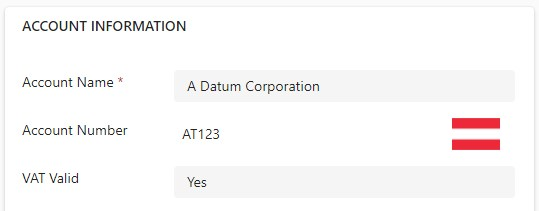
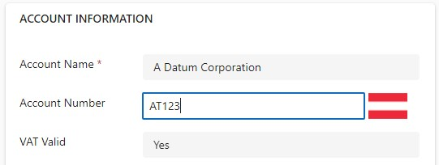
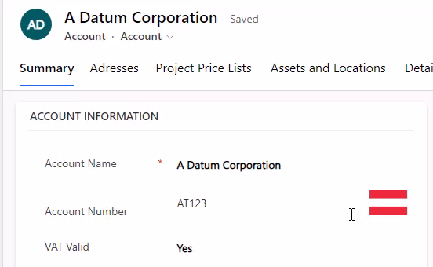

Did you know there is [a preview for using React in Code Components](https://learn.microsoft.com/en-us/power-apps/developer/component-framework/react-controls-platform-libraries) (aka Power Apps Component Framework, PCF)? Well, I recently received training on using React natively so I thought this is a great opportunity to consolidate my knowledge.

I plan to broaden the topic around [VIES VAT](/tags/vies-vat), so this experiment will contain a new PCF that shall do the same thing as the original [VAT Number Validator](https://pcf.gallery/vat-number-validator/) just for Power Pages. 

## Full example
Please note that this is a first shot, the actual validation part is mocked at this stage, we will worry about CORS and calling VIES VAT in another article. 

Therefore the code at this stage has received a separate branch, so make sure to view the branch [my-first-shot/react-pcf](https://github.com/Kunter-Bunt/PowerPagesVATNumberValidator/tree/my-first-shot/react-pcf) when comparing your solution.

## Setup
As this is a preview feature, keep a close eye on [the official documentation](https://learn.microsoft.com/en-us/power-apps/developer/component-framework/react-controls-platform-libraries), the parameters might change!

To create my control I've used
`pac pcf init --name PowerPagesVatNumberValidator --namespace PowerPagesVATNumberValidatorNameSpace --template field --framework react --run-npm-install`. 

You can also shorten the parameter names to 
`pac pcf init -n PowerPagesVATNumberValidator -ns PowerPagesVATNumberValidator -t field -fw react -npm`.

The main difference here is the `--framework` or `-fw` parameter, making it a React component.

> **Note:** You cannot have a .gitignore in the folder where you are executing the `pac pcf init` command, if you have, you will receive an IO error.

Other commands you might need are `npm run refreshTypes` after you changed the _ControlManifest.Input.xml_, `pac solution init --publisher-name MariusWodtke --publisher-prefix mwo` to create a new Solution locally and `pac solution add-reference --path ..\` to add the _.pcfproj_ file as a reference to your solution. If you now `dotnet build` your solution, the PCF will also be built and included in the solution. To test locally, `npm start watch` launches a sandbox in the browser to quickly test changes. Please note that not all features of PCF are supported in the sandbox, for example, I noticed that `getResource` does somewhat work, but hands out undefined as the requested content. Also, remember that when deploying the built solution to Dataverse you will need to increase the version of the control node in the _ControlManifest.Input.xml_, otherwise Dataverse won't pick up the changes.

## The component
A lot of the magic of the _VAT Number Validator_ happened in index.ts, this will be much different even in the easiest React controls because you want to work in .tsx files instead. I named my entry-point _Control(.tsx)_ in correlation to the convention for _App(.tsx)_ as the entry-point for native apps. The index.ts will call this entry-point and pass along some needed objects, like the input parameters and a function that will ultimately call `notifyOutputChanged` to persist the calculated results to the actual form field. In contrast to classic PCFs this happens in the `updateView` method which looks like this in my case:
```
public updateView(context: ComponentFramework.Context<IInputs>): React.ReactElement {
    const props: IControlProps = {
        context: context,
        outputChanged: (outputs) => this.outputChanged(outputs),
    };

    return React.createElement(
        Control, props
    );
}

private outputChanged(outputs: IOutputs){
    this.outputs = outputs;
    this.notifyOutputChanged();
}

public getOutputs(): IOutputs {
    return this.outputs;
}
```

So, updateView creates the root React element and passes the context with the inputs. The React element passes back the outputs, should the user input something into the field this is persisted in the form via `notifyOutputChanged`.

Now I can use my _Control.tsx_ to define the elements that are rendered inside. I want to mention the concept of `useState`: It returns a getter and a setter. And when a component uses the getter it will be rerendered every time the setter is called. So in the following sample, when vatStates.img is set asynchronously after the correct image is determined and loaded, the img element will be refreshed automatically.

```

```

The variable vatStates is already a complex object here, as I prefer to extract the handling of multiple states to a separate class with hooks. The hooks in the sample are stored in the _/services_ folder and have the _use_-prefix as a convention for the public methods. If you take a closer look at the _vathooks.ts_ you will notice that the actual validation only looks for the user input starting with "AT" for marking it as valid. That's of course not correct, but allows us to observe the loading of the sample image and persisting the bound fields.

This preview also includes Fluent UI and using it should give you a look that is consistent with the Microsoft designs. You can [find the component here](https://developer.microsoft.com/en-us/fluentui#/controls/web), I've used a TextField as input.

```
<TextField 
    className='pcfvatinput' 
    value={vatStates.input} 
    onChange={(_, value) => vatStates.onInput(value ?? '')}
    styles={{
        fieldGroup: { border: "none" }
    }} 
/>
```

There is not much to elaborate on this component, you can work here as explained in regular React tutorials. The only difference is the onChange will have to call `notifyOutputChanged` method directly or indirectly. Here this happens through `vatStates.onInput`, `internalOnInput` and `props.outputChanged`. If you skip this, your inputs will not persist in the form and therefore will not be saved with the form.

## Problems I faced
I did not want to inline styling and wanted to work with a .css module, however I couldn't make the sandbox pick it up and instead used a regular .css. A .css just has to be referenced in the _ControlManifest.Input.xml_ and then you can use the defined classes in your components.

As already mentioned, the sandbox does not work correctly with `getResource`, it loads the resource when observing the network, but passes undefined to the callback. For debugging purposes, I solved this with a ternary, rendering a fixed image in the sandbox so that styling can be checked.
```
context.resources.getResource(
    "img/at.png",
    data => data
        ? setImg("data:image/.png;base64," + data) // -> rendered in dataverse
        : setImg("data:image/.png;base64,iVBOR...ggg=="), // -> rendered in sandbox
    () => console.log("Failed to get img"));
```

And finally, the _New Look_. Here the look of the Fluent UI component is not in line with the other fields, making it very apparent, that this field is self-made. This might change if we were using Fluent UI v9 (we can't right now, the library versions in the _ControlManifest.Input.xml_ are fixed) and maybe applying additional styling, but the current transition highlights how even well-fit PCFs can be a break to the user experience with future wave updates and do require maintenance. Here are some screenshots of the new look and in the next section is a short video of the "old" look, where the integration (apart from the font) is much better.




## Summary



React makes it easy to work with asynchronous resources and render the results in a way that is not the ultimate Christmas tree. Together with Fluent UI, the addition of this framework capability is a great fit for slick PCFs that behave well for the user while also having clean code behind them.  