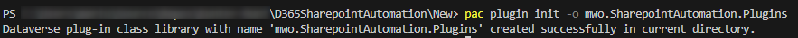
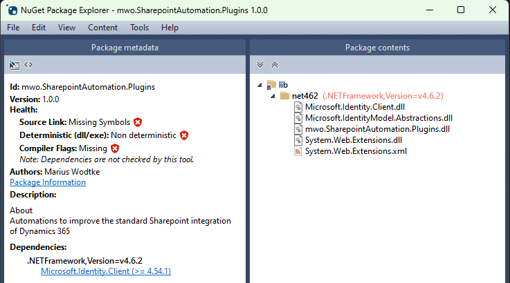
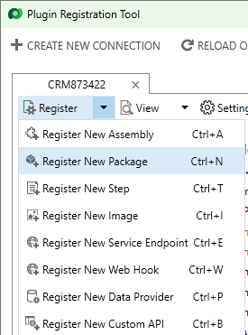
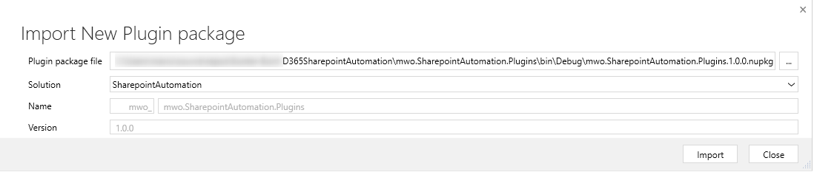
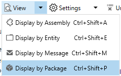
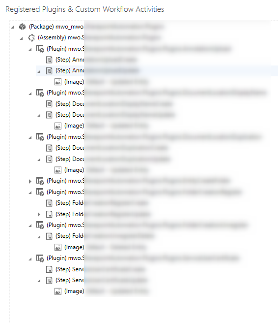

I recently noticed for a project that needs certificate authentication that _Microsoft.IdentityModel.Clients.ActiveDirectory_ is deprecated.
But that NuGet was particularly practical as it was loaded to the Dynamics 365 Sandboxes, letting me use it from plugin code. Contrary the new _Microsoft.Identity.Client_ is not in CRM and therefore traditionally would need _ILMerge_ to be deployed.

However Microsoft has a new preview feature for Dynamics CRM called "[Dependent Assembly Plugins](https://learn.microsoft.com/en-us/power-apps/developer/data-platform/dependent-assembly-plugins)". This allows you to upload a .nupkg file and since a nupkg is just a .zip file in the end, this means we can include multiple .dlls including ones from other NuGets.

## Prerequisites
We are going to need the latest version of the PAC CLI. A simple way to do get it is via the [Power Platform Tools](https://marketplace.visualstudio.com/items?itemName=microsoft-IsvExpTools.powerplatform-vscode) of VSCode since I assume most of you will have VSCode already installed.
And for deploying the package the latest version of the Plugin Registration Tool is advisable, a simple solution is to include the [Microsoft.CrmSdk.XrmTooling.PluginRegistrationTool](https://www.nuget.org/packages/Microsoft.CrmSdk.XrmTooling.PluginRegistrationTool) NuGet to your Project, after building the project you will find the _PluginRegistration.exe_ in your package folder. 
You might also want to install the [NuGet Package Explorer](https://apps.microsoft.com/store/detail/nuget-package-explorer/9WZDNCRDMDM3) to inspect the contents of the packages quickly.

## Initialising a project
So for my use case I do already have a plugin project generating an assembly that is already uploaded to my Dynamics CRM instance. This previously had no dependencies on assemblies that are not loaded within the Sandbox. To transform the project to a Plugin Package, the `pac plugin init` was used. Since I want to transform an existing project I first made a new Folder (simply left the default name, it does not matter) and executed the command inside that folder with the name of the original plugin project. I want to keep the namespaces etc the same here but obviously I can't run the command in the "correct" folder since the files are already there. 

Next I only took the .csproj from this newly created project and copied it back to my existing project. Since I chose the Namespace to be identical this overwrites the existing project. 

Of course if you starting fresh you can simply run `pac plugin init` in the root folder and start implementing form there!

## Fixing up the project
So before we actually include any new dependencies now, lets try to build! 
And of course that does not work anymore, who would have guessed? In my case the older .csproj style of the existing project meant that some Assembly Attributes were duplicated, that was easy to fix. Also all the Assembly references are not included to the new project, they can be copied over from the old .csproj file when running a `git diff`, but I took the opportunity here to do some house keeping and went through the build errors, only adding the references needed by the current code. Finally with the newer project style, there was also a class included to the project which I intentionally did not include in the old one, with the new style I had to explicitely exclude it.

After that, the code was building and already I found a .nupkg file in my bin/debug folder, cool!

## Integrating a dependency
Next up, integrating a dependency. A no-brainer would be something like _Newtonsoft.Json_, but for my take _Microsoft.Identity.Client_ was already set. This comes with another dependency on _Microsoft.IdentityModel.Abstractions_. The amount of other dependencies is critical since the Sanboxes still do not allow unmanaged code, so any dependency using it can kill your dreams of a helper library.
So I uninstalled _Microsoft.IdentityModel.Clients.ActiveDirectory_ from my project, installed _Microsoft.Identity.Client_ and then built to then work through the errors. In these situations the "[Separation of concerns](https://en.wikipedia.org/wiki/Separation_of_concerns)" is a blessing since that meant that I only needed to adapt the CertificateCredentialClient built for getting an _access token_ from a certificate. 

Naturally after a rebuild you want to know whether everything is in the .nupkg as expected. This is where the _NuGet Package Explorer_ is handy since you can just drag and drop the .nupkg to the application window and it will show you the contents.

That worked nicely, I can even see that _System.Web.Extensions_ was included which is technically not needed, so I could remove it from the package by setting the dependency to not _Copy Local_. 

> **_NOTE:_** I've noticed here that the NuGet is not updated on regular build unless you increase the package version, however a rebuild always packs a new .nupkg.

## Registering the package
With our package ready from the development side now, open the _Plugin Registration Tool_ and connect to your instance. 

## The catch
No the last screenshot already shows the steps and images, however the reality is that your old assembly now has a "copy" and will only contain the types, but nothing else. So I migrated all the steps from the old assembly over to the one included in the package and then unregistered the old assembly with the same name. This was feasable for this assembly, but for larger projects, this will be a bigger effort. It would be much easier if regular tools like spkl could interpret packages and register the steps. So for larger assemblies you want to wait for such a feature (or include it yourself) to then just run the full registration on the new package and then just unregister the old assembly. 

## Summary
"[Dependent Assembly Plugins](https://learn.microsoft.com/en-us/power-apps/developer/data-platform/dependent-assembly-plugins)" is a great addition to Dataverse. It offers a supported way to practice modern development with relying on helper libraries and splitting your own code to multiple libraries. The PAC CLI offers an easy way to initialize such a project but for existing implementations you should keep in mind that this feature is still in preview and that the community tooling has not yet caught up with it. Therefore you might want to wait with it before developing production code with it and rather resort to experimenting what new possibilities this feature will enable you to deliver in the future. 