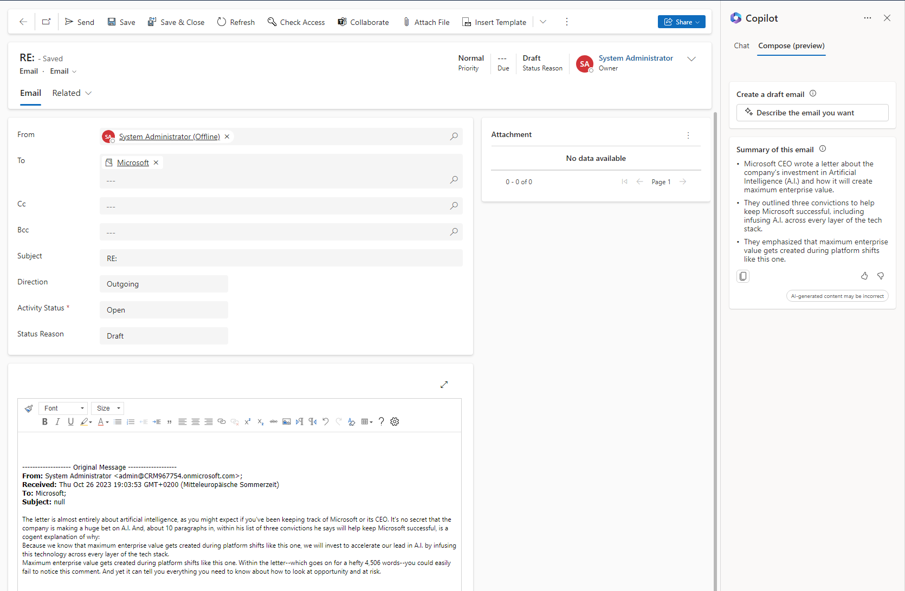
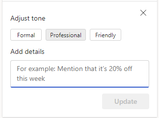

Microsoft is all in on AI. And that means we won't get around it. But don't get me wrong as well here, generative AI is cool! Naturally by now the first customer request reached me and I'm skilling up on what the Sales Copilot for Dynamics CE can do right now (October 2023) and you will join me on that journey.

## Setup
Setup of the Copilot SHOULD be straight forward, but as my tenant is not in North America the cross border data processing agreement kept me searching for a while. It's in the bottom right corner of the environment page. That is the first hurdle: Is this agreement really ok for your organization? But to be honest I think MS will roll this out world wide, so that might be a matter of waiting.

After agreeing to that, the yellow box you see in the next screenshot will disappear and you can enable the assistant app by app or just everywhere with the checkboxes at the top. The settings are found at _Sales Hub > App Settings > Sales Copilot (preview)_.

After a full refresh the selected apps will now show the Copilot pane on the right side of the screen.

## Settings
Apart from the apps you can also configure the fields to be evaluated for summaries and "catch up". Catch up shall evaluate audit history for you, well at least for up to 10 fields. 
In general I think we will end up with specialized views for the correct field selection as this will be vital to the output of the AI and you probably don't want to make any compromises with the requirements for a regular view.

The preview feature "Compose" has no settings at the time of writing.

## Summarize
From now I will use this like a user. And as a user of ChatGPT I expected chat to be a chat. Well, the first attempt did not go so well and the whole evening did not go any different: The "suggested requests" are the only requests this bot understands. 

 

So this is the summarize request, you type the name of a record (use a slash "/" to get an autocomplete) and it will use the 7 fields from the view in settings to generate you a short text. 

## Catch up
You can use the catch up feature with the phrase "show me recent changes for" and it will evalute the 10 fields from the view in settings for changes in the last 7 days. For the sample I logged in with a second user and made some changes to the opportunity.

Cool right, but the next sample does not work so great: I changed the estimated revenue twice and the bot only got the last change and failed to combine both changes to one (10000/12000 -> 15000).

 

## News
"Get latest news for" lets you specify an account and get a list from bing news for it. So essentially the same as visiting bing.com/news and then entering the account name to the search box. But you don't need to open another browser tab and with "/" you get an autocomplete which is nice.

## Today
The last of the chat functions is "Prepare me for today's meetings". This shall evaluate notes and emails of the regarding record of appointments in the next 24 hours. So to really use this feature, you would need a fully working Exchange sync to have a number of appointments and synchronized emails. Nethertheless, I tried to mock something up here.

Wow, that did not work so great! Because there was no regarding on the second appointment the bot did not list it at all. For me that's a problem, because who has all his appointments linked correctly? I might miss a meeting here! It should at least tell me it can't prepare a summary, because there is no linked record.
But ok, let's try again with both records linked.

Ok, thats better, but still I need to select a record to get the summary. So if I have 5 meetings, I need to go through this 5 times...

## Compose
First I had some trouble with this: You cant use that feature from the Activities Grid, but from Timeline and Up Next it should work! But I've tried it with the Microsoft Account and that apperently also illegal, but at least Opportunity and Lead work, which would be in line with the configurations for summary and catch up. 

The second tab for Compose shows a summary of the email and offers to write a response, let's try!

  

The email tone can be selected as well and finally with "Add to email" we can insert the text and of course change it to our needs.

 

## Summary 
I'll be honest with you: I'm only mildly impressed by the chat features. Nothing in there seems to be more than "hardcoded" functionality. And everything from there can be achieved with well designed forms (the Summary tab has that name for a reason) and Dashboards. This becomes a different story if for example the catch up would allow you to query multiple records at the same time, imagine you having 10 open opportunities and Copilot can tell you which of these have changed over the last days. For just one record I could simply visit the Audit History myself. But then again, I'm a professional, someone who has had little touch points with Dynamics yet might find a connection through these features! A chat is of course easier than to navigate forms if you don't know what you are doing, so assuming it will get more options and maybe "multi-record features" the future looks brighter here.

In contrast I liked the compose feature right away. There is still potential, at least in my testing it did not seem to leverage the context of the surrounding records and prior emails, but if you are like me and waste time on formulating while you know what you want to write, this can save actual working time. And my experience with TLDR-bots says that they do work really well, so I think we can assume that Copilot will be helpful with longer emails as well.