I had to write this article because I was unable to find this information online: "Can you set a specific Status/Status Reason with a Business Rules in Dynamics?" So I had to go blind and just try and here is the outcome for you to make a confident statement about whether you can solve your requirement with a Business Rule (BR).

To set the scene, let's dive a little into my requirements. Quotes need to be confirmed by a certain group of people before they can be offered to the customer. This shall prevent excessive discounts. After a quote is confirmed it shall not be changed anymore. The proposed solution was to use Column Security (formerly called Field Security) and add the people who can confirm those quotes to a Column Security Profile to allow them to change that field. The problem is, that you can't activate Column Security on the Status/Status Reason columns. It would not make any sense anyway because you then would also be unable to win or lose a quote afterward without access to the column. So the idea is to make a simple switch (boolean) with Column Security to only allow the approvers to change it and make a Business Rule to activate the quote when the field is set to prevent any changes after the quote is confirmed.

## Setting StateCode
We will be starting with a Business Rule set to _Entity_ Scope. It sets the Status (StateCode) to active for a _Draft_ Quote that is _Confirmed_. 

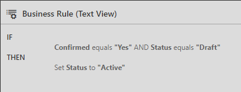

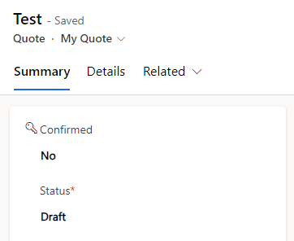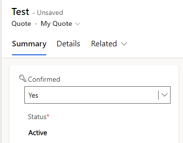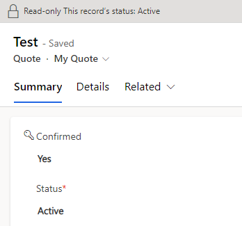

The rule works as expected, when the Confirmed field is set, the Status switches to Active and after saving the Quote is locked. The Status Reason was automatically switched to the default choice _In Progress_.

## Setting StatusCode
Next, the same again (_Entity_ Scope) just with setting Status Reason (StatusCode). Because in the standard the Status Reason _In Progress_ is there for both _Draft_ and _Active_, I've introduced a custom choice called _Confirmed_ as well. This has the nice side effect, that it is distinguishable from a normal activation via the _Activate_ button which would default to _In Progress_.

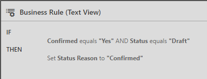

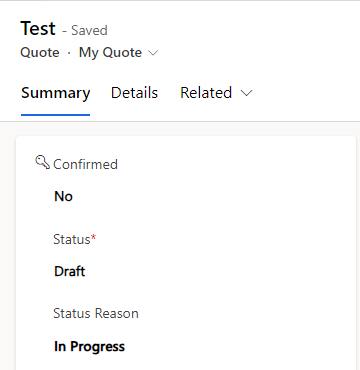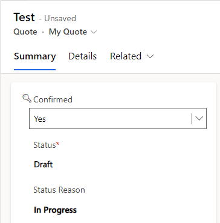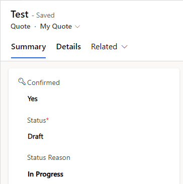

**This does not work!** The combination _Confirmed_ and _Draft_ is obviously illegal but unlike changing Status in the previous section this situation is not autocorrected by the system and is therefore just not changed.

## Setting StateCode and StatusCode
If setting only the Status Reason does not work, surely first setting Status and then Status Reason will work, right?

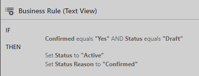

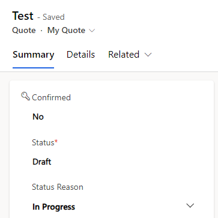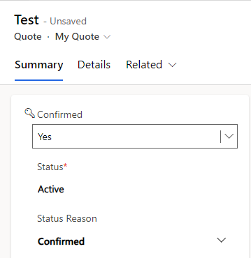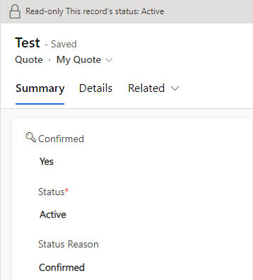

Yes, it does. And by the way, it also works if we change the order and set Status Reason first, at least for the _Entity_ Scope this does not matter.

## Using Form Scopes
When using Form Scopes instead it is usually very important to ensure all relevant fields are on the form. If they are visible or marked as read-only does not matter, they just need to be there. This is true for all fields manipulated by an action as well as all fields being evaluated in a condition. 
But Status is different. The Form Editor claims it's not on the form, but the Business Rule still works.

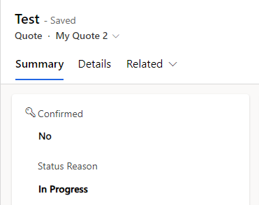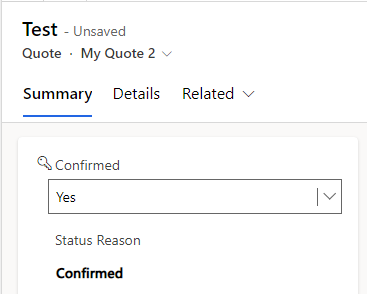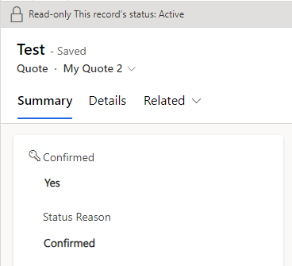

But as soon as I remove setting the Status again it stops working.

## Summary
Conclusion time. Setting Status and Status Reason does work with Business Rules, just make sure that you set Status if it needs to change, Dynamics will not do that for you if you only set the Status Reason. If however, you set only Status, the Status Reason will be automatically corrected to the default choice for the given Status. 

One caveat with this and Quotes: When revising, all fields are copied, including the _Confirmed_ field... So we need a clever solution for resetting that field too.