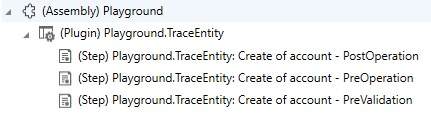

This week just some observations regarding timing that might be helpful in your solution designs. We are going to find out when Business Rules are executed within the execution pipeline and when Autonumber fields are filled by Dynamics.

## Execution Pipeline
In [the official documentation](https://learn.microsoft.com/en-us/power-apps/developer/data-platform/event-framework#event-execution-pipeline) Microsoft only lists the following Stages of the Event Pipeline:
- PreValidation
- PreOperation
- MainOperation
- PostOperation

In reality, this implies that there is also something like a MainValidation and PostOperation splits into two parts. One synchronous part is still within the transaction and one asynchronous part will be executed outside of the transaction by [the Asynchronous Service](https://learn.microsoft.com/en-us/power-apps/developer/data-platform/asynchronous-service?tabs=webapi).

So the real Event Pipeline will look something like
- PreValidation
- MainValidation
- Database Transaction
  - PreOperation
  - MainOperation
  - PostOperation
- Asynchronous

I would assume that especially Autonumber would be executed somewhere in the MainOperation and from the Audit History I know that Business Rules, unlike synchronous workflows, are not executed PostOperation. But let's find out!

## Setup
To check my theory, I wrote a simple plugin that uses the tracing service to print all attributes present in the target.

This Plugin is deployed to my Dataverse environment and registered with the Plugin Registration Tool (PRT) for PreValidation, PreOperation and PostOperation of Create of the Account entity. MainOperation is not available in this case, that would only be possible for Custom APIs or Virtual Table implementations.



For the Business Rule, I set up a Business Rule with Entity Scope and made it fill `emailaddress2` with a fixed value if it is empty. **Important**: `emailaddress2` is not on the form in this experiment because otherwise the field would already be filled when the form is submitted, meaning the value would be present before PreValidation.

For the Autonumber field, I chose the `accountnumber`, the presence of this field is the reason why I've used the account table. This field is on the form but is not filled in the tests.

## Testing
For testing, I now create accounts and check the trace logs for the plugin executions where the attributes are logged. Let's run through the results, I've marked the important lines below.

## PreValidation
```as {hl_lines=34}
account(1390bc28-44cc-ee11-9079-0022489ef7a6) 
{
    'name': 'Test 3'
    'msdyn_travelchargetype': '690970003'
    'msdyn_taxexempt': 'False'
    'creditonhold': 'False'
    'donotpostalmail': 'False'
    'donotfax': 'False'
    'donotphone': 'False'
    'donotbulkemail': 'False'
    'donotemail': 'False'
    'preferredcontactmethodcode': '1'
    'statuscode': '1'
    'msdyn_gdproptout': 'False'
    'processid': '00000000-0000-0000-0000-000000000000'
    'transactioncurrencyid': 'transactioncurrency(6f02758b-6fc2-ee11-907a-0022489bee1d)'
    'ownerid': 'systemuser(50baf8f5-0cc2-ee11-907a-0022489bee1d)'
    'donotsendmm': 'False'
    'donotbulkpostalmail': 'False'
    'accountratingcode': '1'
    'accountclassificationcode': '1'
    'isprivate': 'False'
    'territorycode': '1'
    'businesstypecode': '1'
    'shippingmethodcode': '1'
    'marketingonly': 'False'
    'followemail': 'True'
    'merged': 'False'
    'address2_addresstypecode': '1'
    'customersizecode': '1'
    'participatesinworkflow': 'False'
    'address2_shippingmethodcode': '1'
    'address2_freighttermscode': '1'
    'accountnumber': '1000'
}
```

## PreOperation
```as {hl_lines=[19,43]}
account(1390bc28-44cc-ee11-9079-0022489ef7a6) 
{
    'territorycode': '1'
    'msdyn_travelchargetype': '690970003'
    'address2_shippingmethodcode': '1'
    'accountid': '1390bc28-44cc-ee11-9079-0022489ef7a6'
    'followemail': 'True'
    'donotbulkemail': 'False'
    'donotsendmm': 'False'
    'createdon': '2/15/2024 8:52:48 PM'
    'statecode': '0'
    'isprivate': 'False'
    'businesstypecode': '1'
    'donotpostalmail': 'False'
    'owningbusinessunit': 'businessunit(5eb3f8f5-0cc2-ee11-907a-0022489bee1d)'
    'ownerid': 'systemuser(50baf8f5-0cc2-ee11-907a-0022489bee1d)'
    'donotbulkpostalmail': 'False'
    'name': 'Test 3'
    'accountnumber': '1000'
    'address2_addresstypecode': '1'
    'donotphone': 'False'
    'transactioncurrencyid': 'transactioncurrency(6f02758b-6fc2-ee11-907a-0022489bee1d)'
    'modifiedby': 'systemuser(50baf8f5-0cc2-ee11-907a-0022489bee1d)'
    'donotemail': 'False'
    'statuscode': '1'
    'modifiedonbehalfby': ''
    'preferredcontactmethodcode': '1'
    'msdyn_gdproptout': 'False'
    'accountratingcode': '1'
    'createdby': 'systemuser(50baf8f5-0cc2-ee11-907a-0022489bee1d)'
    'donotfax': 'False'
    'merged': 'False'
    'customersizecode': '1'
    'marketingonly': 'False'
    'processid': '00000000-0000-0000-0000-000000000000'
    'shippingmethodcode': '1'
    'msdyn_taxexempt': 'False'
    'creditonhold': 'False'
    'modifiedon': '2/15/2024 8:52:48 PM'
    'participatesinworkflow': 'False'
    'accountclassificationcode': '1'
    'address2_freighttermscode': '1'
    'emailaddress2': 'test@marius-wodtke.de'
}
```

## PostOperation
```as {hl_lines=[19,43]}
account(1390bc28-44cc-ee11-9079-0022489ef7a6) 
{
    'territorycode': '1'
    'msdyn_travelchargetype': '690970003'
    'address2_shippingmethodcode': '1'
    'accountid': '1390bc28-44cc-ee11-9079-0022489ef7a6'
    'followemail': 'True'
    'donotbulkemail': 'False'
    'donotsendmm': 'False'
    'createdon': '2/15/2024 8:52:48 PM'
    'statecode': '0'
    'isprivate': 'False'
    'businesstypecode': '1'
    'donotpostalmail': 'False'
    'owningbusinessunit': 'businessunit(5eb3f8f5-0cc2-ee11-907a-0022489bee1d)'
    'ownerid': 'systemuser(50baf8f5-0cc2-ee11-907a-0022489bee1d)'
    'donotbulkpostalmail': 'False'
    'name': 'Test 3'
    'accountnumber': '1000'
    'address2_addresstypecode': '1'
    'donotphone': 'False'
    'transactioncurrencyid': 'transactioncurrency(6f02758b-6fc2-ee11-907a-0022489bee1d)'
    'modifiedby': 'systemuser(50baf8f5-0cc2-ee11-907a-0022489bee1d)'
    'donotemail': 'False'
    'statuscode': '1'
    'modifiedonbehalfby': ''
    'preferredcontactmethodcode': '1'
    'msdyn_gdproptout': 'False'
    'accountratingcode': '1'
    'createdby': 'systemuser(50baf8f5-0cc2-ee11-907a-0022489bee1d)'
    'donotfax': 'False'
    'merged': 'False'
    'customersizecode': '1'
    'marketingonly': 'False'
    'processid': '00000000-0000-0000-0000-000000000000'
    'shippingmethodcode': '1'
    'msdyn_taxexempt': 'False'
    'creditonhold': 'False'
    'modifiedon': '2/15/2024 8:52:48 PM'
    'participatesinworkflow': 'False'
    'accountclassificationcode': '1'
    'address2_freighttermscode': '1'
    'emailaddress2': 'test@marius-wodtke.de'
    'msdyn_taxexemptnumber': ''
    'msdyn_travelcharge': ''
    'exchangerate': '1.000000000000'
    'msdyn_travelcharge_base': ''
}
```

## Results & Implications
This is quite far from what I expected. The Autonumber received its value before the PreValidation! In the form, Autonumber fields are empty before the first save, but they are filled before any plugin can run. 

The business rule ran somewhere between the PreValidation and PreOperation stages. So you can expect that they have been executed before your PreOperation plugins run, but not for your validation logic that you push to the PreValidation Stage.

The PostOperation stage then offers no new insights, some properties were added, like the exchange rate, but the subjects of our test are already done.

Because the Autonumber is executed before the Business Rule, this means the Business Rule can use the result in its conditions or actions. This is in contrast to Calculated fields which will be available earliest in the PostOperation stage since they are calculated upon retrieval, which is not possible PreCreate and might deliver wrong results PreUpdate.
Also, all custom Plugins can assume that the Autonumber has been executed, but PreValidation Plugins will perform their actions before the Business Rule.

## Summary
This was a short reverse engineering session and we have clarity on timing for these standard features now. Autonumber executes before the PreValidation stage and Business Rules with _Entity_ scope (aka Table scope) are executed between PreValidation and PreOperation if they were not executed on the form in the frontend anyway.

I hope this helps you in your mission to the perfect solution with the Dynamics standard functionality. My experiment here ended with the conclusion: I can use both the results of an Autonumber and a Business Rule action (_Set Value_) to feed a Calculated field which will display correctly right after saving. I just can't use another Calculated field for the Business Rule, in that case, I would have had to resort to a second Calculated field and a dependency between those two.