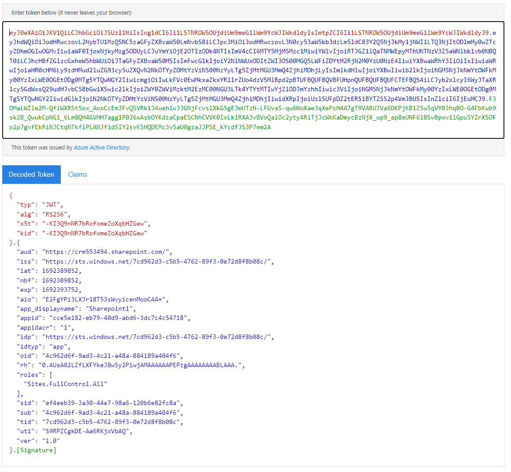

Now this is something different and very specific. So I am writing this series on [Sharepoint](/post/sharepoint) and how to [integrate it from the Dynamics Backend](/post/sharepoint/custom). And Sharepoint Online has a strange restriction for the current state of the art [Azure AD App-Only](https://learn.microsoft.com/en-us/sharepoint/dev/solution-guidance/security-apponly-azuread) authentication. It only works if you use a certificate and not with a secret. 

## Authenticating with a Secret
Lets first start with this rather easy method. There is lots of resources on the internet covering this, but its still important to cover it as a base because a lot of concepts will be similar. Of course we will be doing it without a NuGet.

Essentially we just need to send a POST request to ht<span>tps://login.microsoftonline.com/{yourtenantid}/oauth2/v2.0/token with a form content. The form content has the following 4 parameters:  
```
"grant_type": "client_credentials"  
"client_id": {yourappid}  
"client_secret": {yourappsecret}  
"scope": {whereyouareloggininto}/.default  
```
TenantId, AppId and AppSecret can be retrieved from the AppRegistration you created. 

> **_NOTE:_** Lost here? Check the section "The Portal Way" of [this article](/post/sharepoint/custom/appregistration/#the-portal-way) for some pictures and descriptions on how to create an app registration and where the _Secrets_ section is.

The scope might be a little more difficult. Usually its the url of the app your are trying to log in. So for dynamics this is something like XXX.crm.dynamics.com and for sharepoint it is the root url of the sharepoint. So for example I am trying to login to the site https://crm553494.sharepoint.com/sites/CRM that means my scope is https://crm553494.sharepoint.com/.default. Don't be fooled here, just because you authenticate to the whole sharepoint does not mean you are authorized for all sites within it. **And remember, this wont work due to the restriction that only authentication with a certificate is allowed with sharepoint!**

What you will get back is a json object that contains a property "access_token" that you will pass onto the real application in the header "Authorization" and the format "Bearer {access_token}". 

Now as C#:
```
public string PerformSPRequest(string tenantId, string resource, string clientId, string secret, string site) {
    string token;
    var form = new Dictionary<string, string>
    {
        { "grant_type", "client_credentials" },
        { "client_id", clientId },
        { "client_secret", secret },
        { "scope", $"{resource}/.default" }
    };
    FormUrlEncodedContent formContent = new FormUrlEncodedContent(form);
    var url = $"https://login.microsoftonline.com/{tenantId}/oauth2/v2.0/token"
    using (var aadClient = new HttpClient()) {
        var response = aadClient.PostAsync(url, formContent).Result;
        var responseContent = response.Content.ReadAsStringAsync().Result;
        response.EnsureSuccessStatusCode();
        token = new JavaScriptSerializer().Deserialize<AzureActiveDirectoryToken>(tokenString).access_token;
    }

    using (var spClient = new HttpClient()) {
        spClient.DefaultRequestHeaders.Authorization = $"Bearer {token}";
        var content = "..."
        var spUrl = $"{resource}/sites/{site}";
        var spResponse = spClient.PostAsync(spUrl, content).Result;
    }
}

public class AzureActiveDirectoryToken
{
    public string access_token { get; set; }
}

```
> **_NOTE:_** As already mentioned, Sharepoint will reject the token due to it being created with a secret.

## Debugging a token
This might become relevant when you are questioning why a token does not work. Paste your token to the website [jwt.ms](https://jwt.ms/)



So a token consists of a header (red), a body (blue) and a footer/signature (green). The header is general information like that we are dealing with a JWT token and that RSA256 was used as encryption algorithm. The body contains all the relevant information, like the for whom (sub) and by whom (iss) the token was issued, how long is it valid (exp) etc. and so on. And the footer is a signature of the body. This makes sure noone alters the body, for example extending the validity of an expired token. If you then check the signature against the body it would be invalid.
And in the end all 3 parts are encoded as Base64 and split with dots, this is why they are so easy to analyse since the body is just a Base64 encoded JSON.

Also check the claims tab, this will explain you how Sharepoint knows this is a token generated by a secret: The property "appidacr" gives it away!

## Generating a certificate token with a NuGet
There are multiple that can do it, but the NuGet `Microsoft.Identity.Client` is the current official one by Microsoft.

```
using Microsoft.Identity.Client;
using System.Security.Cryptography.X509Certificates;

public string PerformSPRequest(string tenantId, string resource, string clientId, string secret, string site) {
    byte[] bytes = Convert.FromBase64String(secret);
    var cert = new X509Certificate2(bytes);

    var client = ConfidentialClientApplicationBuilder.Create(clientId)
        .WithCertificate(cert)
        .WithAuthority($"https://login.microsoftonline.com/{tenantId}").Build();

    var authenticationResult = client.AcquireTokenForClient(new string[] { $"{resource}/.default" }).ExecuteAsync().Result;

    using (var spClient = new HttpClient()) {
        spClient.DefaultRequestHeaders.Authorization = $"Bearer {authenticationResult.AccessToken}";
        var content = "..."
        var spUrl = $"{resource}/sites/{site}";
        var spResponse = spClient.PostAsync(spUrl, content).Result;
    }
}
```

As you can see I am passing the Certificate as a Base64 string here, because thats easier to store for me with Dynamics. The constructor of `X509Certificate2` can also take a file and you can work with a certificate store as well!
Nothing much more to say here, its just straight forward getting a token.

## Why I dont want to use the NuGet
Essentially because I'm a Dynamics Developer. Dynamics 365 historically takes exactly one assembly for plugins and everything has to be contained inside apart from the system libraries like System.Net and so on. Thats because they are loaded to an isolated sandbox that will only contain your library. Well not quite... Because the plugins you are running need to be provided with a connection to Dynamics, Microsofts CRM SDK is loaded as well and some more libraries, like `Microsoft.IdentityModel.Clients.ActiveDirectory` which is likely used for the login. And this library can actually achieve a certificate authentication! But unfortunately Microsoft has also marked this library deprected in favor of Identity.Client, so you would rely on it. Also this is a pretty specific dependency that could just stop working if Microsoft migrates to Identity.Client themselves and we have absolutely no idea when it will break. So not a good option for production use cases.

But what about `Microsoft.Identity.Client`? Its not loaded to the sandboxes, we could ILMerge it to our assembly! Yes, but thats unsupported. The new Dependent Assembly Plugins feature can actually include this by packaging it together with the real assembly as a NuGet to upload. And it does work: In my [first shot post](/post/my-first-shot/plugin-packages/) about this, this was the exact NuGet to include because of this exact challenge with Sharepoint.

But this feature is preview at the time of writing, none of the tooling other than the PRT (Plugin Registration Tool) supports it and frankly it does not go that well with existing project. 

And when discussing this option again a colleague opened my eyes here with the comment "did you run this with [Fiddler](https://www.telerik.com/fiddler/fiddler-classic) and checked what they [Microsoft] are doing?" Well, so I closed as much programs as possible, ran an Integration Test from Visual Studio and had the result that we are going to talk about next.

## Doing it without a NuGet
So what is used here is quite cool: Instead of a classic 3 way handshake where AAD sends a challenge, you encrypt it with the Certificate and send it back, a self-signed JWT token is used.

This token is issued by me for me and is signed by myself. When it is sent to AAD, it can check with the public part of the certificate that the signature is correct and can therefore be sure that the token, that only has a short lifespan, is issued by the correct client.

To generate this token I went hunting in Microsofts NuGet. Luckily they do publish it opensource, therefore I was just able to grab relevant parts from there. I don't want to make a super long exhibit here, so I will provide you with links to all relevant files in their repository instead and only print my own part to the article:

- JWT Models: https://github.com/AzureAD/microsoft-authentication-library-for-dotnet/blob/bfe765c6fe5da6f73aabfb3b7fe865ab83bf79dd/src/client/Microsoft.Identity.Client/public/JsonWebToken.cs
- Signing a JWT Token: https://github.com/AzureAD/microsoft-authentication-library-for-dotnet/blob/bfe765c6fe5da6f73aabfb3b7fe865ab83bf79dd/src/client/Microsoft.Identity.Client/PlatformsCommon/Shared/CommonCryptographyManager.cs 
- Base64Conversions: https://github.com/AzureAD/microsoft-authentication-library-for-dotnet/blob/bfe765c6fe5da6f73aabfb3b7fe865ab83bf79dd/src/client/Microsoft.Identity.Client/Utils/Base64UrlHelpers.cs

> **_NOTE:_** I modified and stripped the classes to then not need other things like System.Text.Json and for example the Base64UrlHelper we only need Encode.

And with these Classes in place, the code from above looks like this:
```
using System.Security.Cryptography.X509Certificates;

public string PerformSPRequest(string tenantId, string resource, string clientId, string secret, string site) {
    byte[] bytes = Convert.FromBase64String(secret);
    var cert = new X509Certificate2(bytes);

    var jwt = new JsonWebToken(new CommonCryptographyManager(), clientId, $"https://login.microsoftonline.com/{tenantId}/oauth2/v2.0/token");
    var signedToken = jwt.Sign(cert, Base64UrlHelpers.Encode(cert.GetCertHash()), false);

    var form = new Dictionary<string, string>
    {
        { "grant_type", "client_credentials" },
        { "client_id", clientId },
        { "client_assertion_type", "urn:ietf:params:oauth:client-assertion-type:jwt-bearer" },
        { "client_assertion", signedToken },
        { "scope", $"{resource}/.default" }
    };
    var tokenString = Client.Post($"https://login.microsoftonline.com/{tenantId}/oauth2/v2.0/token", form);
    var token = JsonSerializer.Deserialize<AzureActiveDirectoryToken>(tokenString).access_token;

    using (var spClient = new HttpClient()) {
        spClient.DefaultRequestHeaders.Authorization = $"Bearer {token}";
        var content = "..."
        var spUrl = $"{resource}/sites/{site}";
        var spResponse = spClient.PostAsync(spUrl, content).Result;
    }
}
```

## Summary
So the key to doing a simple certificate authentication with Azure Active Directory was the "client_assertion_type" being jwt-bearer and then the task is to create a valid bearer token. The fact that Microsoft publishes its code is a big help here since the relevant classes are not that big, the stripped classes are only around 400 loc without comments. 

Therefore skipping the NuGet is absolutely valid for the use case of authenticating with a certificate and has much less side effects than switching to [Dependent Assembly Plugins](/post/my-first-shot/plugin-packages/) and will help us big time in the [Sharepoint Integration (Extended) series](/post/sharepoint/custom/).