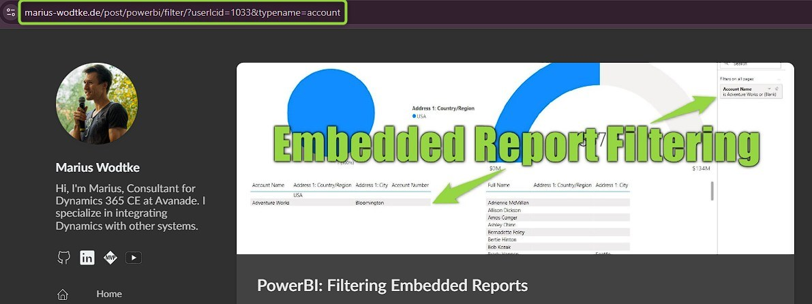

You probably have documentation for your users, right? Something describing processes, tips on how to use Dynamics and so on. Good news is: There is an easy way to link your users to this guidance!

There is this little question mark symbol in the Command Bar right next to your user profile picture. It usually links to [the Microsoft documentation](https://learn.microsoft.com/en-us/dynamics365/#pivot=business-apps&panel=customer-engagement), but we can make it link to our own pages as well.

## Enabling Custom Help in the Admin Center (Configuration)
To change the link, go to the _Power Platform Admin Center (PPAC)_ -> _Manage_ -> _Environments_. Select you Environment and go to _Settings_ -> _Product_ -> _Features_. Here you will look for a section called _Help Features_ and switch on _Custom help for customizable entities_ which will allow you to to set the _Global custom help URL_ where you enter the home page of your documentation site.

Now don't forget to hit save at the bottom to save your changes!

The changes will become active almost immediately, however, as these elements are cached, make sure to perform a "Clear Cache Refresh" when trying out the effects.

I've simply linked to my blog here and no matter where I click the help button in this environment now, it will link me to the home page of this blog.

## Context Parameters
Below the _Global custom help URL_ you will also find a checkbox _Append parameters to URL_.

If we check this and save, Dynamics will append following query-parameters to the given URL:
- **userlcid** (e.g. `userlcid=1033`)  
  The language of the logged in user
- **typename** (e.g. `typename=contact`)  
  The logicalname of the table if at a grid or form
- **entrypoint** (e.g. `entrypoint=form`)  
  Not appended for grids or dashboards, the only place I found it is when clicking help from a form
- **formid** (e.g. `formid=1fed44d1-ae68-4a41-bd2b-f13acac4acfa`)  
  Only appended on forms, contains the guid of the system form

Sample URLs reach from  
https://www.marius-wodtke.de/?userlcid=1033  
when opened from a Dashboard to  
https://www.marius-wodtke.de/?userlcid=1033&typename=contact&entrypoint=form&formid=1fed44d1-ae68-4a41-bd2b-f13acac4acfa  
when opened from a specific form.

## One link per table (Customization)
However, likely your documentation is already present and did not plan for these parameters. Or your documentation platform is simply not configurable to support these. You would have the option now to link to a proxy service that rewrites the url. For example you enter `my-proxy.com` in the PPAC and it translates the userlcid and typename parameters to route parameters instead. Calling `my-proxy.com?userlcid=1033&typename=contact` would then forward to `my-docs.com/en-US/contact`. 

However, if a) the proxy needs a dictionary because the routes do not match (e.g. `typename=mwo_article` needs to become `/Articles/`) and b) automatically resolving the language parameter is not that important, there might be an easier solution.

Navigate to your solution and select a table. Now click on _Properties_ -> _Advanced options_ -> _For this table_ and enable _Provide custom help_. Then enter the documentation for this specific table in _Help URL_ and save.

Now clicking the help button in the context of the table, no matter if you are on the grid or a form, the button will link to the link you entered for this table. If you have _Append parameters to URL_ configured, they will still be appended!

Also note, that the properties of a table are only transported with the solution if _Include table metadata_ is enabled in the _Table segmentation properties_ (you can find this under _Advanced_ at the table ribbon). If you fail to enable this, deploying the solution will not deploy the custom help link.

This option also works if custom help is not enabled for the environment in PPAC! That can be helpful for ISVs as they can link their tables to their own documentation, after all, the user won't find anything helpful in the MS docs.

## Summary
Linking your own documentation might be more helpful to the user than the official docs of MS. 
We can manipulate the help button (? in the top-right ribbon) to link to any url.

For once there is a configuration option in Power Platform Admin Center which is valid for the whole environment. This will link to a single URL and has the option to append query-parameters, most importantly containing the users language and table they are currently on.

However, many systems won't be able to interpret these parameters and thus the customization option in Make might be used. Here a URL is entered per table, which will overrule the PPAC configuration for these tables. 

Most organizations will therefore run a combination of both methods, the PPAC configuration to catch all instances that are not in the context of a table, plus links for each table that have a documentation available. If the OOTB parameters are planned from the beginning, the effort of entering the specific URL for each table may be saved, in this case no further customization is necessary.

If you do not have control over the environment because you just deliver the solution, use the customization option to pack your help links with the solution.