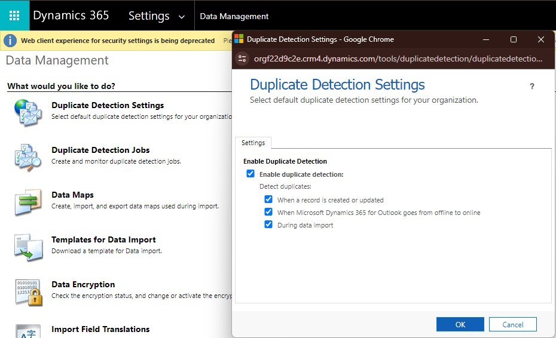
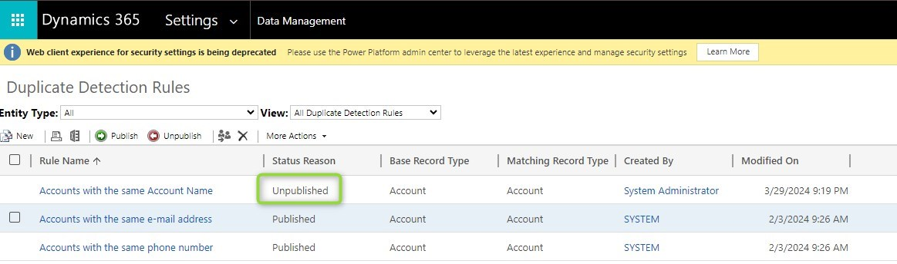
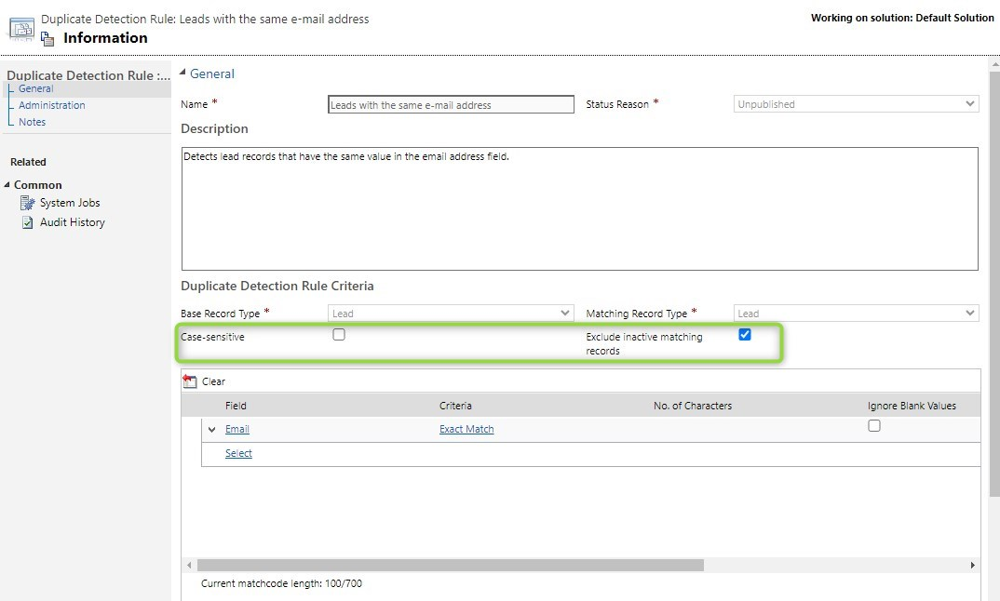
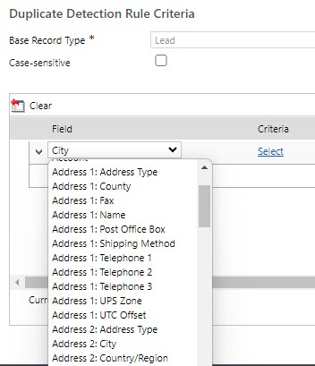
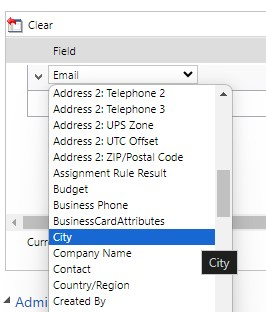
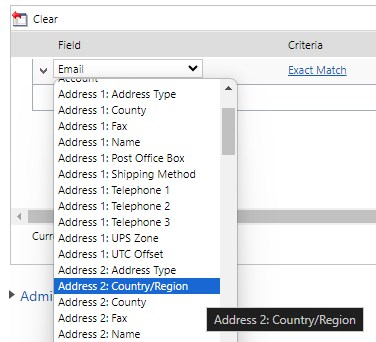

Your duplicate detection (DD) isn't working, now what? As with every problem, stay calm and we'll work our way through all the reasons why it might not be working. Well, at least all the reasons I know.

## Duplicate detection is disabled
You will find this setting in _Advanced Settings_ > _Data Management_ > _Duplicate Detection Settings_. You will want to make sure that the whole feature is enabled and your respective suboperation where you expect DD to be performed.

## Rule not published
Your rules are found in _Advanced Settings_ > _Data Management_ > _Duplicate Detection Rules_. Check that the rules that you want to apply are published and any other rule is unpublished. Notice that DD rules are unpublished upon deployment if they are included in the imported solution! That might be the reason why you have regular problems with unpublished rules.

## Rule can not be published
There is a limit of 5 rules per entity on duplicate detection rules. So if you hit this limit, the publish will fail and you will need to deactivate another rule on the same entity.

## Rule options not correct
_Case Sensitivity_ and _Exclude Inactive Records_ can severely limit the results. Think about the lead here, qualified or disqualified leads will not be taken into account.

## DD does not work on activation
Especially if you use _Exclude Inactive Records_ you might expect the records to be checked upon activation. But sadly I have to tell you that there is another limitation, DD does not work on activate/deactivate.

## Wrong field Display Name
Harder to spot is this one: You might have selected the wrong field because you have renamed the field on the form. So the Display Name of the field on the form might be _City_ in a section called _Billing Address_, you select it in the DD rule criteria and it does not yield the expected result. To check this, I would suggest going to the customizations, opening the form, then selecting the field and opening the column behind it, to check its display name.

## Duplicate Display Name
It gets nasty if in the situation above you have actually changed the display name of both _Address 1: City_ and _Address 2: City_ to _City_. They will be differentiated on the form through their respective section, but in Advanced Find, Power Automate and other places you won't be able to do so. That's why it's generally not a good idea to name 2 fields the same outside of forms, but it's manageable through trial and error still. 

However, DD takes that up a notch: In that situation, the display names in the selection get cleared of duplicates (ironic, I know) and thus, only one of the 2 City fields is shown. And what you select then is pure luck. So simple rule: If you want to use a field with DD, you can't have a second field with the same display name!

 

## Summary
I hope one of these causes hit your problem, if not, I can only wish you good luck with your further search. Remember that you also can open a ticket with Microsoft support, they are often very helpful with their insights from the backend.

