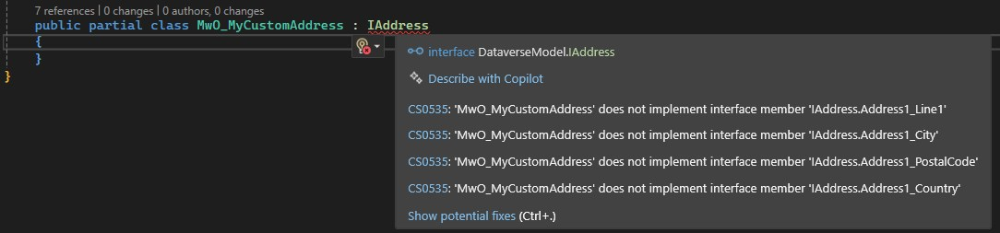

**Avoid duplication**, that's one of the principles of clean code. But sometimes this collides with our wish to work with Earlybounds, which also has the argument of **Fail early** on its side.

So, lets consider the following requirement "We would like to alleviate the user from entering the country when entering the address of an Account. It should be approximated from Line1, City and PostalCode". How this works is not relevant for my sample, but if it happens in a PreOperation-Plugin, the code would look something like this.

``` C#
private void AutocompleteCountry(ILocalPluginContext localPluginContext, Account account)
{
    if (!string.IsNullOrEmpty(account.Address1_Country))
        return;

    var guessedCountry = GuessCountry(account);
    if (string.IsNullOrEmpty(guessedCountry))
        return;

    account.Address1_Country = guessedCountry;
}
```

What's the crux now? If this works well, the next request will be "Make it happen on Contact, Lead and MyCustomAddress as well". 

## Applying interfaces
The problem now is, that we can't simply pass a Contact to the function. Even though it would have the necessary Address1_ fields, Account and Contact are two different objects for the compiler. It would work with Latebound entities, however that would loose our Fail Early advantage.

The solution is interfaces. Let's define one:
``` C#
public interface IAddress
{
    string Address1_Line1 { get; set; }
    string Address1_City { get; set; }
    string Address1_PostalCode { get; set; }
    string Address1_Country { get; set; }
    Guid Id { get; set; }
}
```

And now we only need to apply this to the given entities. Fortunately, if you are using popular tools like the Earlybound Generator (v2) from the XrmToolbox, they will define the entities as `partial`, allowing us to define additional properties. Just make sure that you are working in the same namespace as the generated class, in my sample this is the default namespace `DataverseModel`.

``` C#
namespace DataverseModel
{
    public partial class Account : IAddress
    {
    }

    public partial class Contact : IAddress
    {
    }

    public partial class Lead : IAddress
    {
    }
}
```

And that's it for Contact and Lead. You will now understand why I chose this specific address sample, the entities simply comply to the interface and we can go on to adapt our country logic.

``` C#
private void AutocompleteCountry(ILocalPluginContext localPluginContext, IAddress address)
{
    if (!string.IsNullOrEmpty(address.Address1_Country))
        return;

    var guessedCountry = GuessCountry(address);
    if (string.IsNullOrEmpty(guessedCountry))
        return;

    address.Address1_Country = guessedCountry;
}
```

This worked without any weird passing of `Func` for getters and `Action` for setters, splitting out the parameters for `GuessCountry` and so on. No, simply the input was changed to `IAddress` and since the Account is and `IAddress`, we can pass it.

## Making entities comply
But if we try the same for the MyCustomAddress, problems appear.



The only way to make it comply would be to name the logical names as close to the Address1_ fields as possible and somehow get rid of the inevitable publisher prefix in the generated class. That sounds like more effort than duplication and might be completely unreasonable if there is already data in the table.

Fortunately there is a better solution!

``` C#
namespace DataverseModel
{
    public partial class MwO_MyCustomAddress : IAddress
    {
        public string Address1_Line1
        {
            get => MwO_Line1;
            set => MwO_Line1 = value;
        }
        public string Address1_City
        {
            get => MwO_City;
            set => MwO_City = value;
        }
        public string Address1_PostalCode
        {
            get => MwO_PostalCode;
            set => MwO_PostalCode = value;
        }
        public string Address1_Country
        {
            get => MwO_Country;
            set => MwO_Country = value;
        }
    }
}
```

As you can see, I can simply rewire the Properties to write the desired fields. When the logic reads `Address1_City`, it will redirect to `MwO_City` which (in the generated code) returns `this.GetAttributeValue<string>("mwo_city")`.  
When the logic sets `Address1_Country` it will redirect to `MwO_Country`which (in the generated code) calls `this.SetAttributeValue("mwo_city", value)`. The fields can be used interchangeably.

Simple to read and without any further problems we can pass our custom address table into the function. This is the method you will use in many scenarios where the entities won't line up as nice as the Address1_ fields do. If it is really a one time edge case where logic is applied to fields that are not close or don't have a natural naming, you can even consider inventing a separate prefix and route the fields in all entities, e.g. TaxCodes_Country (-> to not confuse with an address country here).

## Summary
When logic should be applied the same way to multiple tables, applying interfaces to the given Earlybound entities is a great way of achieving reusable code that avoids duplication. This is possible because Earlybound entities are usually marked as partial and thus can be extended.

You first define an interface with properties. Then you create another definition of an entity in a separate file - not in the Earlybounds folder - with the same namespace as the original Earlybound definition. Apply the interface to the new (partial) class.

If your table does not and maybe cannot fit the property names in the interface, you can simply rewire the getter and setter to the property you would like to work with. Once all entities are prepared with the interface, you simply swap the concrete entity with the interface in your logic and can now pass all relevant tables to the code.

Below you will find a short writeup of all the syntax we've used. Everything that is enclosed in _ (underscore) should be replaced with your own variable names.

``` C#
namespace _InterfaceNameSpace_ 
{
    public interface _MyInterface_
    {
        string _MyCommonProperty_ { get; set; }
        string _MyPropertyWrittenDifferently_ { get; set; }
    }
}


namespace _EarlyboundNameSpace_
{
    public partial class _MyEntity_ : _MyInterface_
    {
        string _MyPropertyWrittenDifferently_ 
        { 
            get => _MyActualProperty_; 
            set => _MyActualProperty_ = value; 
        }
    }
}

namespace _LogicNameSpace_
{
    public class _MyLogic_ {
        public void _MyFunction_(_MyInterface_ record) {
            // Do stuff with multiple tables!
        }
    }
}
```