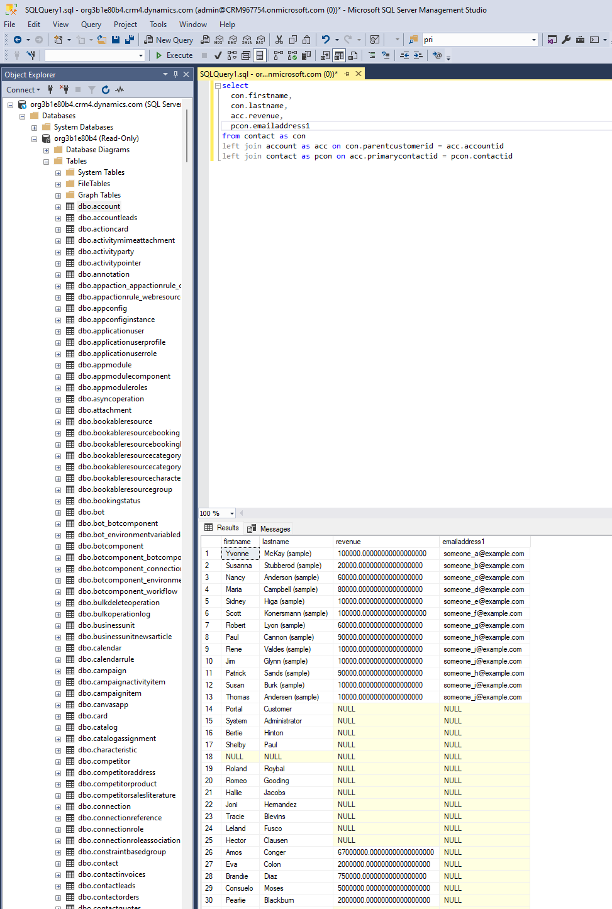
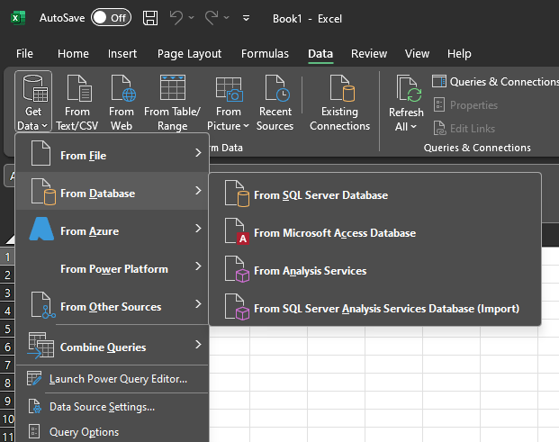
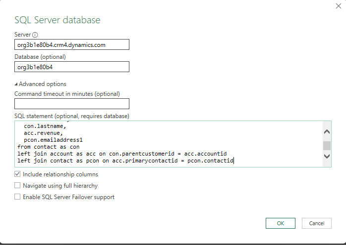
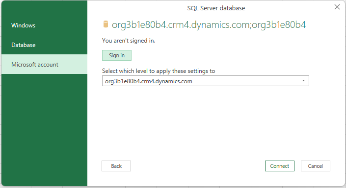
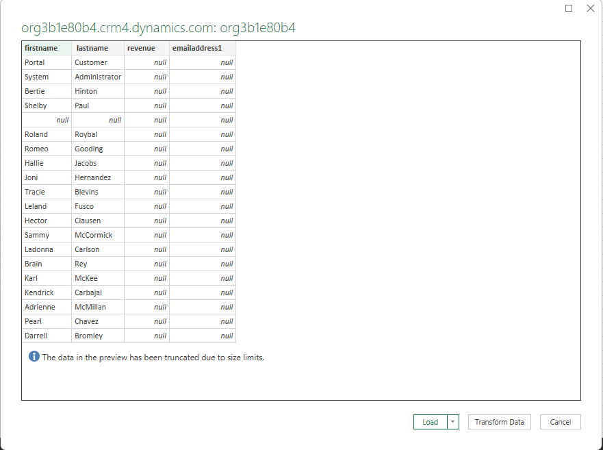
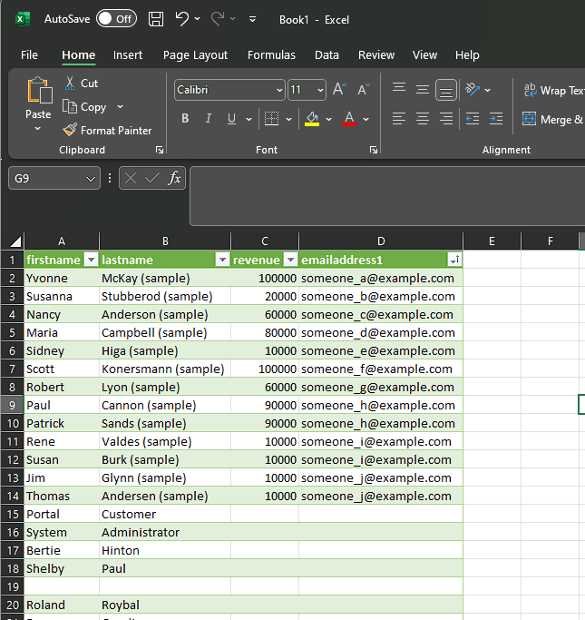

Hopefully this article just comes out as a "short tip" regarding Excel and Dynamics. I do assume you know the standard tools, you can select the _Export to Excel_ option on a grid to open the records in Excel. There are multiple options with _dynamic_ and _static_ worksheets as well as an online option. The other thing is the _Excel Templates_, hey can predefine some evaluations and visualizations of the data. 

## The limitations
There are two limitations I want to discuss here: The options wont export more than 100.000 rows and you can only show columns one lookup deep. The first limitation is pretty clear, but let me give you a sample for the second one. 

Lets assume you have a contact view. You want to display the annual revenue of the account (parentcustomerid), that's no problem for Dynamics. But if I now want to also display the email address of the accounts primary contact (primarycontactid) as well, thats not possible with the OOTB options.

And since we cant define the view, we can also not export it to Excel.

> **_NOTE:_** You can define such a view with the _FetchXml Builder_ in the _XrmToolbox_, but it will not behave correct. E.g. it wont display a name for the "illegal" column and in my testing the view also broke the Excel features.

## A solution
We can overcome both problems with the PowerQuery feature of Excel. PowerQuery is the language that powers PowerBI ([read more here](/powerbi/)) and does not use FetchXML to get data. Instead it uses the readonly SQL Endpoint and that means it does not share many of the limitations of FetchXML based integrations.

So I have written the query in SQL, entered it in the _Get Data_ dialog, authenticate to dynamics and then it loads the data. See below, pictures tell more than a thousand words here.

> **_NOTE:_** The concrete requirement here involved 9 joins (one to the parent entity and then 8 different lookups from there) and a few hundred thousand rows, which took the SQL Server 1-2 minutes to refresh the worksheet. 

## The catch
Well, the catch is: You cant upload it to Dynamics! This file gets all the data and then the user has to define the filters in Excel. That can be a good or a bad thing based on your users. Also, while you can use it for importing changed data to the base entity with a data map, there is nothing like a _dynamic worksheet_ here, as mentioned, the SQL connection is read only. 

## Summary
To summarize, with the SQL endpoint of Dynamics you can export more than 100.000 rows and as many joined records as you like to Excel. But in return you are loosing a lot of the integration that lies within the excel features because you are now accessing the SQL endpoint raw. While it can be the only option to generate such an excel for the user, the acceptance of them having to open a file, refresh the data and then filtering it to their needs might vary a lot based on your organization. Do your users love Excel anyways? Then this will be second nature to them. Are they used to Dataverse and the Advanced Find filters? They might simply hate it...