We have several options for notifying the user of something from the frontend. However, [the Client API documentation](https://learn.microsoft.com/en-us/power-apps/developer/model-driven-apps/clientapi/reference) does not picture many of these ways. So this post shall work as a reference for discussions, since it takes time to prepare a demo, especially if the business has no previous experience and needs all the options. Please note that [In-App Notifications](https://learn.microsoft.com/en-us/power-apps/developer/model-driven-apps/clientapi/send-in-app-notifications?tabs=clientapi) are missing! This is because I don't think this should be a tool for the frontend but rather for the backend.

## Setup
To demonstrate the methods, I've set up ribbon buttons on a custom entity in a custom app. Then I recorded a short gif of each method. The following sections will consist of a short explanation, a code sample and those videos. A short tip for the gifs: If they look a little bit grainy on your browser, you can click on them to enlarge them to the native resolution.

If you want to have a closer look, check [the accompanying repository](https://github.com/Kunter-Bunt/D365JSWarningOptions). For a quick look and feel I recommend the managed solution as it can be uninstalled cleanly after your experiments.

## Form Notifications
The name suggests it, these are for the form. Therefore to show this, a formContext is needed. Alongside the message to show and a level that determines the color (INFO, WARNING or ERROR), there is also an identifier that can be used to remove the message again. In the code below this is done after 5 seconds.

``` js
// level: INFO | WARNING | ERROR
function FormNotification(formContext, level) {
    formContext.ui.setFormNotification(`Hello from ${level} Form Notification`, level, "formNotification");
    window.setTimeout(ClearFormNotification.bind(this, formContext), 5000);
}

function ClearFormNotification(formContext) {
    formContext.ui.clearFormNotification("formNotification");
}
```

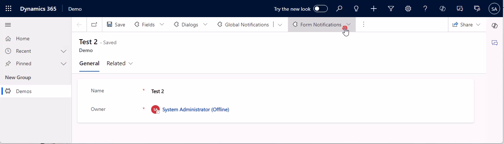

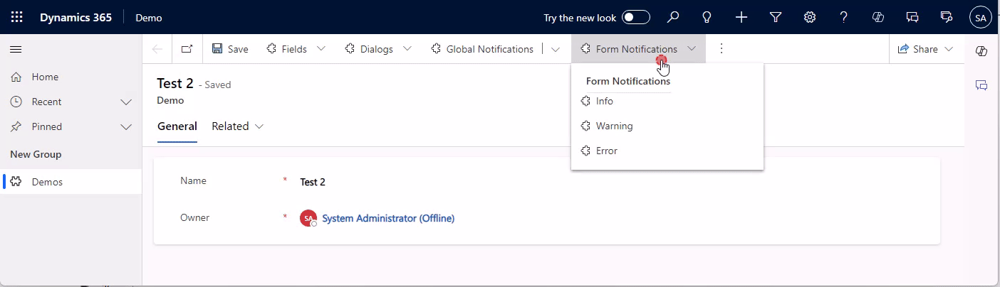

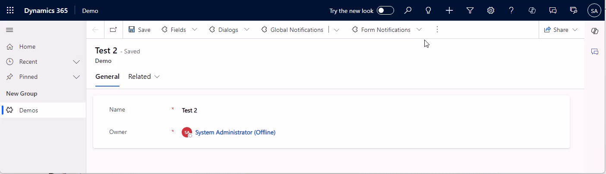

Be careful, if you are planning multiple notifications on the same form, as soon as you have two, they will be folded. And while the top level keeps the color of the highest level, the unfolded notifications are gray and the level is only shown in the icon, making it harder to differentiate them. 

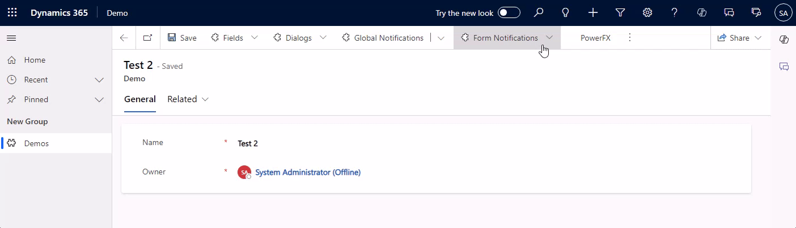

## Global Notifications
Compared to a form notification, a global notification is shown on the whole app, it will span wider across the navigation and above the ribbon. It also has more options! We can include an action button and a close button and also have an additional notification level of SUCCESS.

You will notice that the code is more involved, simply because there are more options and the identifier of the notification is not passed by us but is returned in the deferred. Again, I've included a sample to auto-remove the notification after 5 seconds.

``` js
// level: 1: SUCCESS | 2: ERROR | 3: WARNING | 4: INFO
function GlobalNotification(level) {
    var notification = {
        action: {
            actionLabel: "Visit Google",
            eventHandler: () => Xrm.Navigation.openUrl("https://www.google.com/")
        },
        level: level,
        message: "Hello from Global Notification",
        showCloseButton: true,
        type: 2
    };

    Xrm.App.addGlobalNotification(notification).then(
        (id) => {
            LogNotificationResult("Message set: " + id);
            window.setTimeout(ClearGlobalNotification.bind(this, id), 5000);
        }, 
        LogNotificationResult.bind(this, "Message error"));
}

function ClearGlobalNotification(id) {
    Xrm.App.clearGlobalNotification(id).then(
        LogNotificationResult.bind(this, "Message cleared"), 
        LogNotificationResult.bind(this, "Message clear error"));
}

function LogNotificationResult(message) {
    console.log(message);
}
```

Another important differentiation is the fact, that global notifications will persist a navigation, so if the form is closed, the notification stays.

Also, no formContext is needed, making this suitable for views and "global" scripts. In combination with the action button, you could for example guide a user from a view to a certain record. Or, to be quirky: You create an enable rule on a button in the application ribbon that monitors the database (via Xrm.WebApi) and if a certain state is detected, suggests the user an action. E.g. "Your weekly report is ready! [Go to Report]". But before you consider that, also look for the [In-App Notifications](https://learn.microsoft.com/en-us/power-apps/developer/model-driven-apps/clientapi/send-in-app-notifications?tabs=clientapi), which could be triggered from the backend as soon as the report is ready. The only disadvantage with those is the fact that they can take some seconds to show up, so they are not real-time, more like the same minute.

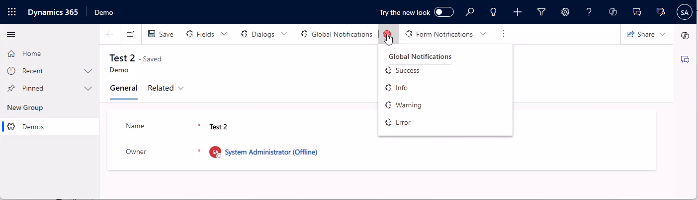

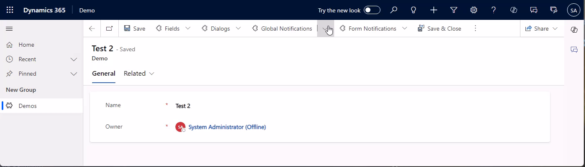


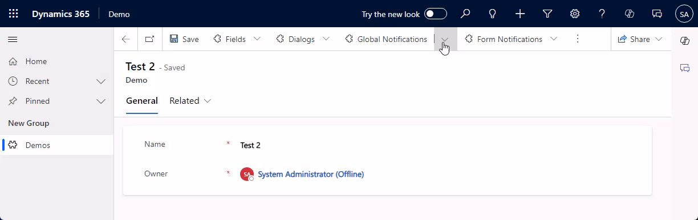

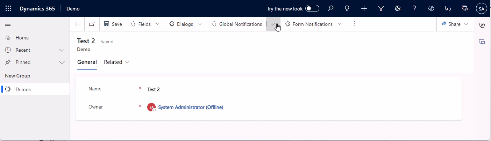

Here, the same thing regarding folding applies as with the form notifications, as soon as there are two global notifications are shown, they will fold. Note, that it is possible to show one form and one global notification without a folding happening.

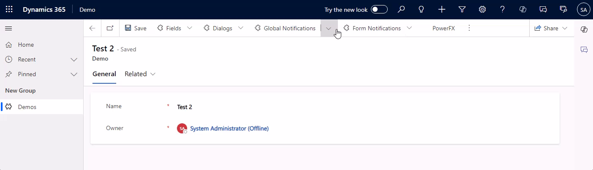

## Field Notifications
Next up are notifications for specific fields. Consider something like "The combination of values for these 2 fields is not allowed". There are 2 types, one for the control, and one for the attribute. Both will block saving (in contrast to the other errors we showed before). I do prefer the notification on the control since it provides immediate feedback to the user. But maybe you want to prevent exactly that and defer the error to saving, assuming the user will correct the error on his own anyway...

In terms of coding, the control notification is pretty similar to the form notifications we've already seen, there is just no level, it's always ERROR. The attributes method setIsValid is different in that there is no id for the notification, there can only be one per attribute, and it's either valid or not.

``` js
function AttributeValidation(formContext, valid) {
    formContext.getAttribute("mwo_name").setIsValid(valid, "Hello from Attribute Validation");
    window.setTimeout(AttributeValidation.bind(this, formContext, true), 10000);
}

function ControlNotification(formContext) {
    formContext.getControl("mwo_name").setNotification("Hello from Control Validation" , "controlNotification");
    window.setTimeout(ClearControlNotification.bind(this, formContext), 5000);
}

function ClearControlNotification(formContext) {
    formContext.getControl("mwo_name").clearNotification("controlNotification");
}
```

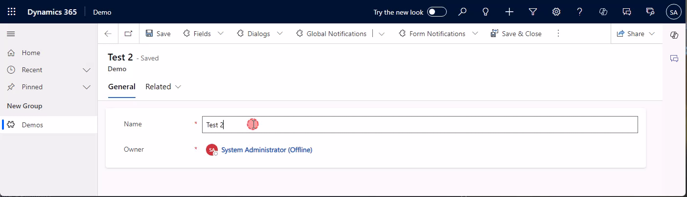

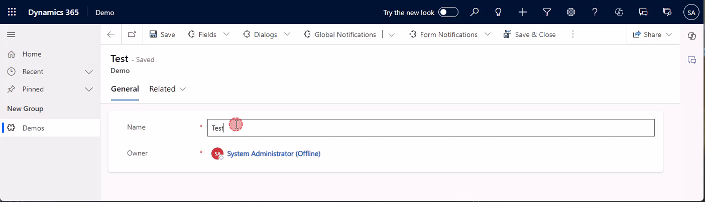

## Dialogs
Dialogs are very "in your face". Which can be good or bad of course. Alert Dialogs have exactly one button to close them, Confirm Dialogs have two options and we can determine which one the user clicked. Error dialogs have 2 variants, one with an error code, and one with a custom message. The error codes receive their text from a [predefined list](https://learn.microsoft.com/en-us/power-apps/developer/data-platform/reference/web-service-error-codes) of MS, so this is especially useful if you want to pass on an error you received from the backend. For all other types of errors, you can use a custom message. You can also provide details, which will be part of the downloadable log.

Note that dialogs can't be closed by code, they are designed to be dismissed by the user.

``` js
function AlertDialog() {
    var alertStrings = { confirmButtonLabel: "OK", text: "Hello from Alert Dialog", title: "Dialog Title" };
    var alertOptions = { height: 120, width: 260 };
    Xrm.Navigation.openAlertDialog(alertStrings, alertOptions).then(
        function (success) {
            console.log("Alert dialog closed");
        },
        function (error) {
            console.log(error.message);
        }
    );
}

function ConfirmDialog() {
    var confirmStrings = { cancelButtonLabel: "Skip", confirmButtonLabel: "OK", text:"Hello from Confirm Dialog", title:"Dialog Title" };
    var confirmOptions = { height: 200, width: 450 };
    Xrm.Navigation.openConfirmDialog(confirmStrings, confirmOptions).then(
    function (success) {    
        if (success.confirmed)
            console.log("Dialog closed using OK button.");
        else
            console.log("Dialog closed using Skip button or X.");
    });
}

function ErrorDialogCode() {
    var errorOptions = { errorCode: -2147135487, details: "Details from Error Dialog" };
    Xrm.Navigation.openErrorDialog(errorOptions).then(
        function (success) {
            console.log(success);        
        },
        function (error) {
            console.log(error);
        });
}

function ErrorDialogMessage() {
    var errorOptions = { message: "Hello from Error Dialog", details: "Details from Error Dialog" };
    Xrm.Navigation.openErrorDialog(errorOptions).then(
        function (success) {
            console.log(success);        
        },
        function (error) {
            console.log(error);
        });
}
```

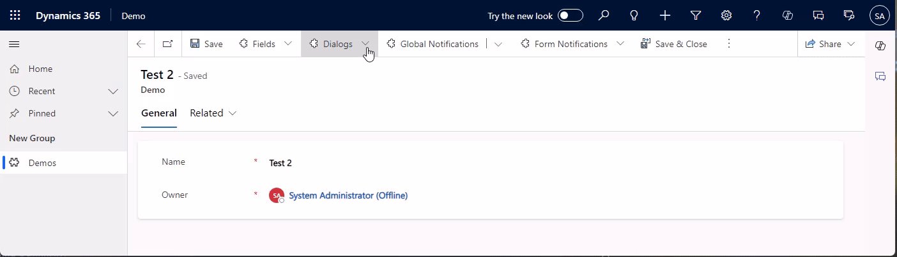


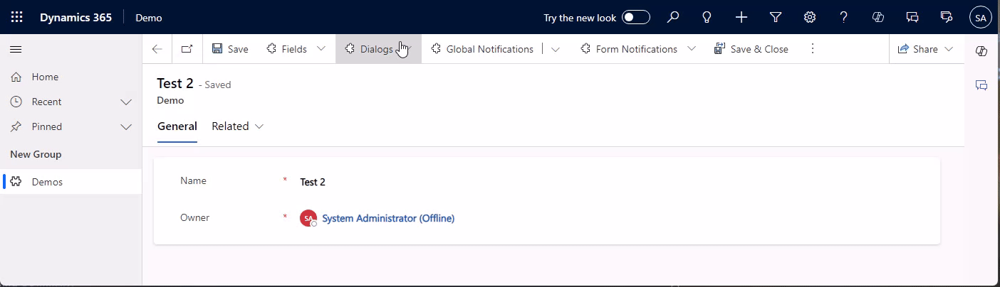

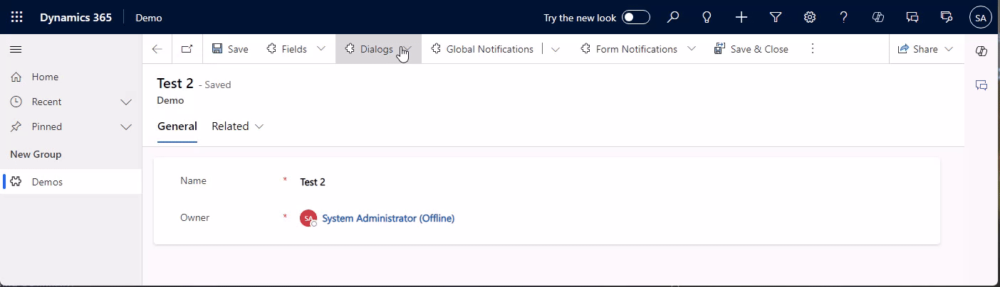

If you download the logs, it will contain the error details you passed to the function.
```
Exception Message: -2147135487

ErrorCode: -2147135487
HexErrorCode: 0x80055001
Error Details: Details from Error Dialog

Activity Id: f42dc166-c52b-4841-a01e-298afff445a1
```

## PowerFX (Modern Commanding)
And finally PowerFX. This became relevant with modern commanding, where you can create ribbon buttons with a Low Code approach. This has only one option, Notify. This is optically translated to a global notification but does not have all its parameters. It only has a message, level and a timeout can be passed.

```
// NotificationTypes: Success, Error, Warning, Information
Notify("Hello from PowerFX", NotificationType.Information, 5000)
```

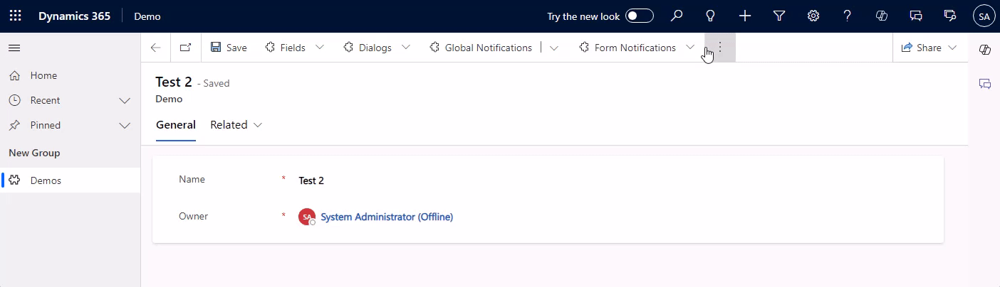

## Summary
While our options with JavaScript are numerous, PowerFX is rather limited in terms of notifying the users. However, it's only available in the ribbon right now and not for form scripting, so this is not that big of a deal. If you need more flexibility, use JavaScript, here you can not only show notifications on the app level but also the form and field level, additionally, dialogs can be used as a hard prompt to the user.

I hope this helps you imagine the user experience you want to provide, have a nice refinement!