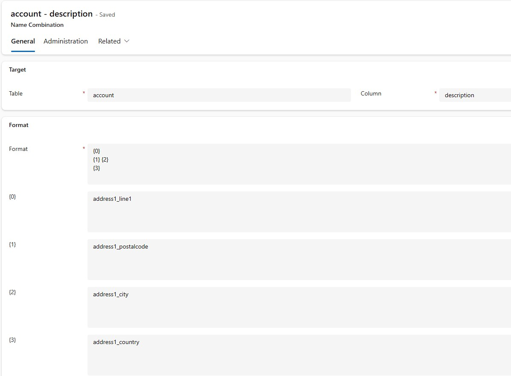
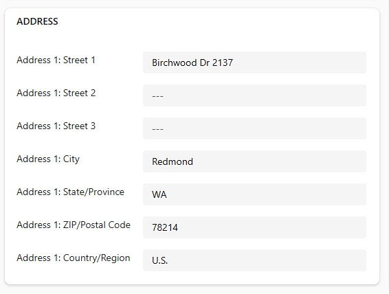
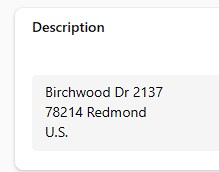
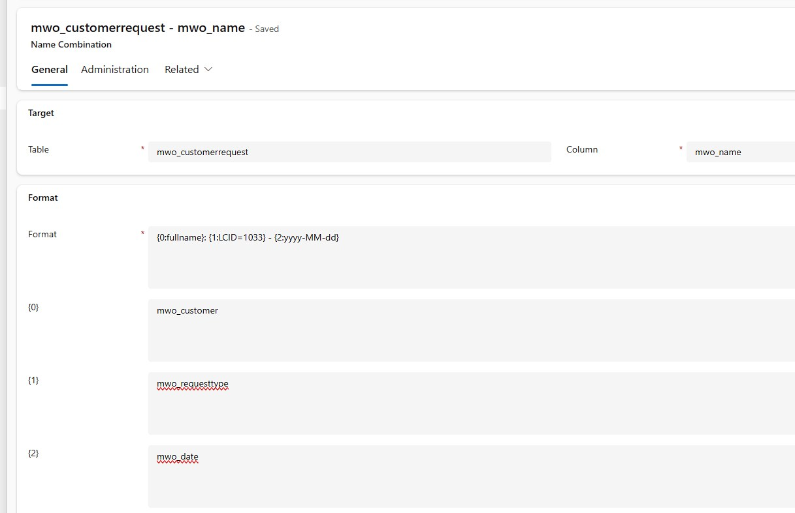
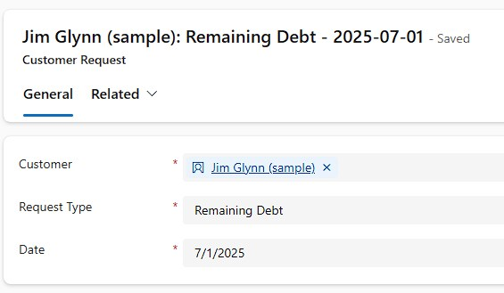
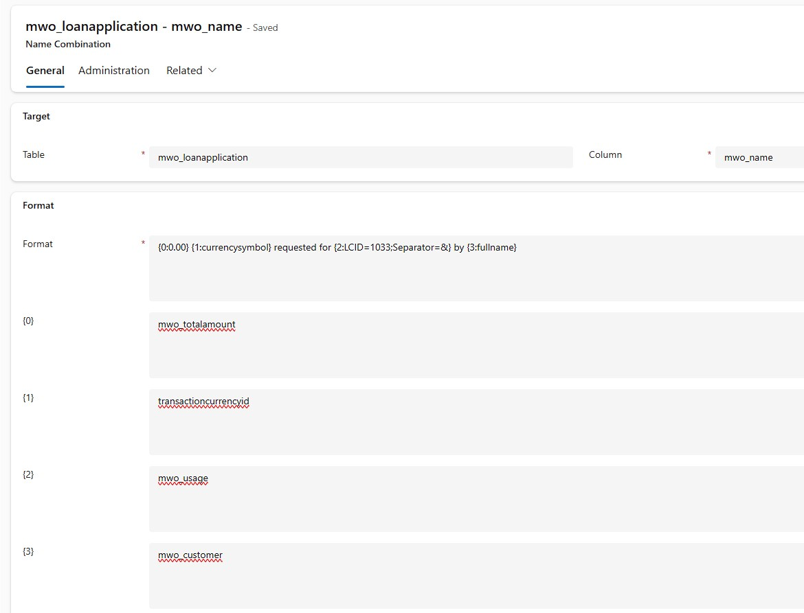
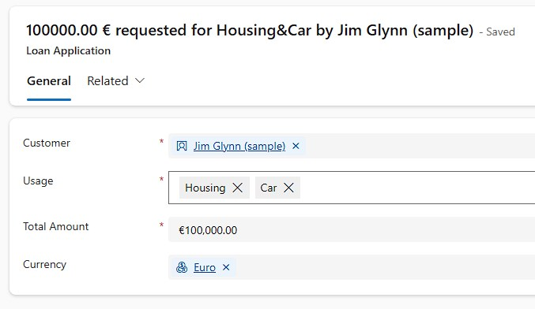

Back when I started this blog, I wrote [a series of articles about Plugin Self Registration](/post/plugin-self-registration/) and it featured a specific use case for this technique in form of the [D365NameCombiner](https://github.com/Kunter-Bunt/D365NameCombiner) which was introduced in "[Putting it into practice](post/plugin-self-registration/praxis/)".

In this post I want to revisit this tool as I still think it's very relevant and just lacks some advertisement and samples.

## The Basics
The D365NameCombiner is installed as a managed solution that comes with the app _Name Combiner Administration_ where you create _Name Combinations_. These specify and table, a target column and a formula(/format) for this column. This format is then applied synchronously whenever one of the fields below change.

To have a very basic example, lets take a combined address format that is commonly used in german speaking countries.
```
Street Streetnumber
Zip City
Country
```

To combine this into a single field the following Name Combination is created.



 

A main advantage here is that this is applied synchronously. A flow doing the same thing would introduce a delay, which could be detrimental if someone tries to print the address right after changing it. They would now persist the old address in the generated document.

This whole sample is really for illustration only. For once _address1_composite_ does have a very similar format already (it just swaps zip and city) and for example a Word Template for a letter could combine the address from the separate columns anyways. So in the next sections we will dive into some more practical scenarios.

## The Request
In this sample a bank employee shall log the type of a customer request, for example _Balance_ or _Remaining Debt_, in a custom entity. As any entity, this needs a primary column of type string that is shown for example in Lookups. However, the natural things for the employee to enter are an Optionset value (Request Type), a Lookup (Customer) and potentially a Date (Request Date). If we now combine a name in a Flow, the form will still show "New Customer Request" in the header after the request is saved until the flow has ran and the user refreshed the form, not ideal. So let's try this scenario with the D365NameCombiner.

This time, we will use additional formatters within the formula. These are behind the double-colon ":" and specify additional information for the logic. We have 
- `{0:fullname}` for the Lookup, where fullname specifies the column of the entity behind the lookup. 
- `{1:LCID=1033}` for the Optionset, where LICD=1033 specifies that the english displayname of the selected option shall be used.
- `{2:yyyy-MM-dd}` for the datetime field, which specifies that only the date part shall be printed (in ISO format) because it has the _Date Only_ subtype, making the time part unnecessary. 





## The Loan Application
Continuing with our bank employee, they record loan applications by customers. Because much more data is entered here, giving the application a name would be feasible, but in practice, the names are all over the place. Therefore the organization wants to combine a name from some required fields.

Compared to _[The Request](#the-request)_ we have 2 additional formatters
- {0:0.00} for the money field, formatting the amount to loan with 2 decimal places.
- {2:LCID=1033;Separator=&} for the Multi-Select-Optionset, specifying a separator in case the user selected multiple options.

This time the outcome is a more lengthy, but well formatted sentence.





## Summary
Generating names synchronously does not require a programmer! With the [D365NameCombiner](https://github.com/Kunter-Bunt/D365NameCombiner) solution everyone with maker knowledge can fulfill requirements for synchronous text field generation, even if methods like a formula column are not available because it is about the primary column. 

Additional formatters after a column allow for well formatted results. For example navigating to columns behind a lookup and printing the labels of optionsets.