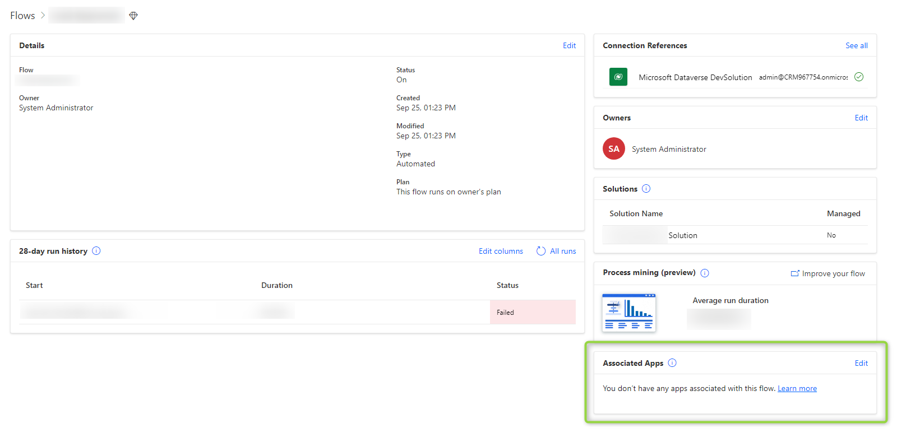
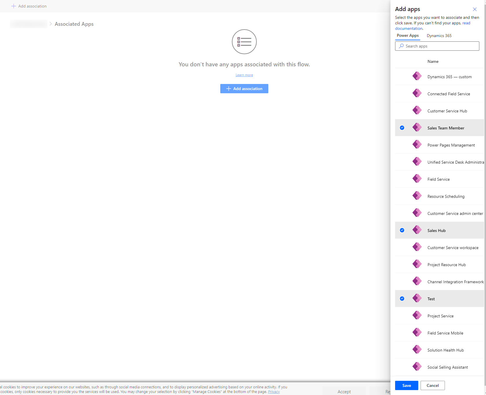
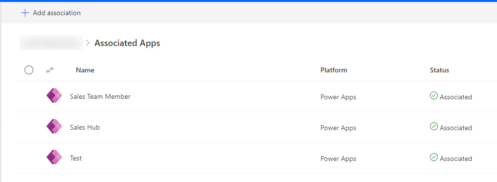
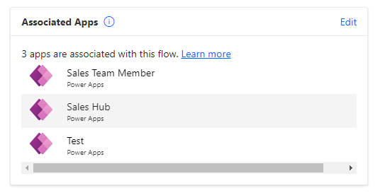

Are you using PowerAutomate (Flows) with Data? Then get ready for this change by Microsoft! 

## Multiplexing
Multiplexing is something that forbids leveraging the fact that only the owner of the flow needs a _Flow Premium_ license to offer an automation to other users. If premium connectors are used within the flow and if offers direct value to other users, those users will need a the _Flow Premium_ license as well.
There is a hole in this though: If one of the two ends (trigger or action) is directly related to a Dataverse app and the value is provided to the users of this app, the entitlement for this value can be derived from the license they have for Dataverse (e.g. _Sales Professional_, _Customer Service Enterprise_ and so on).
In some situations you still need to be carefull, e.g. think about a Flow that triggers from Dataverse and stores a document in Sharepoint. Now if this is stored for the Dataverse user that should be no problem, but if the user using the document is not a Dataverse user they might need a _Flow Premium_ license to be entitled to gain the value from that flow.

## What's new?
We will actually have to mark the flows that fall under this exception. Thats not to hard, its only the effort I'm just afraid of the effort for existing implementations with dozen or even a hundred flows.
But lets do this, select a Flow, navigate to the _Details_ and you will find the _App Association_ section at the bottom right. Then _Add Association_ and then select one or more of your Dataverse Apps. After saving the Apps will be displayed in this view as well as the _Details_ of the Flow.

And thats it! Now repeat this for all Flows and think about what apps they relate to. If you cant pin a certain app, that might be the red flag that you are currently multiplexing and the users "using" the Flow might need a license.

## Summary
This was something completely different for me, I hope you did not get bored with all that legal talk. While we talk about that: Be aware that nothing here is legal advice and the licensing guides do change regularly which may render the statements made here useless. 
For the actual matter: The change here is not to big and it should be possible to find a few hours to complete the app association within 90 days. Yet you should be aware and to be honest I think the idea of this move is for you to reevaluate if you are multiplexing and should buy additional licenses.