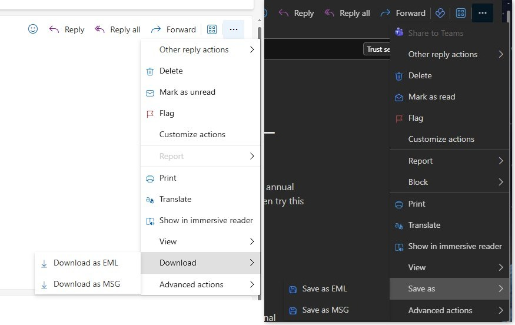
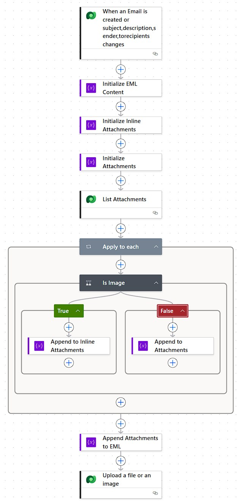
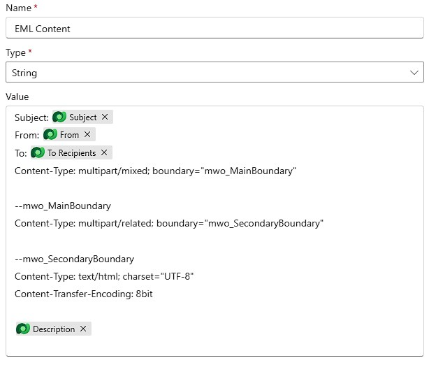
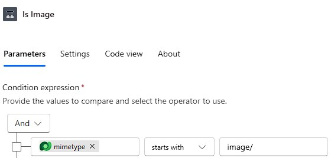
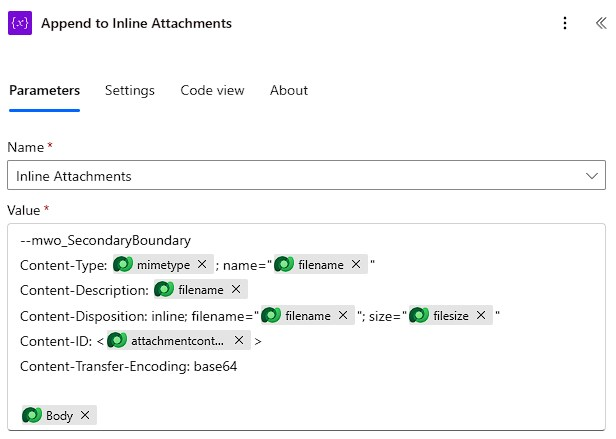
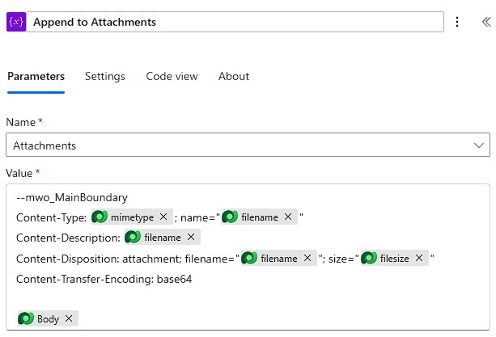
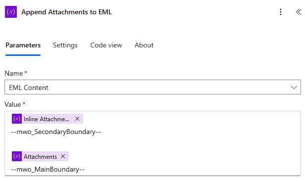
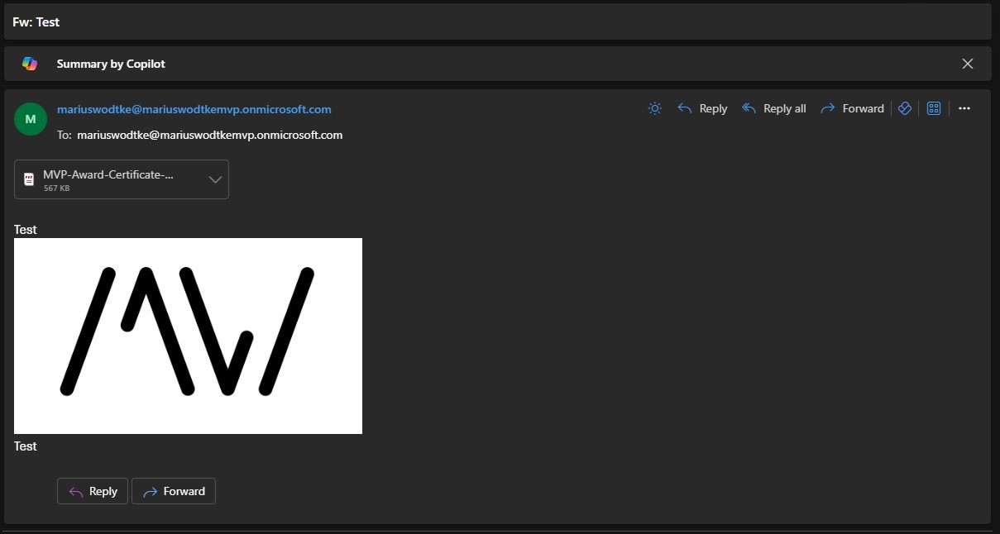

Let me use this article to give you a head start if you ever come across a similar requirement, this one was formulated as "Whenever an Email is related to an Opportunity, store it in our document management solution". I will adapt this here a bit since I don't see a good reason to communicate with a DMS in this article since yours will probably be different; instead we will store the result into a file column of the email.

This might seem to have the benefit of allowing an easy download via clicking the file in the form, however, there is a _Download_ button in the ribbon already, which can achieve this OOTB. This button uses an unbound action `_Downloademailasattachment`, one of those actions where I was unable to find documentation, rendering this option probably unsupported for our custom backend use case.

## The EML format
The well supported options for the Outlook client are .msg and .eml formats, for this article we are using EML. To get sample file simply use _Save as_ (New Outlook)/_Download_ (Web) on a single email.  



These samples usually contain A LOT OF headers, so we will take the final result of this article as it is much simpler to understand

``` text
Subject: Fw: Test
From: mariuswodtke@mariuswodtkemvp.onmicrosoft.com
To: mariuswodtke@mariuswodtkemvp.onmicrosoft.com;
Content-Type: multipart/mixed; boundary="mwo_MainBoundary"

--mwo_MainBoundary
Content-Type: multipart/related; boundary="mwo_SecondaryBoundary"

--mwo_SecondaryBoundary
Content-Type: text/html; charset="UTF-8"
Content-Transfer-Encoding: 8bit

<html><head>
... html ...
</head><body dir="ltr">
... html ...

... html ...
</body></html>

--mwo_SecondaryBoundary
Content-Type: image/jpeg; name="Logo.jpg"
Content-Description: Logo.jpg
Content-Disposition: inline; filename="Logo.jpg"; size="82277"
Content-ID: <f64c0b69-6aaf-4691-87dc-69b19df912cd>
Content-Transfer-Encoding: base64

/9j/4AAQSkZJRgABAQEAYABgAAD/ ... a lot more base64 stuff
--mwo_SecondaryBoundary--

--mwo_MainBoundary
Content-Type: application/pdf; name="MVP-Award-Certificate-25.pdf"
Content-Description: MVP-Award-Certificate-25.pdf
Content-Disposition: attachment; filename="MVP-Award-Certificate-25.pdf"; size="580208"
Content-Transfer-Encoding: base64

JVBERi0xLjcKJanNxNIKMiAwIG9 ... a lot more base64 stuff
--mwo_MainBoundary--
```

Main observations:
- We have headers with {key}: {value} notation 
- Content-Type specifies a boundary, this is usually a randomized string, I've used a descriptive one here, prefixed with my publisher prefix to avoid collision (mwo_MainBoundary). This is used as `--mwo_MainBoundary` and `--mwo_MainBoundary--` to start and end the "body"
- Inside this body another boundary is defined (mwo_SecondaryBoundary) which is used to split the html from the inline attachments (`--mwo_SecondaryBoundary`).
"Real" attachments are split by the `--mwo_MainBoundary`.
- Inline images are using an `src` attribute which is matched to the a header `Content-ID` in other parts of the multipart content. This header encloses the id in \<\> (`Content-ID: <f64c0b69-6aaf-4691-87dc-69b19df912cd>`)

Note here, that I certainly don't have all the information for headers in the sample, you might also be interested in `Date: Fri, 26 Dec 2025 03:19:03 +0000`. Just download an email that has the information you desire to find the header you are looking for!

## The Flow
I think here pictures say more than words, the main elements are a variable _EML Content_ which is filled slowly with content. The attachments of the email are listed and then iterated, images are added as inline attachments, everything else is added as normal attachment. Finally, the closing boundaries are added and the _EML Content_ is stored as a file. 
Some more notes:
- Inline attachments should be added first, because of the boundaries. This is why we are leveraging the 2 helper variables. If you want to append directly to the _EML Content_, use 2 queries with "mimetype starts with image/" and "mimetype does not start with image/" and iterate each of them instead of using the condition.
- When creating test cases, be aware that dynamics will not generate an inline attachment for images, instead it will push it as base64 directly into the image tag. To test the secondary boundary, generate an email with something like the outlook client and synchronize it into Dynamics.














## The Result


And here you see that Outlook is indeed able to visualize this email. Since I did not include the `Date` header, we don't see it in the rendered result, showing the flexibility of the EML format.

My version of this flow has a total of 9 actions, so I conclude that exporting Dynamics Email to EML files for automated processing is doable with reasonable effort.  
Please keep in mind that this is not needed for user interaction use cases. The frontend of Outlook as well as Dynamics already offer a _Download_ option for usage in not automated scenarios. However, the flow shown may help you to transfer emails in an automated fashion.