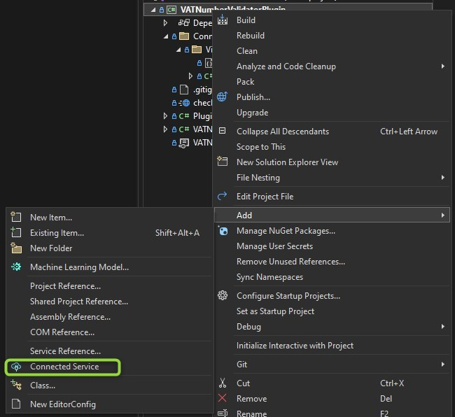
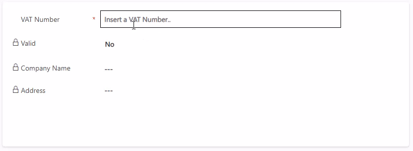

I hate CORS! It has cost me so many nerves throughout my developer career and still while I have some patterns now for myself, you can be sure that colleagues will find a way to run into these problems and approach me with wild errors.

And CORS is a topic of PCFs as well. Recently I discovered the [VAT Number Validator](https://pcf.gallery/vat-number-validator/) in the PCF Gallery and immediately thought "How did the author solve the CORS problem here?"

## The original solution
While researching that in the linked [blog article](https://www.blog.allandecastro.com/deep-dive-into-power-apps-component-framework-part-4-walkthrough-to-create-your-first-pcf-based-on-a-field/) I noticed that the author, Allan De Castro, is a colleague from France, best regards from this point.

Allan mentions the usage of https://cors-anywhere.herokuapp.com/ which as a third party may fail and is therefore not a preferred solution for enterprise use cases. The actual solution contained https://cors.bridged.cc instead which is a commercial alternative, selling the service of passing through requests with a CORS wildcard. Having a contracted party is of course better, but it still introduces the risk of a third party not being available.

## The (short) CORS explanation
CORS stands for Cross-Origin Resource Sharing. It requires that if a Website implements a request to a different domain, the server accepting the request must explicitly allow the request.

It is an important detail that this is enforced and validated by the browsers, not the server handling the request! When JavaScript performs a request in code (POST for example), the browser first sends an OPTIONS request to the server requested and evaluates the response. Is the current domain and the HTTP method allowed? Are all headers required for the actual request valid? 

All of these can be set with a wildcard at the destination, so a server can allow all operations from any domain with any headers. However, remember the first sentence "request to a different domain", so all of this is not required if your page is requesting a server on the same domain that also delivers the page itself.

## My solution in the past
I had to implement the VAT Number Validator twice in my life already, once as a backend solution and once in the frontend. At the time we were not on the PCF train yet and used plain JavaScript, but the problem remains the same, CORS does not allow you to directly call http://ec.europa.eu/taxation_customs/vies/services/checkVatService from the browser. 

Our solution there was to use the existing Azure API Management (APIM) as a proxy. You define an API on the WSDL of the European VAT Service (VIES) and add an _inbound policy_ to allow CORS from your Dynamics Environment URLs (XXX.crmY.dynamics.com). Additionally, when defining the API you can tell the APIM to perform a SOAP/REST conversion, allowing you to pass a JSON body as input which is much easier to define in JavaScript. 

SOAP body:
``` js
var soadpRequest = "<?xml version='1.0' encoding='UTF-8'?>" +
    "<SOAP-ENV:Envelope xmlns:ns0='urn:ec.europa.eu:taxud:vies:services:checkVat:types'" +
    " xmlns:ns1='http://schemas.xmlsoap.org/soap/envelope/'" +
    " xmlns:xsi='http://www.w3.org/2001/XMLSchema-instance'" +
    " xmlns:SOAP-ENV='http://schemas.xmlsoap.org/soap/envelope/'>" +
    "<SOAP-ENV:Header/><ns1:Body><ns0:checkVat>" +
    "<ns0:countryCode>" + this._vatNumberElement.value.slice(0, 2).toUpperCase() + "</ns0:countryCode>" +
    "<ns0:vatNumber>" + this._vatNumberElement.value.slice(2) + "</ns0:vatNumber>" +
    "</ns0:checkVat></ns1:Body></SOAP-ENV:Envelope>";
```

REST body:
``` js
var soadpRequest = {
    countryCode: this._vatNumberElement.value.slice(0, 2).toUpperCase()
    vatNumber: this._vatNumberElement.value.slice(2)
};
```

If there is a provisioned APIM already, this solution will be free. If you need or have a consumption-based APIM, either the 1 million free requests or 3.8 EUROCENTS(!) per 10.000 requests are quite cheap. Of course, keep in mind that these conditions and prices are a snapshot and Microsoft could change them. 

But this whole solution requires extra resources, the APIM, and thus works well in a project situation with the customers Azure subscription but not in a public PCF, so we need something different.

## Defeating CORS in Dataverse Contexts
But by now we have an easy and completely free method of defeating CORS problems in Dataverse Contexts: Custom APIs. 

This works because CORS is browser-only and allows communication to the server that is delivering the website. So the browser is calling XXX.crmY.dynamics.com which is allowed and the server code of Dynamics calls ec.europa.eu which is also allowed. 

Here is a quick rundown of how this looks.

First, you need to tell the PCF Framework that you need the webAPI in the ControlManifest.Input.xml. This by the way limits the PCF to Model Driven Apps because Portals and Canvas Apps don't have that API available in the same way. 

``` xml
<feature-usage>
    <uses-feature name="WebAPI" required="true" />
</feature-usage>
```

Then you define a request class matching the inputs of your Custom API. This is very easy here, there is just one string input "VAT".

``` js
class ValidateVATRequest {
    private readonly VAT: string;

    constructor (vat: string){
        this.VAT = vat;
    }

    getMetadata = function () {
        let metadata = {
            boundParameter: null as unknown as string,
            parameterTypes: {
                "VAT": {
                    "typeName": "Edm.String",
                    "structuralProperty": 1,
                },
            },
            operationName: "mwo_ValidateVAT",
            operationType: 0,
        };
        return metadata;
    };
}
```

Then we can instantiate that class and call the webAPIs `execute` method to invoke the API. After converting the response body to JSON we can use all outputs. I've used the original outputs of the VIES service, so we have `Valid`, `Name` and `Address` available.

``` js
var request = new ValidateVATRequest(this._vatNumberElement.value);
var response = await (this._context.webAPI as any).execute(request);
var result = await response.json();
if (result.Valid == true) {
    ...
}
```

And finally of course we need the Custom API. Apart from the records in CRM, this is a plugin class that extracts the VAT from the inputs, feeds it to the connected SOAP Service and extracts the response properties back to the output. 

``` c#
protected override void ExecuteDataversePlugin(ILocalPluginContext localPluginContext)
{
    var context = localPluginContext.PluginExecutionContext;

    string input = context.InputParameters["VAT"] as string;
    localPluginContext.Trace($"input: {input}");
    input = input.Replace(" ", "").ToUpper(); // general cleaning of input

    string country = new string(input.Take(2).ToArray());
    string vat = new string(input.Skip(2).ToArray());
    localPluginContext.Trace($"country: {country}, vat: {vat}");

    var service = new checkVatPortTypeClient();
    service.checkVat(ref country, ref vat, out bool valid, out string name, out string address);

    localPluginContext.Trace($"valid: {valid}, name: {name}, address: {address}");
    context.OutputParameters["Valid"] = valid;
    context.OutputParameters["Name"] = name;
    context.OutputParameters["Address"] = address;
}
```


## Next steps
The decision now was, is this an improvement for the existing control or should it be a fork? This is because the Custom API ties this down to Model Driven Apps which might not be wanted. But I'm in contact with Allan and it seems the Control was always aimed at Model Driven Apps anyway so the changes will be merged. Until the changes are available in [the official control](https://pcf.gallery/vat-number-validator/), you can download the control or take a look at the source code in [my fork](https://github.com/Kunter-Bunt/VATNumberValidator).

> **Update:** The Fork was merged to [the official control](https://pcf.gallery/vat-number-validator/) and is available for download.

## Demo time!


Simple and effective, you enter the VAT Number and it gets validated as well as Name and Address are resolved.

## Summary
I still hate CORS :D But when you have Dataverse as the platform, it's easy to circumvent with Custom APIs. Other frontends might require different solutions, like Flows for Canvas Apps or simply Azure API Management as a Swiss army knife, but as long as you have a server that you can program, you can get around it!