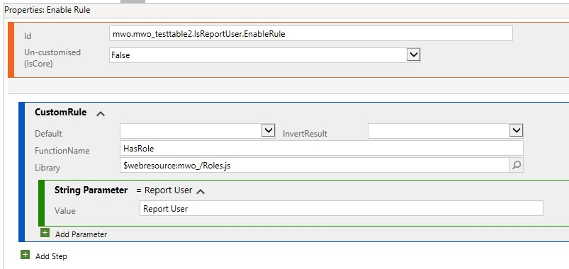

Have you heard of the requirement "When X visits (a record of) Table Y, they should not see Z", whereX is a role and Z is a button, control, section or tab? Although Dynamics works with privileges, stakeholders usually think in roles and therefore produce concepts which may only work with roles and not with privileges. And the other issue may be, that the request needs frontend scripting with JavaScript anyways and nitpicking about privileges vs roles is no value.  
If Z is a button, the discussion might be worth it! That is because there is an out of the box display rule (EntityPrivilegeRule) that can check for the presence of a privilege, that could skip a custom implementation fully. If there is no natural privilege, it may be an option to create an dummy entity for this purpose (but document this well!).

I specifically write this article because I recently came across a situation where someone implemented this hush-hush with Copilot and it used the "old" style of querying role names. And although you will find the "new" style of implementing at probably half dozen other articles, there apparently need to be more so that chances rise that humans and AI find the better way of comparing roles.

To have something concrete for our samples, lets consider this: "Only the european users have access to the the Power BI report of the (european) customer in the 'Report' Tab on the Account form. We may roll out this report for other regions soon. However, the others should not see it for now to avoid confusion and support requests regarding the missing permissions error".  
This can be solved with pure customizing by creating a copy of the form, adding the Tab, restricting it to a Role "Report User" and adding the form to the app. However, this is often unpopular with stakeholders and users when they are not used to switching forms. Therefore the scripting solution is preferred.

## Basics and the old way
Like any other record in Dataverse, Roles have Guids. However, the same role exists for every Business Unit in the environment! So if we have a Role _Report User_ and the Business Units _Root_, _Europe_ and _Asia_, _Report User_ will be present 3 times with different Guids. If you assign _Report User_ to _User1 (Europe)_ and _User2 (Asia)_ they will physically have different roles although conceptually they have "the same permissions". The quotation marks are necessary here because we have this concept on Business Units, because of their different assignments the two users will have different permissions depending on the Owning Business Unit of records.

Traditionally there was the property `Xrm.Utility.getGlobalContext().userSettings.securityRoles` to get the roles of the current user. It returned a list of Guids. However, usually you want to check for a roles name, so it needed to be retrieved and code looked something like this:

``` JS
// DO NOT USE THIS CODE, BETTER ALTERNATIVES BELOW!
function HasRole(roleNameToCheck) {
    var userRoles = Xrm.Utility.getGlobalContext().userSettings.securityRoles;
    var roleNames = [];
    var promises = [];

    userRoles.forEach(function(roleId) {
        var promise = Xrm.WebApi.retrieveRecord("role", roleId, "?$select=name").then(
            function success(result) {
                roleNames.push(result.name);
            },
            function error(error) {
                console.log("Error getting role name: ", error.message);
            }
        );
        promises.push(promise);
    });

    Promise.all(promises).then(function() {
        console.log("Roles of the user: ", roleNames, "; checking against: ", roleNameToCheck);

        return roleNames.includes(roleNameToCheck);
    });
}
```

Problematic here also, it's asynchronous, so it gets a bit more tricky in using because it is unknown how long it will take until the names are retrieved. Usually it will be below a second, but it could also be well above, resulting in poor UX.

## New an better style
Microsoft extended the Client API with a `Xrm.Utility.getGlobalContext().userSettings.roles` property some time ago, and it's much better! Its output is a list of objects and each object has a `name` and `id` property. So there is no need anymore to fire a query for every role of the user, instead we can directly use it. Here is a sample output:
``` JS
[
    { id: "e7dd9bc6-d239-ea11-a813-000d3a35b14a", name: "Report User" },
    { id: "733ea175-0aeb-4442-a634-1972703f9750", name: "Sales Team" }
]
```
The resulting code is much simpler:

``` JS
function HasRole(roleNameToCheck) {
    var userRoles = Xrm.Utility.getGlobalContext().userSettings.roles;
    var roleNames = [];
    userRoles.forEach(item=>roleNames.push(item.name));

    console.log("Roles of the user: ", roleNames, "; checking against: ", roleNameToCheck);
    return roleNames.includes(roleNameToCheck);
}
```

And if you really want it as a single line, here you go `var hasRole = Xrm.Utility.getGlobalContext().userSettings.roles.getAll().map(_ => _.name).includes(roleNameToCheck);`, but I thinks it's too long and `getAll()` is [not officially documented](https://learn.microsoft.com/en-us/power-apps/developer/model-driven-apps/clientapi/reference/collections).

Next comes a TypeScript class with the same functionality.

``` JS
export class Roles {
    static readonly ReportUser: string = "Report User";

    static HasRole(roleName: string): boolean {
        const userRoles = Xrm.Utility.getGlobalContext().userSettings.roles
        var roleNames: string[] = [];
        userRoles.forEach(item=>roleNames.push(item.name));

        console.log("Roles of the user: ", roleNames, "; checking against: ", roleNameToCheck);
        return roleNames.includes(roleName);
    }
}

// Usage:
// if (Roles.HasRole(Roles.ReportUser)) { ... }
```

And this is synchronous, so we can show/hide with minimal delay, making for a better UX than the previous solution.

## D365RibbonHelpers
In the intro I already told you: Try to switch ribbon button rules to privileges. But it is virtually the only application where you could use the code from this article in isolation. And sometimes you can't convince stakeholders to change their requirements, so maybe you need this for hiding/showing a button.

So, we create a custom enable rule, use the file `mwo_/Roles.js` and the function `HasRole`. Then we add a string parameter with the name of the role we are looking for. Now the rule is associated to the command of the button and it should work!



If you are wondering what is happening, the console log line might help you, here are outputs with and without the role of the sample:


## Summary
The addition of the `roles` property in `Xrm.Utility.getGlobalContext().userSettings` was very welcome and makes checking roles in frontend code simpler and more efficient. You can use the code samples in the article for your own implementations or leverage `mwo_/Roles.js`:`HasRole("myRole")` from the D365RibbonHelpers solution.

If you are dealing with a button, you may be better of by discussing whether the requirement can also be fulfilled with checking the presence of a privilege as this is supported by standard display rules. If your requirement is already formulated for a privilege and is not regarding a button, you may want to take a closer look at the [getSecurityRolePrivilegesInfo](https://learn.microsoft.com/en-us/power-apps/developer/model-driven-apps/clientapi/reference/xrm-utility/getglobalcontext/usersettings#getsecurityroleprivilegesinfo-method) method.