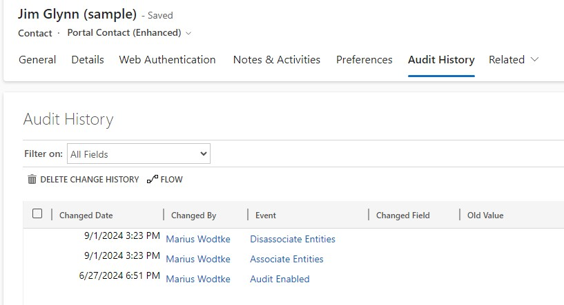

Often we have to design something that connects N records of Table A with M records of Table B. And often it is not that simple as "they are connected". More information needs to be collected, like in which way are they connected? When were they connected and when disconnected?

## When to use N:N relationships
N:N Relationships are perfect whenever there is no additional information or processing required. But I want to stress that you should discuss whether something could be on the horizon. Once we established the relationship it's hard to change it to one of the other options after it's established. 

Some information might even be retrievable for N:N relationships: If you enabled Auditing for the involved tables, you will see the associations in the Audit History. However, keep in mind that Audit Data is not that easily analyzed! 

 

One more thing to consider is processing: There is no Power Automate Trigger for Associate/Disassociate! And also if you are capable in high code, the Plugin Steps cannot be filtered down to a certain relationship. That means you will trigger on any Associate anywhere in the system and then in code you filter down to your tables. It might not sound like much, but platform operations like loading your assembly are heavy. Especially if it is synchronous logic, it will affect the whole system. Just one more sample: There is such a logic OOTB for Knowledge Article Attachments and it will affect the performance of an Associate between two custom tables.

Long story short: I advise against putting logic to Associate/Disassociate until we have effective measurements to filter on platform level. Even more so if the logic shall be synchronous as this may be a straight path to performance issues with N:N Relationships.

There is also a big advantage to N:N relationships: You can associate multiple records to the one you are currently on at the same time. Users love that feature ;)  
You will find such a relationship OOTB at the Opportunity for Competitors.

Another subtle advantage over the other methods is the fact that this is only "one table far". Some functionality in the platform can only span one table from the current record, for example Word Templates. So lets assume you'd connect the Competitors with a Connection instead of N:N, then you would only be able to print information from the Connection and not from the Competitor itself. You can sometimes get around this limitation by pulling information via calculated fields, but of course this approach does not scale.

## When to use Connections
Connections is another predefined concept by Microsoft. It is essentially what we will later look at as a "Connection Table", but it is ready to use with your Dataverse. All you need to do is activate "Can have Connections" on the table(s) and you will be able to connect that table to any other table that has connections enabled. Here comes the first disadvantage: After being enabled, it cannot be disabled again.

 

Connections not only have a "left" and "right" but they may also have roles, a description and a start and end date. And maybe important for your use case, it has the regular fields of a table like Owner, Created By, Modified On, etc. 

Connections let us capture much more information out of the box and can even be customized! We can add more fields, however you should always keep in mind that Connections are a general concept. If we have 10 different relationships we'd like to manage with this feature and define 1-2 fields for each, the user will simply be overwhelmed by the options presented on the form. 

There are some parts in the OOTB experience where MS already customized the experience for the users. The Stakeholders and Sales Team at the Opportunity are such examples. When you select + New Connection at these grids, the Select Records experience will open, you choose the Contact/User and the Connection Role will be auto-selected for you.

When you make a custom subgrid for connections on a form, the + New Connection will open a Create Form. Unfortunately for some reason Quick Create is disabled for this table... And this is problematic for the user experience when users need to associate multiple records to the current one. This is also why [other authors](https://crmtipoftheday.com/1233/make-connections-via-quick-create/) shy away from using this feature more.

One more note regarding the roles: These can represent concrete concepts, like we see here with a user being the Account Manager of a customer. We could also define the Technical Sales, Escalation Manager and Service Team Members. In an onsite event scenario we could connect Accounts to the Event as Caterer, Light Tech, Security and so on to capture which of our partners participated in the execution.  
And the best thing is that these roles can be added to a solution, so we already have an ALM process for such scenarios.

Here we have not that big of a problem with custom logic. Flows can be triggered on create or update of the Connection table and since we know the Ids of the Connection Roles even after deployment, we can even use the trigger filters.

## When to use a custom connection table
We can always build something like the Connection ourselves. Just create an table C and put Lookups to the tables A and B on it, create a form and probably a Quick create form and we are done. And because it is that easy, "complex" relationships are often built like this.

But should we? After all this is a significant customization, the resulting tables are not "standard". There are good reason why projects use these a lot and a big reason is that they are NOT generalized. So when the user opens the form what he sees has a clear purpose, not to few, not to many fields, the Lookups point exactly to the tables he needs for the current process and not half the systems tables. But when we have competent users that know their ways/are able to learn their ways around Connections, in which situations should we still lean towards a custom Connection Table?

Good identifiers are:
- You have multiple or complex logic. A custom table just offers clear separation, especially if you need fields for processing states.
- You require non general fields for your process. If you do need fields that are specific to one process they will be shown on all Connection records and their forms. Unless you do JS evaluating the connected record types. But that is a quick road to moving away from the standard and doing heavy coding.
- You are building a core business process that justifies a customized experience.

I strongly advise you to enable and create a Quick Create Form as this will speed up the association process a lot for the user. To showcase this I created a Sponsor entity that connects an Event to a Contact but also needs to additional information specific to the process (while Amount could be general, Recurring Sponsor is not) and processing information that might be updated or triggers logic (Transaction Complete).

## Summary
I think when you started to read the article you already had an idea when to use what. But it's a good idea to have some clear rules in your head why you choose one thing over another. This makes prior discussions and documentation afterwards much easier. 

You should use N:N relationships when you don't need to capture any additional information on the relationship, you don't need logic when such an association happens and will likely not need to in the future. Then you get the advantage that it is light in customization, the interface is very clear and users can associate multiple items at the same time.

You should use Connections when the information you need to capture fits the schema of this OOTB table or the use case requires little customization that is of a more generic nature. Custom logic is possible here, but it might become challenging to separate multiple logics on the same table. Users need to associate records one by one. In a system that leverages Connections a lot users have a lot of flexibility in associating records, this may be a good or bad thing depending on your user base.

When you need special fields on the relationship or heavy logic, that's a sign for custom relationships. Also complex business processes and lack of training for the users might be reasons to choose a custom table for associating two tables. This gives the customizer the most control and isolation but also requires more customization and maintenance. Users will have to associate records one by one.