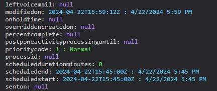
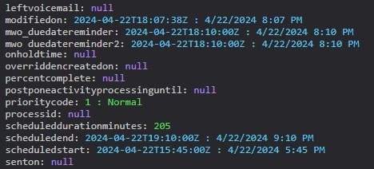

Have you tried the _Delay Until_ option of the Dataverse trigger in Power Automate? If not, I will show you some useful knowledge about that field, variations of usage and a workaround.

For the story: We want to send out a notification when the _Due Date_ (scheduledend) of a task approaches. Hitting the correct timing is possible in many ways, but _Delay Until_ can be very elegant!

## Using Delay Until Trigger
If you just have a simple field that marks the execution time, it's simple, just enter the logical name. If it's more complicated, you are out of luck at first, since you cannot use any outputs of the trigger for calculating the delay in an expression. We will try to cover that in the next sections.

 

 
 

Oh, and a bonus: If _Delay Until_ is in the past, it will be evaluated as an immediate execution, so we do not need to worry about that.

 
 

## Business Rule for calculation
But for the story, it would be nice if the reminder is not right at the deadline but sometime before! So we need to deal with that and that will be calculating the correct time for the reminder in a separate field. Our first attempt with Business Rules shows a weakness in the Formulas of Business Rules: They can only add/subtract days. This will work here if the requirement is "send the reminder 1 day before due", but not if it is "send the reminder 12 hours before due" because the formula for adding days only allows whole numbers.

 

 
 

Of course, any other method of writing a field with the correct value would work, e.g. Flow, Plugin and JavaScript will work as well, but will add complexity.

## PowerFX and calculated columns
Our next attempt will be with calculated columns, with the modern PowerFX ones and a classic field. Both have a problem: While they are more flexible than the Business Rule formula, the resulting field does not work with _Delay Until_! But we can still work around it.

So first of all, the idea is we subtract one hour from the _Due Date_ and trigger on _Due Date_ since you cannot trigger on calculated fields.

 

 

 
 

Pretty much the same happens with a classic calculated column.

 

 
 

## Delay Until Action
How can we still make it work? There is also a Delay Until action in Power Automate! And since the fields are in the trigger output we can directly feed them to this action.

 

The flow will now wait for the given timestamp and then will resume execution. But of course, since this is in the flow execution, we might as well just calculate an expression, skipping the PowerFX/calculated field after all. 

 

## Trigger vs. Action
If the action is more flexible here, why should I bother with the trigger option at all? Well, there are three considerations why I think the trigger option is better.

Number one, the trigger outputs are calculated upon start. In the sample of the due notification, you want to check if the task is not already closed by the time the flow is about to send it. With the trigger option, you have the correct values, if you used the actions to wait for days probably, you will want to re-retrieve the task to check for its state, introducing an inefficiency.

Second is the long runs. If you are using the action, run duration is now dominated by the Delay Action, making it hard to determine how long the runs take in terms of real operating time. Also, you might have a long list of runs that are all running, while with the trigger option, the whole monitoring looks exactly like a flow that has no waiting conditions at all.

And third, you might run into the 30-day flow timeout. In our story, if the _Due Date_ is in 45 days, no one will get a notification if you used the action, since the flow will have timed out. With the trigger option, it will run right on time (if the flow was turned on when the change event happened as well as on the target time).

 

## Summary
Let's summarize. 

Prerequisites:
- You have a clear idea of when the Flow actions shall execute.
- You can PERSIST that DateTime to a Dataverse field.

Action:
- Enter the logical name of the field that holds the target execution time to the _Delay Until_ option of the Dataverse Trigger.
- (Optional) Add a condition that the field should not be empty into the _Filter Rows_ option to prevent immediate execution.
- (Optional) Add the logical name of the field to the _Selected Columns_ option to limit the pileup of executions due to other changes in the meanwhile.
- Add an internal condition to check the deferral time to prevent early execution when the target time was moved while the Trigger delayed the execution.

With these in place, you can get around ugly solutions like polling (Scheduled Trigger) and busy waiting (Delay Until Action). It will result in short flow run durations, will not introduce inefficiencies due to re-retrieving and even can break the 30-day barrier of flows.