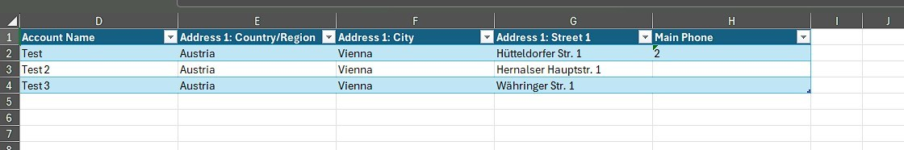
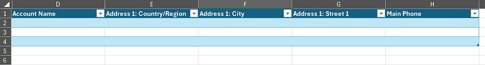
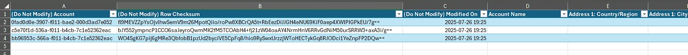
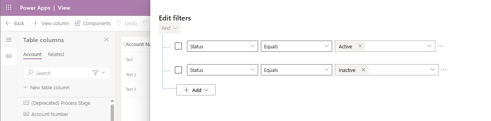
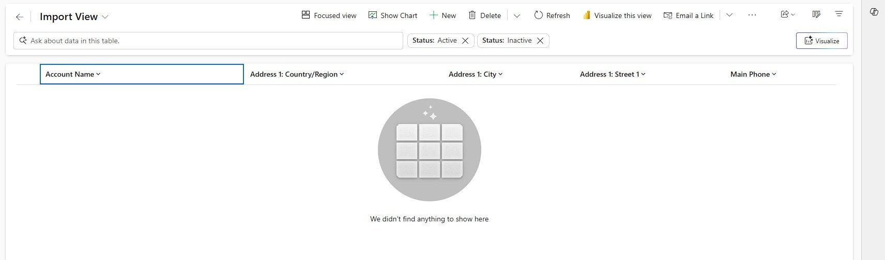

An Import View? Why would I need that? Yes, of course it is not per say necessary, but as you will learn here it is very helpful for steering the user!

This pattern is helpful when users are somewhat regularly are importing data into a table. For the screenshots I took the Account, but if you think this is unrealistic because you have a tight master data concept for accounts, think about this instead: "When my sales people come back from a trade show, they will import their new leads via Excel, because they won't find the time to record them to the system immediately."

## The situation
In theory this is pretty easy, select a view of the table with the appropriate fields. If there are fields missing, add them to the view and optionally save as a personal view if you need this regularly.
Now use "Export to Excel (static worksheet)" to get a good template to enter your data.
Remove all existing data to have a clean field to enter data and prevent any unwanted changes to the existing data.

Enter your data, save and use "Import from Excel". Because our headers were generated by "Export to Excel", the data map will already be very good, maybe some lookup matching will need refinement. 

The data is now importing and then you will notice a BIG problem: You have just overwritten your existing records. 
That's because the Excel contained 3 hidden columns on the left (notice in the screenshots above that the columns start with D) and one of the is the Guid column, which will beat any other key in matching.

> If you are finding this article because you already made this mistake, there are possibilities. Of course you can roll back to a backup, but this will reset all other tables as well. You can also restore a backup to a new environment, then use "Export to Excel" there and import it to your regular environment. However, the imported Excel needs to loose the hidden columns for Modified On and Row Checksum, otherwise Dynamics will complain that this data won't match the data in the environment. If it needs to be more selective, you can also export another Excel from the target environment and match up the rows, e.g. via the Guid.

To not run into this problem, we either need to keep all existing records in the Excel and only append to the end OR we also delete the content in the hidden columns. You may keep an empty Excel as a template in an accessible location like a SharePoint library, however, the reality says these are forgotten...

And believe it or not, I have seen this mistake happen from people that are totally capable of handling Dynamics, Administrators, Power Users, Consultants. Every human being is prone to this error, because the Excel looks okay since the columns are hidden. And they are hidden for good reason as well because tampering with these columns can lead to serious problems with the import, including fully duplicating all data contained. And I just suggested you to tamper with these columns to fix our problem, both before it occurs as well as fixing it afterwards...

## The solution
Obviously, we need something better! And that's where our Import View comes in. First of all, we can easily fix the need to add columns to have all necessary fields in the view, just talk to your users and gather a list! It does not matter here if there are to many columns here for being displayed well in a Model Drive App, it's only important that the exported Excel is usable.  
But more importantly, we can fix our big problem by simply ensuring that the View is always empty!

By pushing impossible conditions to the filters, we make sure that the view is empty and therefore the Excel is empty and can be safely filled with data by the users. Compared to a pre-exported template, this is easily accessible from Dynamics itself and also adding needed columns "correctly" is very easy for the user. Correctly here meaning that it will be recognized automatically by the data maps, especially important for non-text fields, like Optionsets.

Now you only need to ensure the view is shown in your app and we are ready to tell our users about the 4 easy steps of select the Import View, "Export to Excel", add data, "Import from Excel".

## Summary
Prevent a data disaster by supplying your user with an Import view! This is a view that contains all necessary columns that users will need to do a successful import and contains conflicting filters in such a way that it will always be empty. This ensures that users won't accidentally overwrite existing data by missing the fact that there are 3 hidden columns in any exported Excel from Dynamics. This pattern only applies to tables where "Import from Excel" is used on a regular basis. 