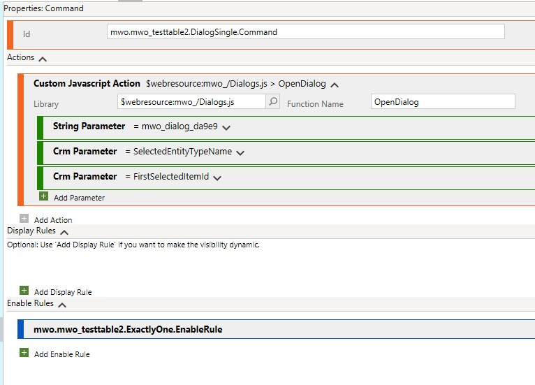
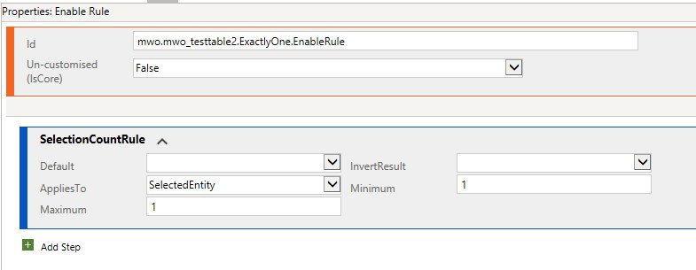
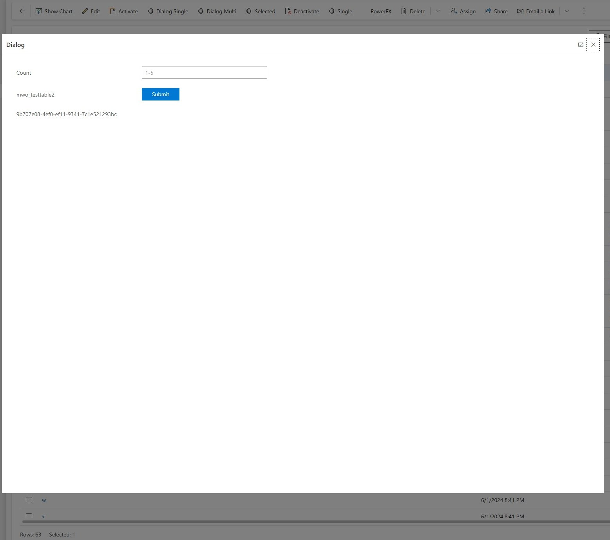
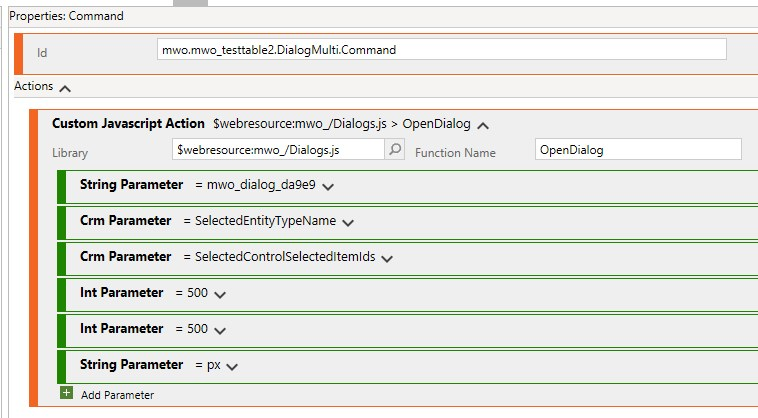
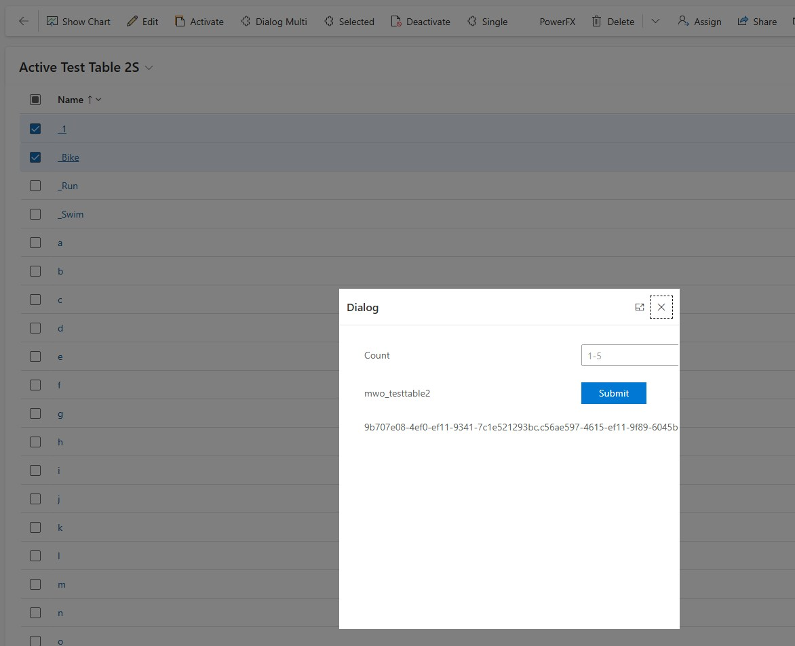
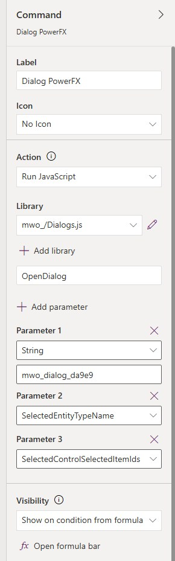
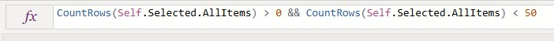
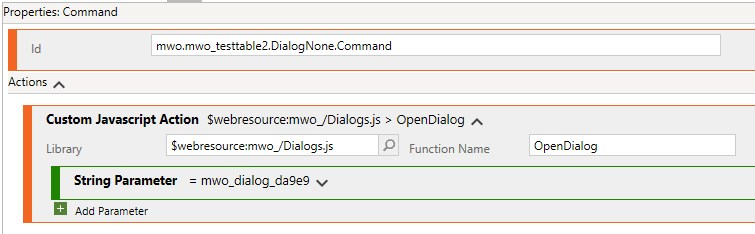
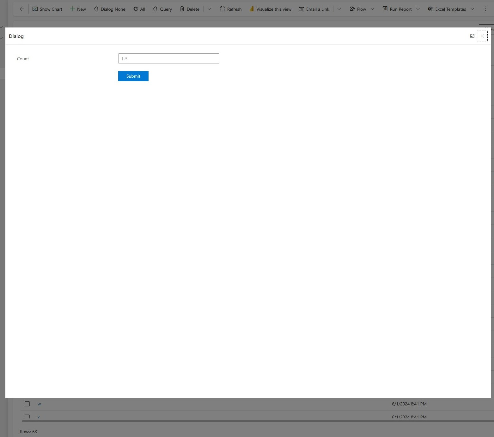

In the ["trigger flow from ribbon" pattern](/post/pattern/ribbon-flow/) we already took a look at triggering logic from the ribbon. But what if we require additional input from the user?

For this article consider the following requirement as a sample when you might need this pattern: "We need to copy records. When copying, we want to decide how many copies we need and the system should create the according amount." The discussion in this scenario showed that the maximum number of copies would be 5, so we could still handle this with a flyout or splitbutton that vary input. But of course we can easily imagine inputs that break the "half dozen variants" barrier where separate buttons start to fail. 

This pattern relies on the usage of JavaScript, but you can also download the solution from [the Ribbon Helpers repository](https://github.com/Kunter-Bunt/D365RibbonHelpers) to skip programming. In that case you only need to work with either Ribbon Workbench (XrmToolbox) or  

## Custom Pages
Back in the days there were the dialogs for this, but they are long deprecated. But we've gotten Custom Pages instead, this is essentially a Canvas App for a single screen. And important for the use case: `Xrm.Navigation.navigateTo` allows us to pass an `entityName` and `recordId` to the page and there we can read these values with `Param("entityName")` and `Param("recordId")`. 

So, we start with building a Custom Page, I've put a Label and Input for the amount of copies in there and a "Submit" button, which will trigger a flow with the id (or ids, more on that later) and amount of copies to then read the record and create the records in a loop.

Additionally I've put up two labels with the entityName and recordId, but this is mainly for debugging purposes, I would advise to hide or even delete those labels before shipping to production. Unless of course your users like this kind of debug information, but experience says that almost no one values it.

## Code
This is fortunately very short, we only need to call `Xrm.Navigation.navigateTo(input,options)` where input and options are relatively simple objects. For options in theory it would be enough to specify wether the page should be opened fullscreen (`target: 1`) or as overlay (`target: 2`). For input you need the `pageType: "custom"` and then the name contains the logical name of the custom page, so for example `name: "mwo_dialog_da9e9"`. And then, for the scenario in this pattern, we also want to pass `entityName` and `recordId`. 

Below you will find the full function that is part of [the Ribbon Helpers repository](https://github.com/Kunter-Bunt/D365RibbonHelpers). It also allows to control the size on screen, where you can pass width and height as "px" or "%" (unit). In the next section we will take a closer look on how to leverage this function from the Ribbon Workbench.

``` js
function OpenDialog(pageName, entityName, entityIds, height, width, unit){
    if (!height)
        height = 80;

    if (!width)
        width = 80;

    if (!unit)
        unit = "%";

    if (typeof entityIds === "string")
        entityIds = entityIds.replace("{", "").replace("}","").toLowerCase();

    if (Array.isArray(entityIds))
        entityIds = entityIds.join(",").replace("{", "").replace("}","").toLowerCase();

    var options = {
        target: 2,
        width: {
            value: width,
            unit: unit
        },
        height: {
            value: height,
            unit: unit
        }
    }

    var input = {
        pageType: "custom",
        name: pageName,
        entityName: entityName,
        recordId: entityIds
    }
    
    Xrm.Navigation.navigateTo(input,options).then(
        () => console.log("Dialog opened"), 
        (error) => console.log(error)
    );
}
```

## Single Record Dialog
Now we will start with operating the Ribbon workbench. I will spare you the buttons and so on. The easy sample uses the CRM Parameters "SelectedEntityTypeName" and "FirstSelectedItemId" to get logicalname and id. Additionally a string parameter specifies the logical name of the custom page, that's it.



For the button to be shown at the right time you should also add a selection count rule, this ensures it is only shown when exactly one record is selected, everything else might lead to unexpected behaviors where the dialog is opened without a record or only with the first one, although multiple were selected.



And the result then looks like



Obviously the default 80% of the screen is way too much for this simple dialog, we will explore the sizing options a bit in the next section, but essentially this is a trial and error for every page for me.

## Multi Record Dialog
First of all **consider this unsupported**. So recordId (and also entityName) does not have a reasonable character limit, this means we can pass more than one record. Technically [MS does not specify a limit](https://learn.microsoft.com/en-us/power-apps/developer/model-driven-apps/clientapi/reference/xrm-navigation/navigateto#custom-page) but their language talks about a "table record". Of course this does not hinder us from passing more, but we can't be sure this will be considered as a bug and being fixed without a prior notice. 

But well, if you are brave enough and the function is not that business critical, we can can switch "FirstSelectedItemId" to "SelectedControlSelectedItemIds" and adapt the selection count rule to something reasonable, lets say 50 records.



You can also see the usage of the sizing parameters here, which limit the size of the dialog to 500x500 pixels. This is not optimal as well, we would require more width and less height, but for showcasing the feature, it will have to do.



## Modern Commanding/PowerFx
Theoretically, CustomPages can also be called with PowerFx from the Modern Commanding ribbon. However, even [the official documentation for Navigate](https://learn.microsoft.com/en-us/power-apps/maker/model-driven-apps/commanding-use-powerfx#navigate) prominently links to the JS functions, since you cannot pass the recordId and entityName parameters.

But we can use the same function with the same parameters that we used previously in the Ribbon Workbench. The sample below uses the multi record parameter "SelectedControlSelectedItemIds", remember that this is kind of unsupported.



We could also fix this by only showing the button when only one record is selected, visibility can be controlled with the function `CountRows(Self.Selected.AllItems)`, compared to the sample below you could specify it to be `= 1`.



## Passing no record
Like I mentioned with PowerFx, you can open a custom page without passing a record, this is also possible with the OpenDialog function pictures above. However, using JS extensions for this use-case seems silly to me; instead, you can simply add the page to the navigation of the Model-Driven App if you do not need a record association. But, to be complete, this is how it would work:





## Summary
With custom pages and the possibility to pass in records we got a much better version of dialogs! You can either implement on your own with `Xrm.Navigation.navigateTo` or install [the Ribbon Helpers Solution](https://github.com/Kunter-Bunt/D365RibbonHelpers) and then use `OpenDialog` with Ribbon Workbench or Modern Commanding to open a prepared custom page with the context of a record. The custom page then uses `Param("entityName")` and `Param("recordId")` to read these parameters.

Because there is no reasonable character limit on these parameters, also multiple records can be passed as a comma separated list to the page. However, this should be considered unsupported and therefore should be avoided for business critical functionality. Also keep in mind that in this case, the custom page needs to be aware of this behavior and must split the list of ids again.