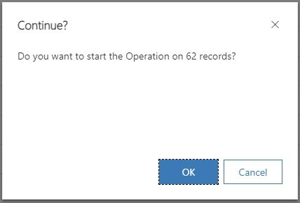

Of course, we can easily boost the productivity of users by letting them apply logic to multiple records at once! Think about the requirement "I need to confirm close to 100 orders per day, it is sufficient to check plausibility in the View, I don't want to navigate every single order confirming them on the form!"  
This sounds like a good fit for our pattern here, the user clicks a button and the Flow connected to it then executes the logic, like firing a _FulfillOrderRequest_ (confused here? Check [the previous article](/post/pattern/ribbon-flow/)). Just that the user would still need to confirm the records one by one from the grid...

## Button Visibility
Before we go further with the button functionality I first want to take a little side step that I should have already explained in [the last article](/post/pattern/ribbon-flow/). You can control when a button is shown based on the amount of records being selected in a grid. This makes sense for the Home Grid button that we implemented last time to just show it if exactly one record is selected. For this article of course we will require at least one selected record. This can be enforced by the Enable Rule _SelectionCountRule_.


## Multiple Selected Records
For selecting multiple records, we first need to make a little change to our JS. It is now possible that the records to update is an array and we need to update for each. I will simply paste the full code here because quite some changes revolve about the handling of the success message, which will only be given once per execution, while errors will be handled one by one.
``` JS {hl_lines=[6,14,15,18,23,40]}
function TriggerFlow(entityName, entityIds, fieldLogicalName, successMessageForUser, displayDuration, workingMessageForUser) {
    if (!successMessageForUser)
        successMessageForUser = "Operation successfully started!";

    if (!workingMessageForUser)
        workingMessageForUser = "Starting Operation ...";

    if (!displayDuration)
        displayDuration = 5000;

    Xrm.Utility.showProgressIndicator(workingMessageForUser);

    var promises = [];
    if (Array.isArray(entityIds)) {
        entityIds.forEach((entityId) => promises.push(UpdateRecord(entityName, entityId, fieldLogicalName, displayDuration)));
    }
    else
        promises.push(UpdateRecord(entityName, entityIds, fieldLogicalName, displayDuration));

    Promise.all(promises)
        .then(() => {
            Xrm.Utility.closeProgressIndicator();
            GlobalNotification(1, successMessageForUser, displayDuration)
        })
        .catch(() => {
            Xrm.Utility.closeProgressIndicator();
            // No output here, it is done per error
        });
}

function UpdateRecord(entityName, entityId, fieldLogicalName, displayDuration) {
    var updateEntity = {};
    updateEntity[fieldLogicalName] = new Date();

    return Xrm.WebApi.updateRecord(entityName, entityId, updateEntity).then(
        (result) => {
            // No output here, it is done in total
        },
        (error) => {
            GlobalNotification(2, error.message, displayDuration);
        }
    );
}
```

Also, we have a new optional parameter for the message being displayed in the progress indicator (aka loading spinner), considering that the user might select quite a lot of records, which could lead to a wait time until the success message is visible.

In the Command in Ribbon Workbench, instead of passing _FirstSelectedItemId_, we can now simply pass _SelectedControlSelectedItemIds_, the rest can stay identical to the values in [the first article](/post/pattern/ribbon-flow/).


## All (Visible) Records
We can also use the parameter _SelectedControlAllItemIds_ to get all records shown. Notice that in this situation we would configure the button visibility to have a selection of 0 records.

This is of limited use in my opinion because it has rather limited use for the user. He cannot easily exclude records and on the other hand it will also only include the records on the current page. He could achieve the same by using the "Select All" checkbox at the grid and then using the button with _SelectedControlSelectedItemIds_.


In testing, I've noticed that the "New Look" ignores the _Records Per Page_ setting and dynamically renders 50 new records as you scroll down. _SelectedControlAllItemIds_ then returns the first 50 items no matter the _Records Per Page_ setting until you start scrolling, again a very uncontrolled scenario.


## All Records
So, let's discuss a real "All Records" option.

For this, we will leverage the [_getFetchXml_](https://learn.microsoft.com/en-us/power-apps/developer/model-driven-apps/clientapi/reference/grids/gridcontrol/getfetchxml) function from the grid client API. We will then have to iterate through all pages and update all records found.

Some more changes:  
The optional parameters were consolidated into a single JSON, we just need too many parameters at this point.  
This is partly because I also added a confirmation dialog. This is because this potentially enables the user to trigger a Flow on millions of records in a single click, which will likely lead to the flow hitting service limits and starting to throttle, significantly slowing the functionality for all other users as well. "With great power comes great responsibility". The confirmation shall prevent accidentally missed filters and similar mistakes.
And lastly, the _retrieveAllRecords_ is grabbed [from MS here](https://learn.microsoft.com/en-us/power-apps/developer/model-driven-apps/clientapi/reference/xrm-webapi/retrievemultiplerecords#fetchxml-example-online-scenario).

``` JS
function TriggerFlowQuery(gridContext, fieldLogicalName, optionsString) {
    var options = JSON.parse(optionsString ?? "{}");

    if (!options.successMessage)
        options.successMessage = "Operation successfully started!";

    if (!options.workingMessage)
        options.workingMessage = "Starting Operation ...";

    if (!options.confirmMessage)
        options.confirmMessage = "Do you want to start the Operation on {count} records?";

    if (!options.confirmTitle)
        options.confirmTitle = "Continue?";

    if (!options.displayDuration)
        options.displayDuration = 5000;

    var entityName = gridContext.getEntityName();
    var fetchXml = gridContext.getFetchXml();

    ProcessAllRecords(entityName, fetchXml, fieldLogicalName, options);
}

function ProcessAllRecords(entityName, fetchXml, fieldLogicalName, options) {
    Xrm.Utility.showProgressIndicator(options.workingMessage);
    retrieveAllRecords(entityName, fetchXml, null, 5000, null).then(
        function success(entities) {
            Xrm.Utility.closeProgressIndicator();

            var confirmStrings = {
                text: options.confirmMessage.replace("{count}", entities.length),
                title: options.confirmTitle,
            };

            Xrm.Navigation.openConfirmDialog(confirmStrings).then(
                function confirmed(success) {
                    if (!success.confirmed)
                        return;

                    Xrm.Utility.showProgressIndicator(options.workingMessage);

                    var promises = [];
                    entities.forEach((entity) => promises.push(UpdateRecord(entityName, entity[entityName + "id"], fieldLogicalName, options.displayDuration)));

                    Promise.all(promises)
                        .then(() => {
                            Xrm.Utility.closeProgressIndicator();
                            GlobalNotification(1, options.successMessage, options.displayDuration)
                        })
                        .catch(() => {
                            Xrm.Utility.closeProgressIndicator();
                            // No output here, it is done per error
                        });
                });
        }).catch(() => {
            Xrm.Utility.closeProgressIndicator();
            // No output here, it is done per error
        });
}
```

And now the last thing left is to define the command, where we will define _SelectedControl_ this time to provide the grid context.




## PowerFX
Can you do something like this with PowerFX as well? At least partly, yes!

So first let's control the button visibility with 
``` JS
!IsEmpty(Self.Selected.AllItems)
```
and then we can Patch the **selected** records with 
``` JS
ForAll(
    Self.Selected.AllItems, 
    Patch('Test Table 2S', ThisRecord, { 'Trigger Field': Now() })
);
Notify("Operation successfully started!", NotificationType.Success, 5000);
```

Of course, do not forget to replace the entity ('Test Table 2S') and field ('Trigger Field') with your values.

This only works with the selected records, getting all records or the query of "Self" is not possible to my knowledge.

## Summary
From a few to thousands of records, the pattern can scale with some adaptions. Remember that you can use [the helper solution](https://github.com/Kunter-Bunt/D365RibbonHelpers) to not have to fiddle with code! So the power of this pattern is just one solution installation away. After that, you can start configuring your ribbon command from the Ribbon Workbench.

This pattern can also be used from Modern Commanding, but as usual, this is sadly more limited than the Workbench. Yet still, there are good chances the options of Modern Commanding might be a fit for your requirements.