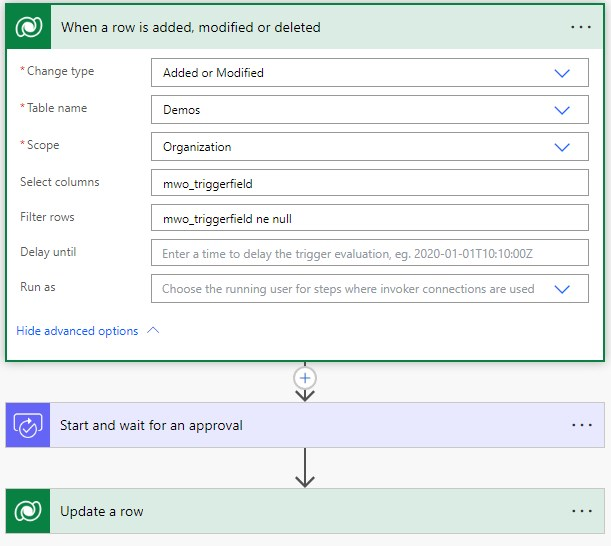
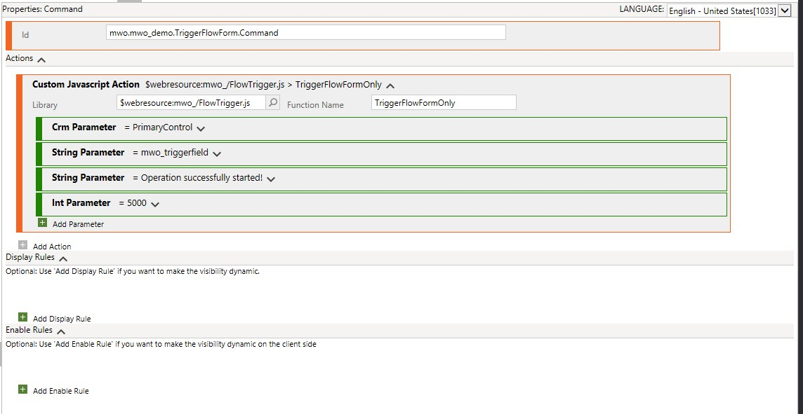
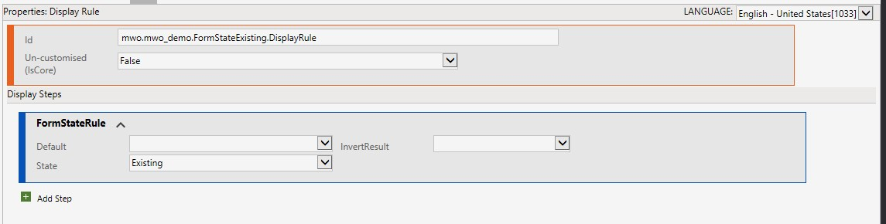
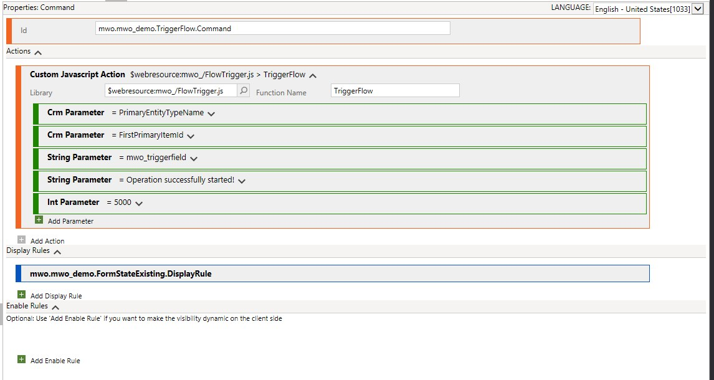
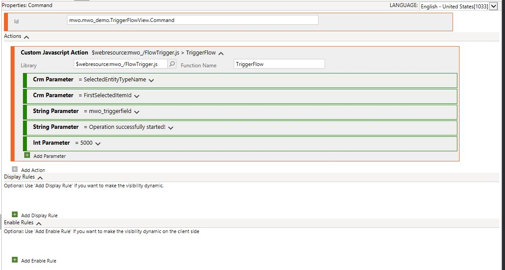
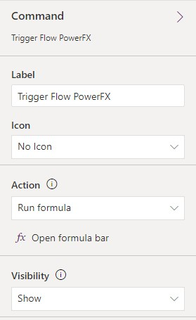
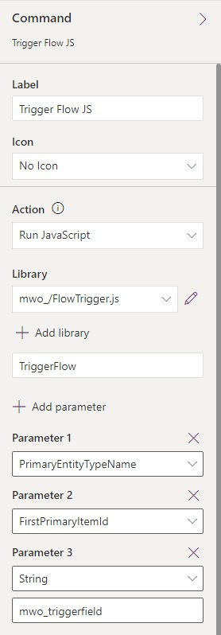

Just like [the first pattern](/post/pattern/date-flow) we discovered, the core of this pattern includes a Flow that is triggered by a DateTime field being set. The requirement sounds like this "When the user clicks the button X, logic Y should run" and Y here is a logic that either requires the Server due to privileges etc. or is just complex enough that you wouldn't want to implement it in the frontend, e.g. as PowerFX directly to the button. Considering the debuggability of PowerFX in the ribbon (aka Command Bar), that point for me is reached quite quickly. I might then resort to JS, but in the low code era, it might be much easier to do it in a Flow.

To have a concrete sample you would implement like that: "After adding the necessary information, the user needs to send the record for approval". The Power Automate Approvals are best used from Power Automate, so we would like to trigger our flow from a ribbon button "Send to Approval".

## Backend Setup
For that, we first create a DateTime field, user local, on our table. Then we define a Flow with the Dataverse trigger, (Added or) Modified targeting the table and choosing the newly created field in the _Select Columns_ option.

Anything aside the trigger is now tuned to your logic X.



## Why DateTime?
For the trigger field, we are using a DateTime because it is the most logical for a generalization:
- Boolean will be set to yes on the first execution, and on the second? Even if you force another Update to yes, this will not show up in Audit History.
- Choices have a similar problem.
- Lookups are harder to set, and there is no natural value to generalize, only in certain cases this might make sense, but still has the problem of the second execution.
- String fields work better with changing strings since this will at least show up in Audit, but for generalization, only random strings would make a good fit.
- Numbers are more interesting since you can simply count how often the button was clicked! And this makes sense if you need that reporting and don't want to use the Audit History to count manually. They are just a little more complicated to implement because you first need to retrieve the current value of the field, coalesce it with a 0 and then set it. If the field is not on the form, we will even need nested deferreds for that. 
- DateTimes provides a timing of the last execution even without Audit History and there is a natural way of setting it via the native functions of JS (`new Date()`) or PowerFX (`Now()`).

## Frontend Setup
Here we have 3 possibilities. And cover each one of them with a short code sample.

We can bring the field to the form and the button sets it and optionally directly saves the record (we could also leave this up to the user, but that could lead to confusion).

``` JS
function TriggerFlowFormOnly(formContext, fieldLogicalName, messageForUser, displayDuration) {
    if (!messageForUser)
        messageForUser = "Operation successfully started!";
    
    if (!displayDuration)
        displayDuration = 5000;
        
    formContext.getAttribute(fieldLogicalName).setValue(new Date());
    
    formContext.data.save().then(
        (result) => {
            GlobalNotification(1, messageForUser, displayDuration);
        },
        (error) => {
            GlobalNotification(2, error.message, displayDuration);
        }
    );
}

function GlobalNotification(level, messageForUser, displayDuration) {
    var notification = {
        level: level,
        message: messageForUser,
        showCloseButton: true,
        type: 2
    };

    Xrm.App.addGlobalNotification(notification).then(
        (id) => {
            window.setTimeout(ClearGlobalNotification.bind(this, id), displayDuration);
        }, 
        (error) => { console.log(error); });
}

function ClearGlobalNotification(id) {
    Xrm.App.clearGlobalNotification(id)
}
```

To call this, pass the CRM Parameters for the formContext (primaryControl), the fields logical name and optionally parameters for the message text and display duration. The values in the screenshot are taken as default if you skip them.



We can also update the field through the OData Web API. This does not require the field to be on the form and it's also possible to use on a View! However, since it needs an Id to update the record, it will only work after the first save of the record!



``` JS
function TriggerFlow(entityName, entityId, fieldLogicalName, messageForUser, displayDuration) {
    var updateEntity = {};
    updateEntity[fieldLogicalName] = Date.now();
    
    if (!messageForUser)
        messageForUser = "Operation successfully started!"
    
    if (!displayDuration)
        displayDuration = 5000
        
    Xrm.WebApi.updateRecord(entityName, entityId, updateEntity).then(
        (result) => {
            GlobalNotification(1, messageForUser, displayDuration);
        },
        (error) => {
            GlobalNotification(2, error.message, displayDuration);
        }
    );
}

// Find the GlobalNotification function in the code block above
```

This time we will need to pass the logical name and record id. The other parameters for the field logical name and the optional message and duration stay the same.

 

And the third way is of course leveraging the modern commanding with PowerFX. This will internally work very similarly to `Xrm.WebApi.updateRecord`, meaning it works from views and on forms without the field present.

``` JS
Patch(Demos, Self.Selected.Item, { 'Trigger Field': Now() });
Notify("Operation successfully started!", NotificationType.Success, 5000);
```



## Helper Solution
And of course, we can also trigger the JS functions from the modern commanding as well since it can simply call WebResource functions. And this is where [the helper solution](https://github.com/Kunter-Bunt/D365RibbonHelpers) for this article comes in! With this, you can call a flow from the ribbon without writing a single line of code (be that JS or PowerFX) and without leveraging third-party tools like RibbonWorkbench. Simply install the solution, edit the command bar of your table, set the button's action as shown below, publish and you are ready to go.



## Summary
Users like ribbon functionality and low code developers like Power Automate Flows. To bring both together we will filter our flow trigger to a DateTime field and then define a ribbon button that has exactly one purpose: Setting that field.

With the help of [the RibbonHelpers solution](https://github.com/Kunter-Bunt/D365RibbonHelpers), this can be done without writing a single line of code. Or you could also do it with one to two lines of PowerFX!

The low complexity and wide possibilities in Power Automate are why this has become my favorite way of implementing ribbon functionality.

