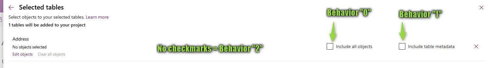
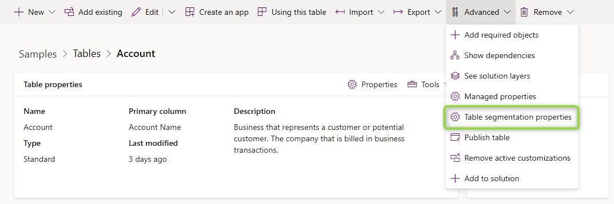
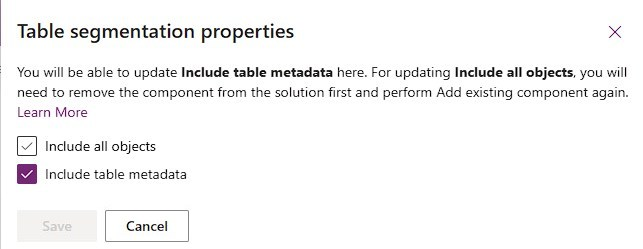
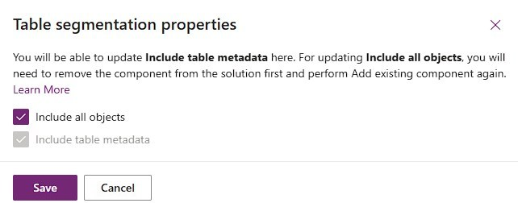

"Table Segmentation Properties" or "Root Component Behavior" is an important concept that everyone working with solutions should understand thoroughly!
The terms describe how much of a table is in the solution and will affect deployment of it.

## When to use which behavior
When exporting a solution and looking at the solution.xml file you will find a section about root components like this:
```
<RootComponents>
    <RootComponent type="1" schemaName="account" behavior="1" />
    <RootComponent type="1" schemaName="contact" behavior="2" />
    <RootComponent type="1" schemaName="mwo_test" behavior="0" />
    <RootComponent type="80" schemaName="msdynce_saleshub" behavior="0" />
</RootComponents>
```
As you can see, there 3 tables inside, account, contact and mwo_test, which is a custom table created within the solution.
They all have a different value in the `behavior` property. 

Behavior "2" contains the least and should be your default for any table that you do not create yourself. If I only add a column to the contact table and create/modify a form for it, this behavior is the perfect choice, it fully complies with the rule of thumb "Include only what is necessary to a solution to minimize export/import times and avoid conflicts with Managed Solution updates". It does not really have a name, but I will call it "Only include selected subcomponents"

Switching to behavior "1", which is called "Include Table Metadata" is necessary as soon as you start to change the Properties of a table. These are things like the Display Name, Enable Audit, Track Changes etc. 
This a bit tricky, because you can set these properties also in a solution containing the table as "Only include selected subcomponents" and they will take affect on the source environment, however they will not be exported and thus not transported to the target environment. You will learn how to check which behavior is active in the next section, however this is easy to overlook and it would be nice if Make would at least warn you about the currently selected behavior. Environment Variables for example have a much better UX in terms of what is included to the solution.

Behavior "0" is sometimes necessary but should be used with caution. It was preselected for me by Dynamics when I created the Test table in the solution and that is because the first time a new table is introduced to a target system via solution import, it needs to be with behavior "0". It's called "Include all objects". 
The only other situation where you would choose this behavior is when you have created a custom entity in another solution but now want to transfer it to the current one for deployment as you are not going to deploy the other solution first. This is because "Include all objects" will be needed for successful creation of the table in the target environment. If you would choose a different behavior your solution would have a dependency on the table being present in the target environment.
However, you cannot misuse this to fully include a table from a managed solution into your solution as the solution will still report the dependency on the managed solution containing the entity. Furthermore, you will run into bigger deployment issues when doing this to frequently used OOTB tables like account or contact. Including all objects means you will create dependencies to all managed solutions defining a component in these tables and this virtually means that your target environment has to have exactly the same setup as your source. 
To make this more visual: Someone started a PoC for Field Service on the dev environment, great, now you can't deploy to production anymore since the solution has around 20 dependencies to various Field Service solutions. You now have the option to install Field Service to production or remove the account table from the solution and readd it with only the components needed. By the way, the last option is of course the correct option, but what are the needed components? And you better not make a mistake when adding them because failing to add a custom column will delete it from production and thus loose its data!
To summarize: Never use "Include all objects" (behavior "0") on OOTB entities. But this option is almost always the right choice for your custom entities.

## How to set the behavior
As explained in the previous section, when creating a table in a solution the behavior is automatically set to "Include all objects". When adding an existing table you can choose the behavior via 2 checkmarks.



But what if I already included the table? It will not appear in the _Add Existing_ -> _Table_ dialog and when selecting _Add Existing_ at the respective table, the dialog will already be advanced to selecting subcomponents. 
The behavior can be checked and modified at the table under _Advanced_ -> _Table Segmentation Properties_. Here we find the same checkmarks to set.





Note that you are able to select the checkmarks and you are also able to deselect "Include table metadata" again after it was selected. However, once you selected and saved "Include all objects", you will not be able to deselect it again. And as illustrated above: Following the suggestion to remove and readd the component is the correct fix, but you really want to avoid getting into this situation in the first place. So just be careful with the "Include all objects" behavior.

Also note that if "Include all objects" is chosen this also means that table metadata is included as well.



## Summary
For OOTB/Managed tables, leave the checkmarks "Include table metadata" and "Include all objects" unselected by default. If you start changing properties (e.g. Display Name or Audit) of a table, check the _Table Segmentation Properties_ under _Advanced_ and make sure "Include table metadata" is enabled. There is virtually no situation where you would want to turn on "Include all objects" for an OOTB/Managed table and it can be tricky/risky to resolve the issue if the option was selected.

For custom tables use "Include all objects" by default. This makes sure the table can be created in the target environment and ensures that all dependencies within the table are fulfilled. This will be preselected for you if you create the table within the solution.

If you hear someone refer to _Root Component Behavior_ this is because the _Table Segmentation Properties_ are reflected as a property called `behavior` when exporting the solution.