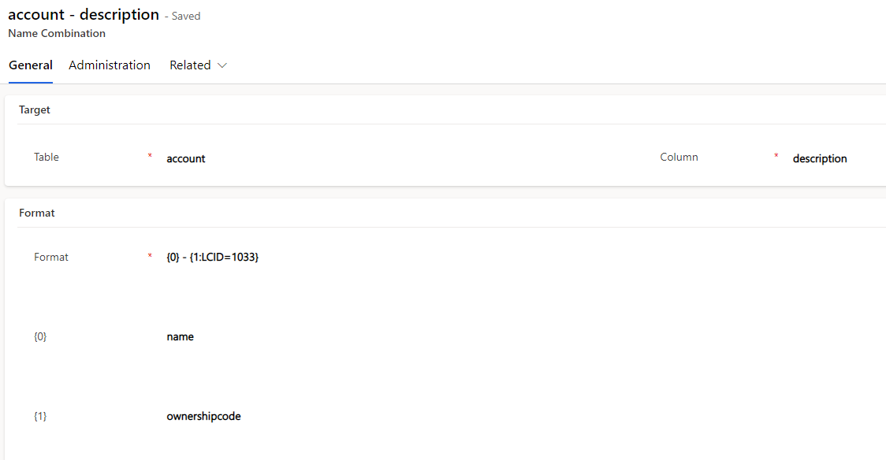
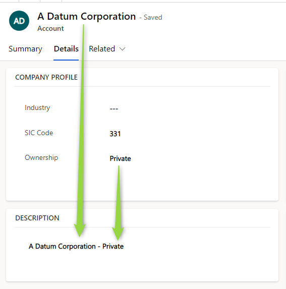
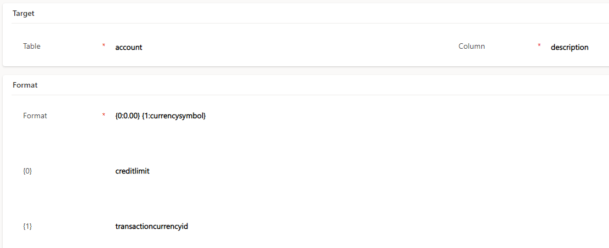
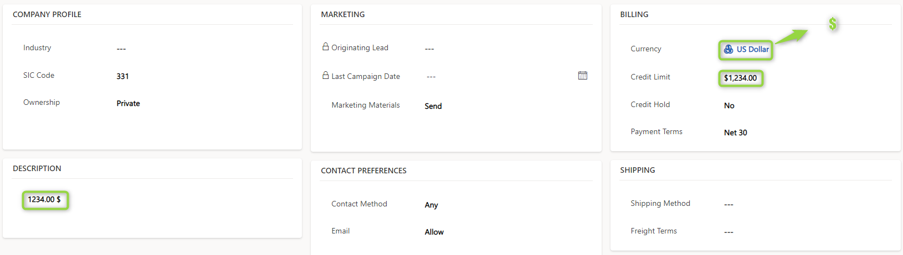

If you are developer you probably have done a naming plugin some time in your career.
It is a common requirement for custom entities where the users cant easily pick a name, instead it should maybe be a combination of fields, just like the fullname of the contact entity. 
This is particularly common with the primary field as you can not make it calculated and Business Rules can only be a solution in very simple cases.
But you may face requirements for combined string fields of course. 
However the requirement, you have multiple solutions:
- Business Rules are quite limited.
- Real Time Workflows might work, but are not the most efficient and their future is anybodys guess.
- Flows (PowerAutomate) are very flexible, allowing to cover many requirements, however they are not synchronous, leaving the field empty after saving. For a primary field the user will then see "New CustomEntity" at the top of the form after he saved the new record.
- A plugin has non of these shortcomings and is therefore often the preferred way of the customer. However I can't count how many times I was requested by customers and business analysts to create such a plugin with trivial requirements and everytime a "coding monkey" was needed.

Now its easy to come up with the idea "lets just create something generic that can create strings from a template and let the non-coders fill it". But the problem lies in the plugin registration of Dynamics that does not a allow for a global registration for that logic.

And this is where the solution from the [previous post](/post/plugin-self-registration/solution) comes in. When someone fills out the template in the configuration entity, we can register on create and update of the targeted entity and then execute the generic logic. 

# Configuration Samples
So the template orientates on format strings of C# - I'm a techy after all. We write something like _{0} - {1}_ and then specify that 0 shall be _Field A_ and 1 _Field B_. Now specify the entity and which field the result should be written to and we are golden. 



Lets first look at some configuration samples before we dive into the inner workings.
So here we combine a regular string field with an optionset. The optionset of course contains a number as value which would be part of the string, but with a C#-like modifier we are able to print it as the english label. The result looks like this:



Similar things are also possible with Money fields which are transformed to their decimal value allowing you to specify the [standard C# formats](https://learn.microsoft.com/en-us/dotnet/standard/base-types/standard-numeric-format-strings) as well as [custom ones](https://learn.microsoft.com/en-us/dotnet/standard/base-types/custom-numeric-format-strings).

Lookups will by default print like this: _transactioncurrency(b5f9a0f3-7db9-ed11-9886-000d3ab6ddad)_. But we can use the modifiers _Name_, _Id_ and _LogicalName_ to print something different or specify the logicalname of a field at the entity behind the lookup. And this is even chainable with a semicolon! But lets look at some simple sample in this post to not overcomplicate the matterl. After all this is designed to cover the most basic requirements of name generation and not fancy pants stuff where its absolutely ok to let someone code that.





That in itself is quite cool, but for me the real magic here is that this is possible on any entity, registering this to the most common entities like account, contact, opportunity, incident, ... would be no problem, but it works anywhere. 

# The Inner Workings
If you have read [the last post](/post/plugin-self-registration/solution) you already know where this is going, of course we are going to generate records of the mwo_pluginstepregistration entity. To be precise, two records, one for create and one for update. 
And for that we wont need a whole lot of code, create and update of the mwo_namecombination is handled with [a mere 160 lines of code](https://github.com/Kunter-Bunt/D365NameCombiner/blob/main/mwo.D365NameCombiner.Plugins/Executables/RegistrationExecutable.cs) (at the time of writing) and deletions were handles in a separate class with [35 lines of code](https://github.com/Kunter-Bunt/D365NameCombiner/blob/main/mwo.D365NameCombiner.Plugins/Executables/DeleteRegistrationExecutable.cs). It even covers checks for whether the fields are existing and translates a deactivation of the name combination to a deactivation of the step and vice versa. 
Why is it so short? We are simply create or update another entity if our configuration entity is created or updated. By the way: The triggers on mwo_namecombination of course use spkl for registering the plugin, because we absolutely know which entity and fields we want to trigger for.

But back to the registration, also when you create a similar mechanism the heart of the registration will be a mapping to the registration, so lets add a (shortened) extract of this code:
```
var step = new mwo_PluginStepRegistration
{
    mwo_EventHandler = typeof(NameCombiner).FullName,
    mwo_EventHandlerType = mwo_EventHandlerType.PluginType,
    mwo_Name = $"{nameof(NameCombiner)}_{subject.mwo_Table}_{subject.mwo_Column}_{message}",
    mwo_Managed = true,
    mwo_SDKMessage = message,
    mwo_PrimaryEntity = subject.mwo_Table,
    mwo_PluginStepStage = mwo_PluginStage.PreOperation,
    mwo_Asynchronous = false,
    mwo_StepConfiguration = subject.Id.ToString(),
    mwo_FilteringAttributes = filters, 
    mwo_ImageType = isUpdate ? mwo_ImageType.PreImage : mwo_ImageType.None,
    mwo_ImageName = "Default",
    StateCode = isActive ? mwo_PluginStepRegistrationState.Active : mwo_PluginStepRegistrationState.Inactive,
    StatusCode = isActive ? mwo_PluginStepRegistration_StatusCode.Active : mwo_PluginStepRegistration_StatusCode.Inactive,
};
```
So with the design of the configuration entity we made sure that we know the target entity (mwo_table) and the filters (here a combination of the fields {0} to {9}) and the rest is either static or semidynamic based on statecode and the fact that we are registering Create and Update. In this case I do pass the Id of the name combination as configuration for the step. This is not needed, the logic could as well just query for name combinations registered to the target entity, but this would mean if two combinations are registered to the same entity, both combinations would be executed twice since there would be two registrations as well. 

# Conclusion
Whats left to do now? Of course to implement all those cool ideas for generic logic that came to your mind while reading through the series! There will be one more post out soon elaborating more on the topic of strategies in self registration and how you can get around it sometimes.
Needless to say: While the [D365NameCombiner](https://github.com/Kunter-Bunt/D365NameCombiner/) served as an example for your own self registration ideas here it is of course a working solution with actual use! Check out its Wiki for more samples.
The next and [last post](/post/plugin-self-registration/outlook) of this series we will take a look at when to use this - and when not.

# Special Thanks
To [Lukas Leitzinger](https://www.linkedin.com/in/lukas-leitzinger-6b5654160/) for contributing to this repository with ideas and code!