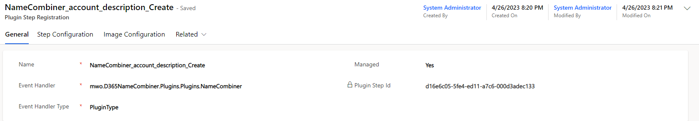
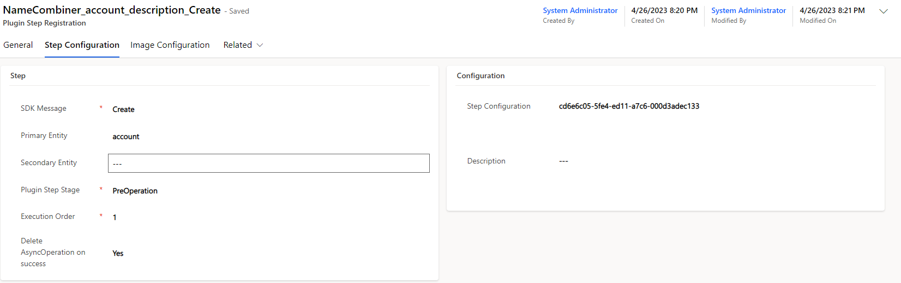
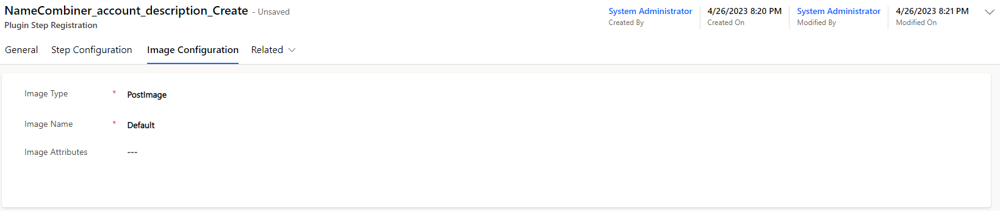
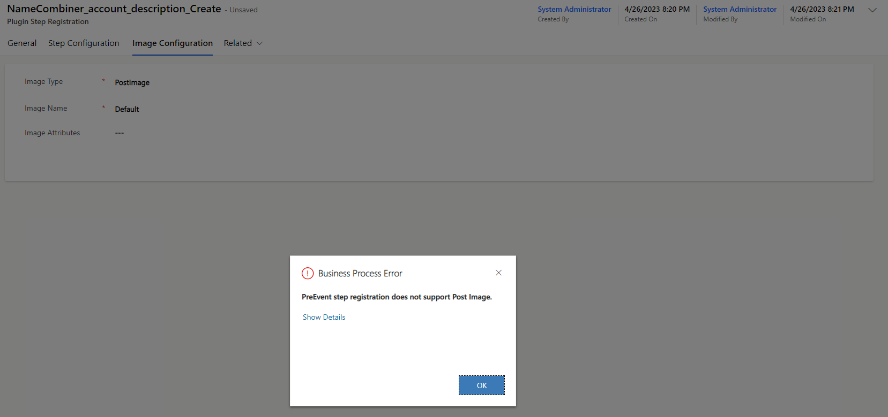

In [the last post](/post/plugin-self-registration/concept) we've dived into the idea that one plugin could register a second plugin to allow for more flexible registration of plugins. But we've ended with the caveat that a lot of entities are involved and no relationships are allowed.

My proposed solution to ease the process of self registration is to introduce an abstraction layer in form another entity. As this will be a regular custom entity, we can relate to it as much as we like. 

# The Repository
[Here](https://github.com/Kunter-Bunt/D365LivePluginRegistration) you will find the public repository of this solution. If you want to use it, simple [download](https://github.com/Kunter-Bunt/D365LivePluginRegistration/raw/master/LivePluginRegistration_3_0_0_1_managed.zip) and install the managed solution to your instance.

# The Mapping
If you're familiar with registering Plugins in Dynamics 365 using the traditional Plugin Registration Tool (PRT), understanding the mapping to the new _Plugin Step Registration_ (mwo_pluginstepregistration) entity can be helpful. In this section, we will explore how the Plugin Step Registration entity maps to the entities in the PRT, and how you can leverage it for registering steps.

_Plugin Type_ in the Plugin Step Registration entity corresponds to Plugin (plugintype) in the PRT. However, it's important to note that you cannot create a new Plugin with the Plugin Step Registration entity - the Plugin must already exist! What you are creating here is a Step (sdkmessageprocessingstep). In the images below, you can see further mappings, they are straight forward. Filtering attributes can be specified using commas as separators. It's worth mentioning that Secure Configuration and User Context are currently not supported. Delete AsyncOperation will be set to "Yes" if you select Stage PostOperation & Async = "Yes".

Image configuration tab allows you to configure an Image (sdkmessageprocessingstepimage) for the Step. The mapping is straightforward, but it's important to remember that, for example, you cannot register a PreImage to the Message "Create".

The Step is now managed by the Plugin Step Registration record. This means that if you update the record, the Step will be updated as well. Similarly, if you deactivate the record, the Step will be deactivated, and if you delete the record, the Step will be deleted too. However, you can untie this one-way connection between the record and the actual Step by setting the field _Managed_ to "No". This allows you to delete the record while leaving the Step untouched. If you're not sure which record manages which Step, you can check the Plugin Step Id against the Id of the Step in the PRT.

# Service Endpoints
Additionally, it's also possible to have Service Endpoints as Event Handlers (formerly known as Plugin Type Name). You can reference them by name in the Plugin Event Handler entity and then select them in the Event Handler Lookup on the Plugin Step Registration. However, it's important to note that by their nature, Service Endpoints can only handle asynchronous steps, and attempting to register a synchronous step will result in failure.

# The physical relation
As mentioned before we cannot store the actual step (sdkmessageprocessingstep) in a relationship like a lookup. Therefore the Plugin Step Registration saves the guid of the step to a string field and parses it back from there. This is of course rather unelegant, but this is why we will use this abstraction for our regular code, we will never need to worry about this again and can simply relate to the Plugin Step Registration.

# Next steps
Now that we know roughly how it works, how do we put this into practice. This is exactly the topic of [the next post](), where we will use this to register a "naming plugin" to any entity.