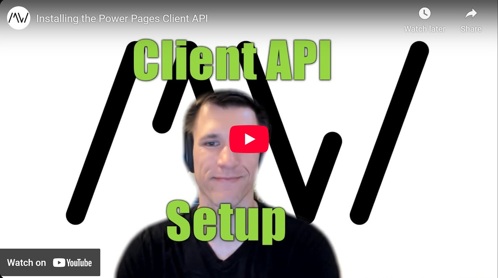

To achieve Power Pages code that is portable from your Model Driven App forms to Power Pages it would be nice to have the MDA Client API available in Power Pages. But sadly it is not there yet, but we will try to make it happen!

In this video we will set up the Power Pages Client API for your own projects in 2 different ways, both for when you are using JavaScript and for when you are using TypeScript with a bundler.

Repository Link: https://github.com/Kunter-Bunt/PowerPagesClientAPI

Check it out [here](https://youtu.be/yzdWePHB71E).

