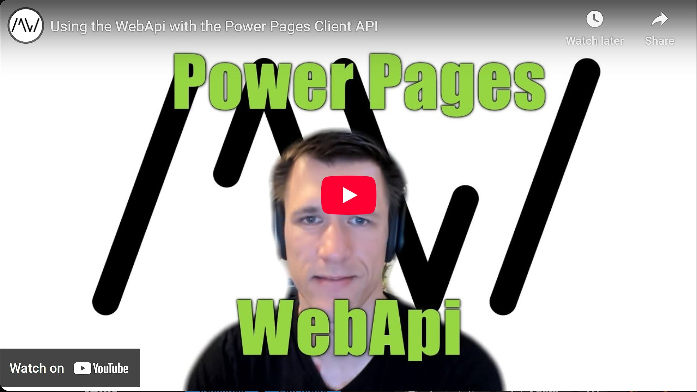

To achieve Power Pages code that is portable from your Model Driven App forms to Power Pages it would be nice to have the MDA Client API available in Power Pages. But sadly it is not there yet, but we will try to make it happen!

In this video we will manipulate data with scripting via the Power Pages WebApi.

Repository Link: https://github.com/Kunter-Bunt/PowerPagesClientAPI

Check it out [here](https://youtu.be/OVCkS4V7guA).

