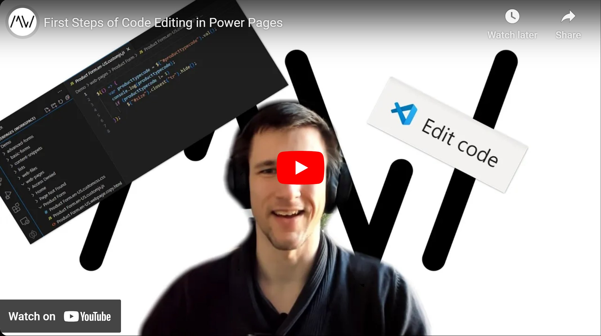

We have used the Design Studio to [create static content](/post/power-pages/editor), [show forms to enter data](/post/power-pages/form) and [lists to let the users view dynamic data](/post/power-pages/list). This time we will broaden our capabilities again by editing the code of a page, allowing for full web development flexibility.

Check it out [here](https://youtu.be/19pSEQNAFHA).

