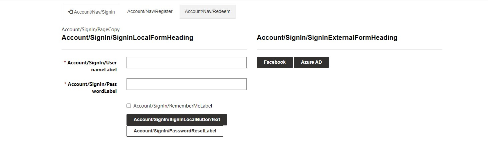
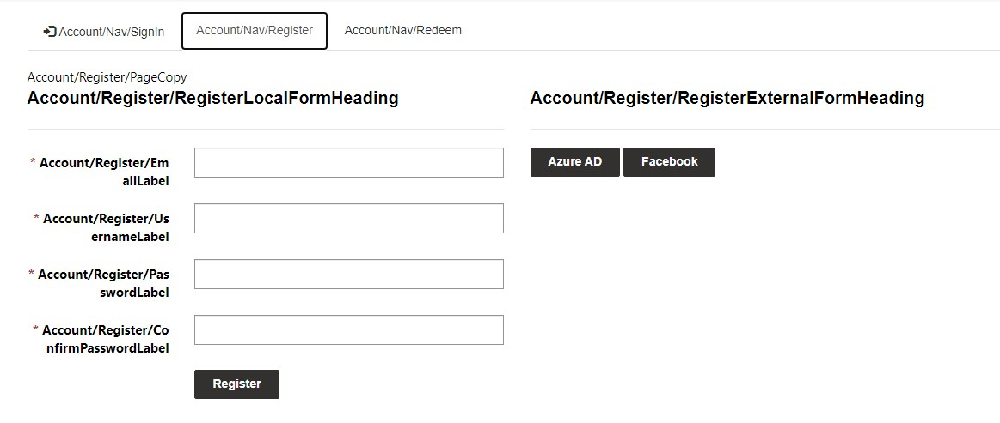
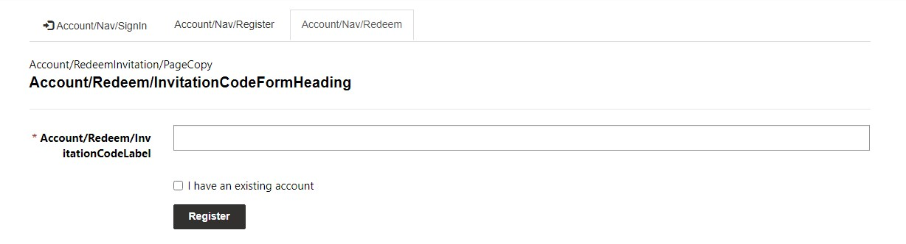
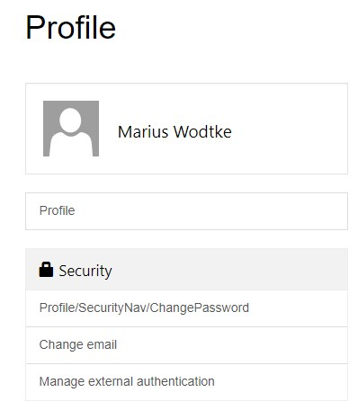
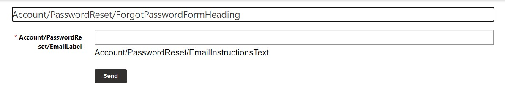

To accompany [our recent video](https://www.youtube.com/watch?v=nWyGKEqbhqA) over on [the Power Platform Learners channel](https://www.youtube.com/@PowerPlatformLearners), here is a list of all the content snippet I know for customizing the login and registration pages of Power Pages

## SignIn
- Account/SignIn/RememberMeLabel
- Account/SignIn/SignInExternalDeprecatedFormHeading
- Account/SignIn/SignInExternalFormHeading
- Account/SignIn/SignInLocalFormHeading
- Account/SignIn/TermsAndConditionsAgreementText
- Account/SignIn/TermsAndConditionsButtonText
- Account/SignIn/TermsAndConditionsCopy
- Account/SignIn/TermsAndConditionsHeading
- Account/SignIn/UsernameLabel
- Account/SignIn/AccountConversionIdentityUsedErrorHeading
- Account/SignIn/AccountConversionIdentityUsedErrorText
- Account/SignIn/MinorNotAllowedCopy
- Account/SignIn/MinorNotAllowedHeading
- Account/SignIn/MinorWithoutParentalConsentNotAllowedCopy
- Account/SignIn/MinorWithoutParentalConsentNotAllowedHeading
- Account/SignIn/PageCopy
- Account/SignIn/PasswordLabel
- Account/SignIn/PasswordResetLabel
- Account/SignIn/SignInLocalButtonText
- Authentication/OpenIdConnect/AzureAD/Caption

## Register
- Account/Register/ConfirmPasswordLabel
- Account/Register/ExternalAuthenticationFailed
- Account/Register/PageCopy
- Account/Register/PasswordLabel
- Account/Register/RegisterExternalFormHeading
- Account/Register/RegisterLocalFormHeading
- Account/Register/RegistrationDisabledMessage

## Redeem (Invitation)
- Account/Redeem/RedeemByLoginLabel
- Account/RedeemInvitation/PageCopy
- Account/Redeem/InvitationCodeFormHeading
- Account/Redeem/InvitationCodeLabel

## SetPassword
- Account/SetPassword/ConfirmPassword
- Account/SetPassword/Email
- Account/SetPassword/PageCopy
- Account/SetPassword/SetPasswordButtonText
- Account/SetPassword/Username

## PasswordReset
- Account/PasswordReset/EmailLabel
- Account/PasswordReset/EmailInstructionsText
- Account/PasswordReset/ForgotPasswordFormHeading

## Navigation
- Account/Nav/Register
- Account/Nav/SignIn
- Account/Nav/Redeem
- Profile/SecurityNav/ChangePassword
- Profile/SecurityNav/SetPassword

## Special Thanks and References
- [Ulrikke Akerbæk](https://ulrikke.akerbak.com/2020/02/16/customize-the-sign-in-and-registration-page-in-power-app-portals/)
- [Arpit Shrivastava/meenoo](https://community.dynamics.com/forums/thread/details/?threadid=d68d0750-b902-4363-a46e-ff9742c6fb1c)
- [Oliver Rodrigues](https://community.dynamics.com/forums/thread/details/?threadid=a5ba9bed-b3d1-4050-99bb-0d27a40602c6)
- [Edwin Valenti Clari](https://www.linkedin.com/pulse/customizing-microsoft-dynamics-crm-365-portal-login-valenti-clari/)
- [Oleksandr Olashyn/Oliver Rodrigues](https://github.com/OOlashyn/PowerAppsPortalSiteSettingsAndSnippets)

## Pictures

