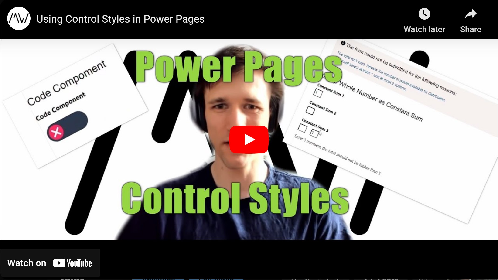

Control Styles can alter the behavior of form fields in Power Pages. Some of them are tailored to gathering customer feedback, but others have a wide range of use cases like "Render Lookup as Dropdown" or "Code Component".

Check it out [here](https://youtu.be/9ERQ6xbIV3A).

