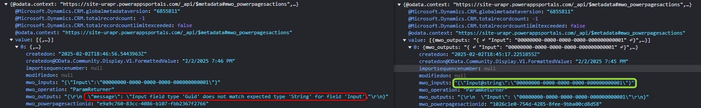

In [a recent article](/post/power-pages/custom-api-parameters/) I detailed the possible parameters with Power Pages Actions and how the parser will recognize them. 

Repository Link: https://github.com/Kunter-Bunt/PowerPagesActions

## The problem
However, Harish Karyattu reached out and made me aware of a problem he was facing with this. He had a string input for his Custom API and the parser misinterpreted the inputs for a Guid. The input in question here stemmed from a payment gateway, so changing the input was definitely not an option.

Simple fix you would say: "Just change the parameter to Guid and you are good!" But a) that might have lead to a conflict if you are using the same API from a Dataverse interface where it is stored as string and b), even more challenging, what if it just fits the format but is technically not Guid? You could run into a situation where some inputs are recognized as string because they are unparsable, while others are forwarded as a Guid.

"d4918dfd-4c34-4497-a69b-3d8844ae462c" is a Guid,  
"d4918d**G**d-4c34-4497-a69b-3d8**Z**44ae462c" is not (notice the G and Z)!

An obvious fix would be for Power Pages Actions to read the type from metadata, however, this would definitely be a performance hit, rendering the solution less useful.

## The fix
So we need something to tell the parser a specific type. The version 1.3.0.0 of Power Pages Actions therefore introduces an option to specify the type of simple parameters with an @. So for the problem above we would use @string like this:
``` JS
var inputs = {
    ["Input@string"]: "00000000-0000-0000-0000-000000000001"
}
```
This will make sure that that "Input" is passed on to the Custom API as a string, even though it technically fits the Guid scheme. 
Remember that you will need to change the style of property definition to the array accessor  
`{Input: "00000000-0000-0000-0000-000000000001"}` ->  
`{["Input@string"]: "00000000-0000-0000-0000-000000000001"}`!  
Of course the syntax of this gets more verbose, but remember that you will only need to use this option if your inputs might match another type.  
I could also imagine this being the case when you have user inputs in a string field that might match number formats.

## Other modifiers
The full list of modifies includes all simple parameters but not the complex objects like Entity.
- @string
- @int
- @decimal
- @float
- @bool
- @guid
- @datetime
- @picklist
- @money

@picklist and @money deserve special attention as they might be a less verbose option for your code, because they convert complex parameters to simple ones. 

Optionset:
```JS
var inputs = {
    PicklistParam: {
        OptionSetValue: 1
    }
}
// can also be written as
var inputs = {
    ["PicklistParam@picklist"]: 1
}
```

Money:
```JS
var inputs = {
    MoneyParam: {
        Money: 7.8
    }
}
// can also be written as
var inputs = {
    ["MoneyParam@money"]: 7.8
}
```

## Summary
First of all, thanks Harish for mentioning this! Feedback is important and you should not be shy to message someone or open an issue on Github for an open source project. While OS solutions might only have few maintainers with a work and private life, obstructing bigger changes, they also do not have to run through big organizations with a Bug/Feature.

With the parser directives it is now possible to fix issues with Power Pages Actions recognizing parameters incorrectly on your own with minimal adaptions. Simply add `@<type>` to your input property where type is a simple type like string or decimal.  
This is only needed in case mismatches are happening or are expected, e.g. due to uncontrollable input.  
To finish this article, here is a sample how such a mismatch and its correction will look like in the network tab.



Repository Link: https://github.com/Kunter-Bunt/PowerPagesActions