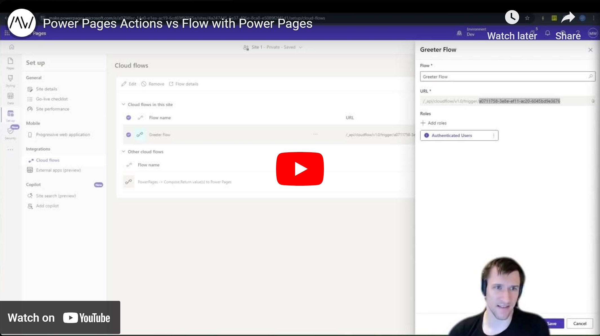

Custom APIs offer a lot of flexibility, but cannot be called directly from PowerPages. With this video and the accompanying repository/solution, this is going to change! We are going to call custom functionality with an interface that is similar to what you know from the JavaScript of Model-Driven Apps.

However by now there is also the possibility to use a Flow as a proxy to call the API. In this video we will compare some of the differences of both methods.

Repository Link: https://github.com/Kunter-Bunt/PowerPagesActions

Check it out [here](https://youtu.be/b2KfA8ZJZI8).

