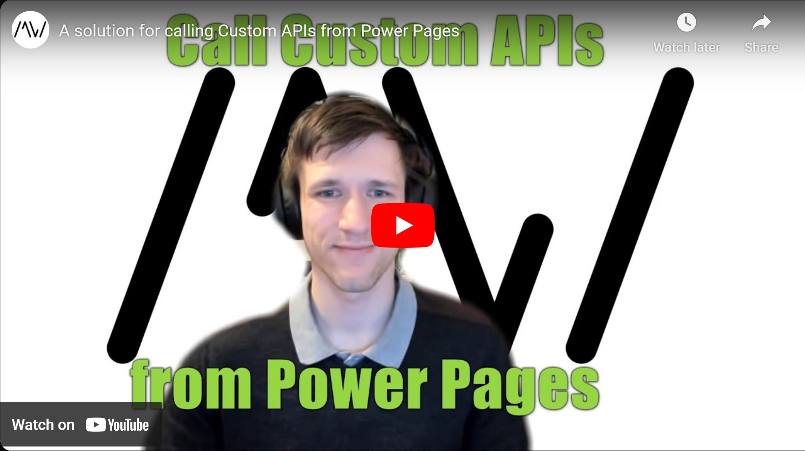

Custom APIs offer a lot of flexibility, but cannot be called directly from PowerPages. With this video and the accompanying repository/solution, this is going to change! We are going to call custom functionality with an interface that is similar to what you know from the JavaScript of Model-Driven Apps.

Repository Link: https://github.com/Kunter-Bunt/PowerPagesActions

Check it out [here](https://youtu.be/oTJVEFKjM1Y).

