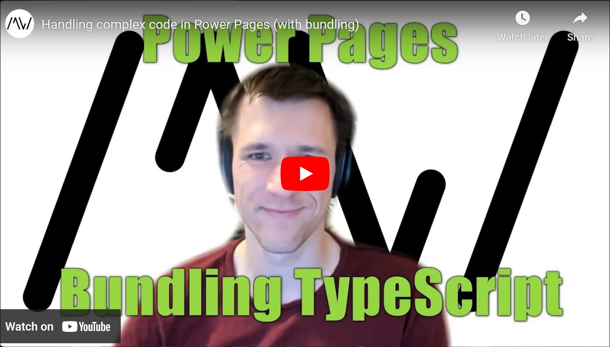

With bundling, we can write in as many files as we want and the result will still be only one JavaScript output file. This is great for more complex use cases in Power Pages, where creating webfiles is a hassle and managing dependencies can be tricky.

Find the sample repository here: https://github.com/Kunter-Bunt/PowerPagesTemplate

Deeplink to Scotts course: https://learn.develop1.net/courses/building-javascript-web-resources-using-typescript/dashboard

Check it out [here](https://youtu.be/_tQReD43LK8).

