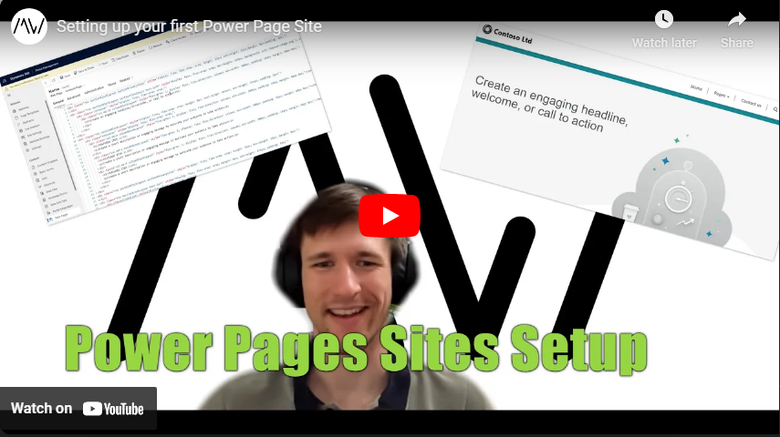

Do you want to provide external users with a website fed with data from Dataverse? Instead of building APIs or synchronization mechanisms with the website's database, you can also use Power Pages! This first video in the Power Pages series walks through a setup, even if you don't have a Dataverse Environment yet.

Check it out [here](https://youtu.be/kz3HtxDJIdA).

