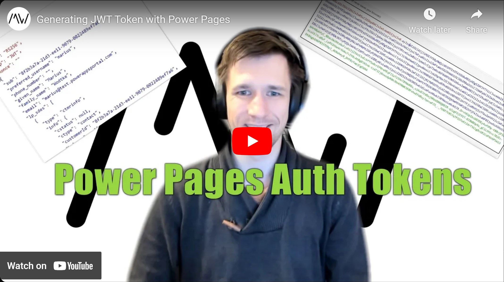

JSON Web Token allows for Authentication and Authorization with WebServices. For example, the Dataverse Web API can leverage such a tokes (with the Dataverse audience) to determine what you can read. With Power Pages, we can also create such tokens as well to secure our custom services. We only need a trusted certificate and an App Registration.

Check it out [here](https://youtu.be/ce8H_Twx0kE).

