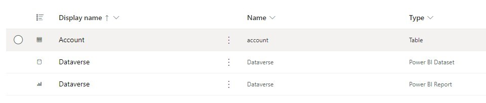
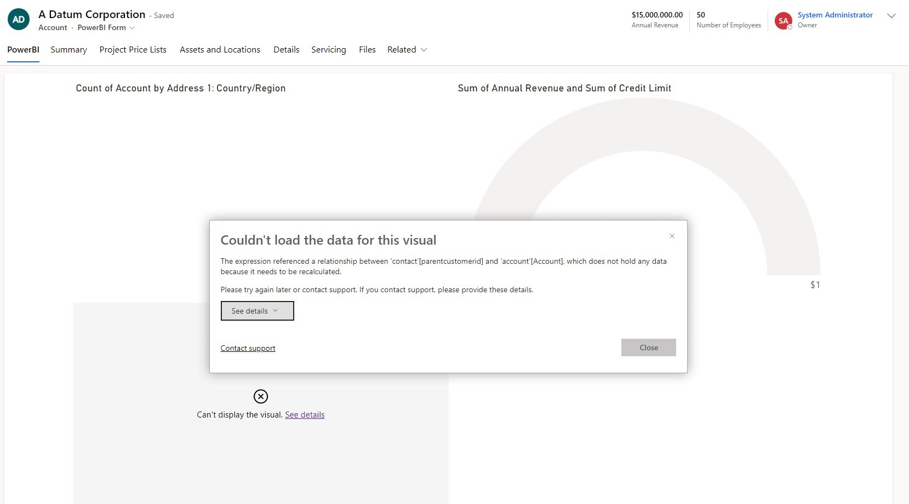
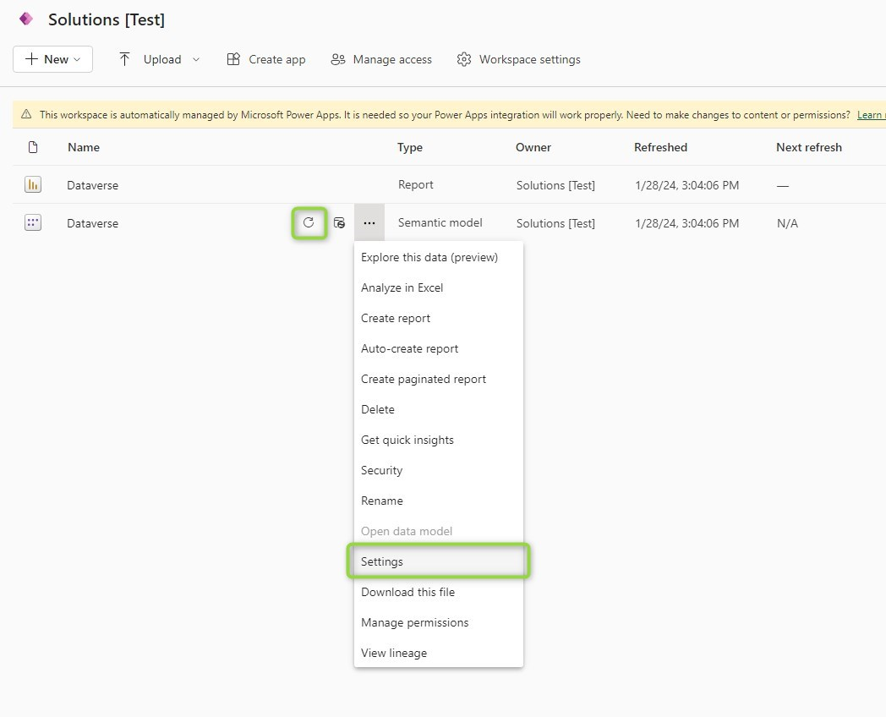
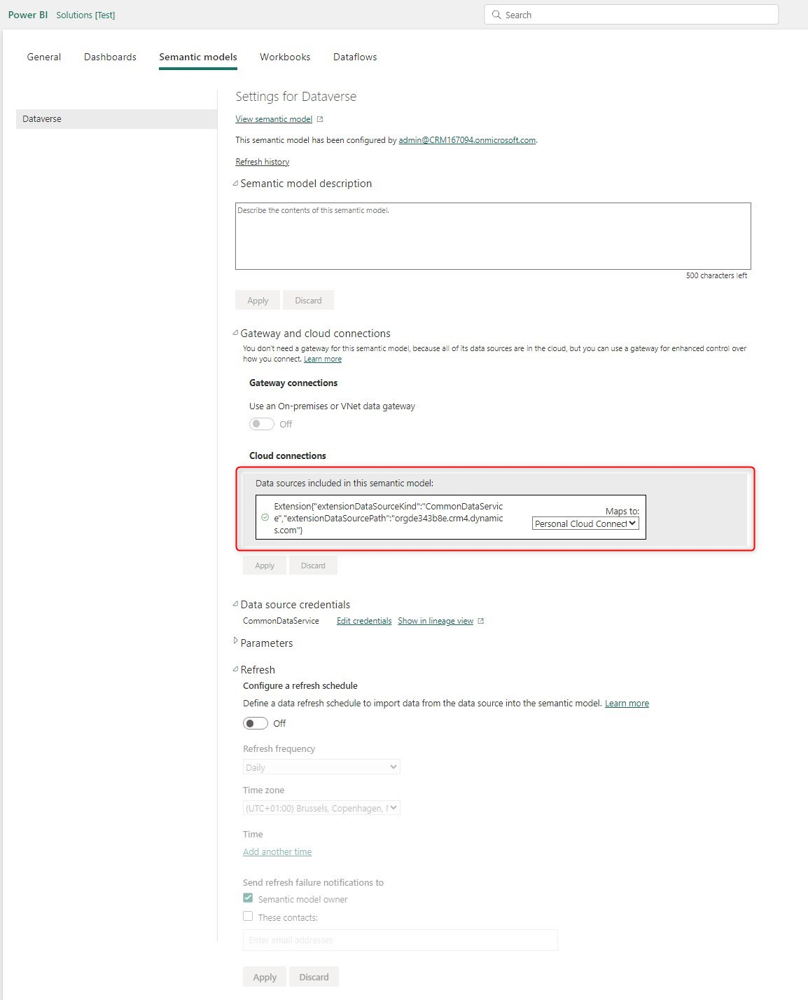
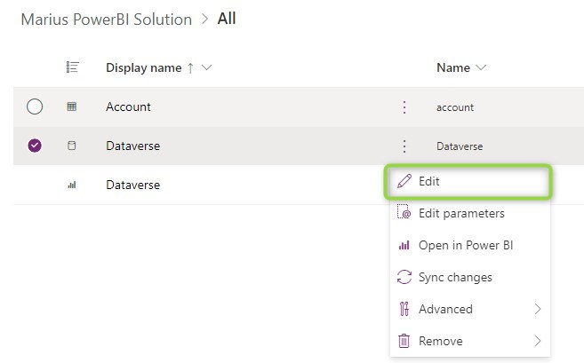
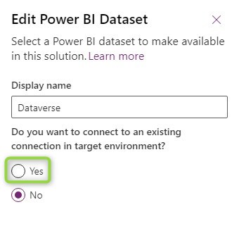
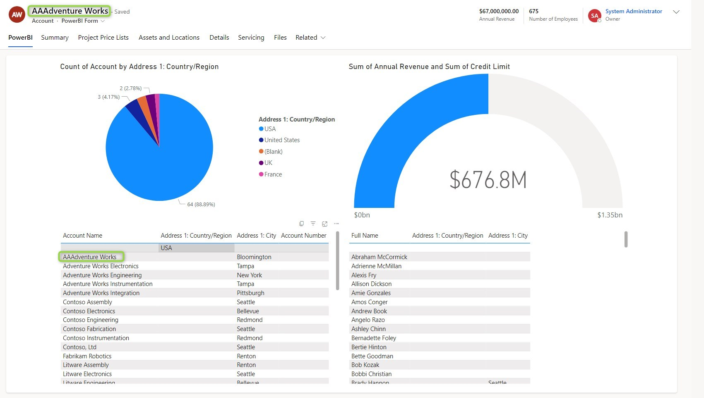

In [the post about Embedded Reports](/post/powerbi/embedded-report), we did talk about the customizations needed to show a PowerBI Report on a form in Dynamics, but not about general ALM praxis: Customize on a Development environment and then deploy a solution.
We will catch up here and explore the _Solution Awareness_ of Reports.

## Preparations
For the report to be selectable for embedding, it needs to be included in a solution anyway, so if you followed [the post about Embedded Reports](/post/powerbi/embedded-report), your solution includes a Dataset, a Report and probably an Entity with a form.



## Plain Import
If we take this solution now, export and import to the target environment, the form will show the report, but no data. This is because the Dataset does not yet include data. We can fix this in the [PowerBI Service](https://app.powerbi.com/) by selecting the managed Workspace for the Dataverse environment, which was automatically created as soon as we imported the solution with the Report/Dataset inside. Here we can manually refresh the Dataset and if needed authorize the connection in the _Settings_. 







## The Connection Problem
But as marked in the last screenshot, the connection from the original environment was kept in the Dataset and the editing capabilities in the [PowerBI Service](https://app.powerbi.com/) cannot simply change it. 

> **Note:** As of writing this article, editing semantic models in the PowerBI Service is a preview feature. Your milage may vary.

Therefore I have to edit the query in the Desktop App and then publish it again to the Workspace of the target environment. And this change will be overwritten with a new deployment! So we need a different solution. Fortunately, there is one for Dataverse: When you click edit on the Dataset in the Solution, there is an option to use the current environment as the connection. If this is set to yes, the Connection-URL will always point to the environment where the solution is deployed! On the first deployment, you will still need to set the refresh schedule and probably do a manual refresh to make the embedded report work and check that the connection is authorized, but after that, there should not be any problems.





## Non-Dataverse Connections
For Datasets that do not connect to Dataverse, this won't be as easy, because there is no "current environment" to connect to. In this situation, I would like to inspire you to look into the Pipelines of the PowerBI Service. 

First, we include the components in a solution on the source environment, then we deploy this solution once to the target environment(s). Now the requirements for embedding are fulfilled. Any updates to the report/model are now deployed via the PowerBI Pipeline which moves the components between the connected workspaces and sets the correct connection values. 

Just be aware that you will have problems importing a new version of the solution, you will encounter an error like this:
```
Import failed: Unsynced customizations detected. 
Please sync changes with Power BI and try again. 
Datasets with customizations: [<ExternalReferenceId=5a4c6949-b787-4920-b608-effd9baeafb3, HasCustomizations=True>]. 
Reports with customizations: [<ExternalReferenceId=9bf7ca28-3b28-4fff-8f5e-6bb1b3847589, HasCustomizations=True>]
```

This can be corrected by using the _Sync changes_ button on the components in the solution in the target environment. This does work on managed solutions as well. But an import of this solution after the PowerBI Pipeline is set up is not advisable anyway, it will reset the connection until the PowerBI Pipeline runs again.

## Summary
At least with a Dataverse connection, the trick of using "an existing connection in the target environment" makes deploying embedded reports easy and only requires manual setup after the first deployment of a dataset. The result contains my changed "**AAA**dventure Works" Account, only being present in the target environment.

Stay tuned for the next episode in this series where we will look into filters to make these reports more useful by applying filters based on values on a form.

