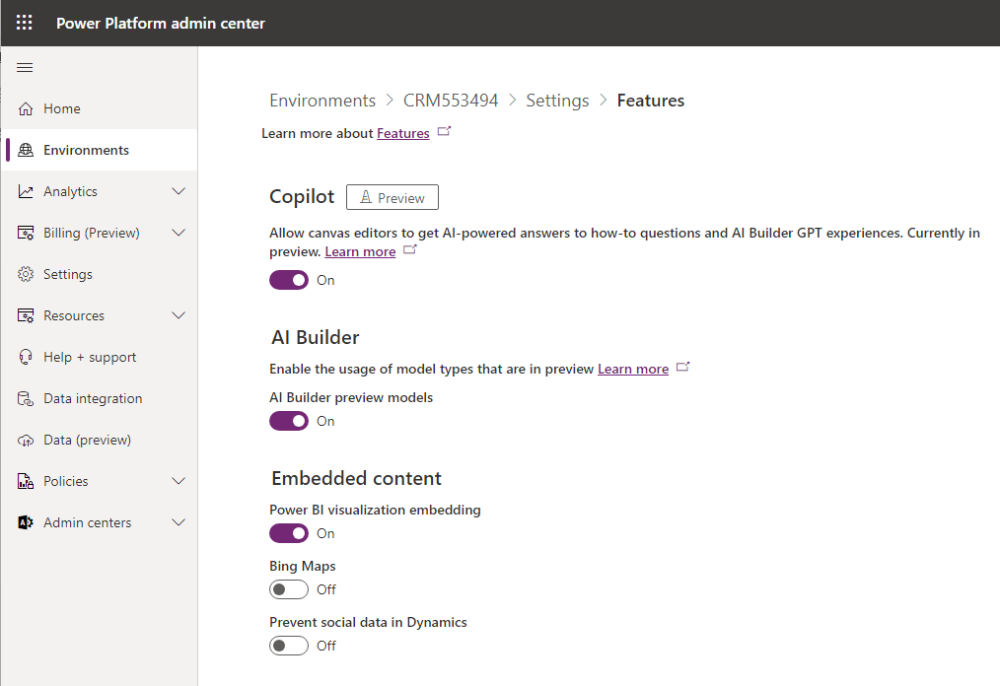
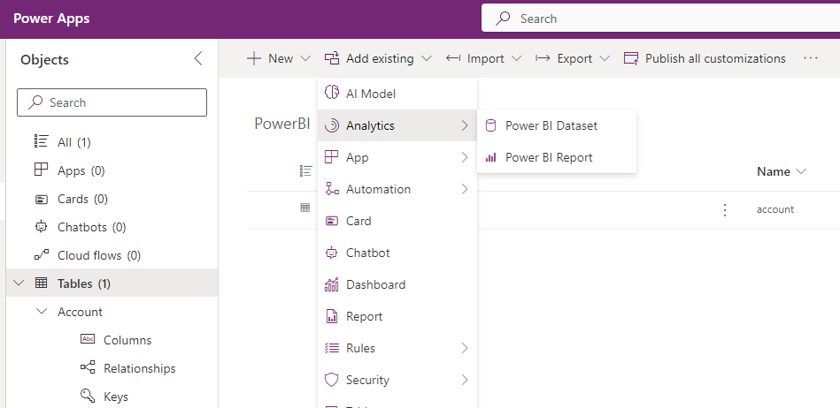
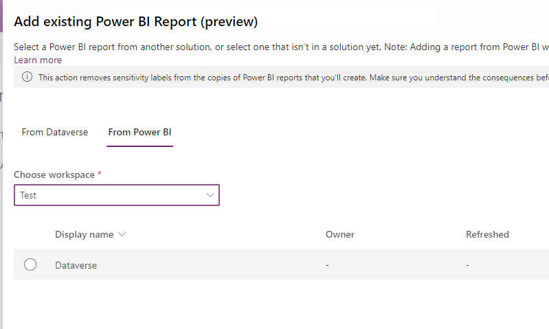
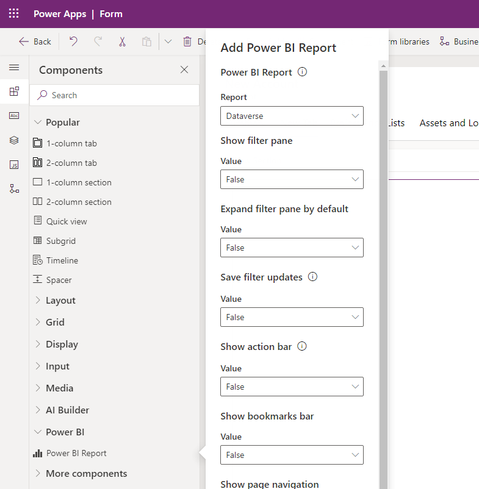
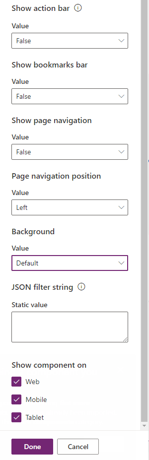
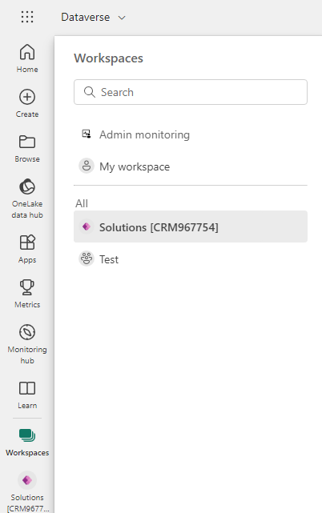
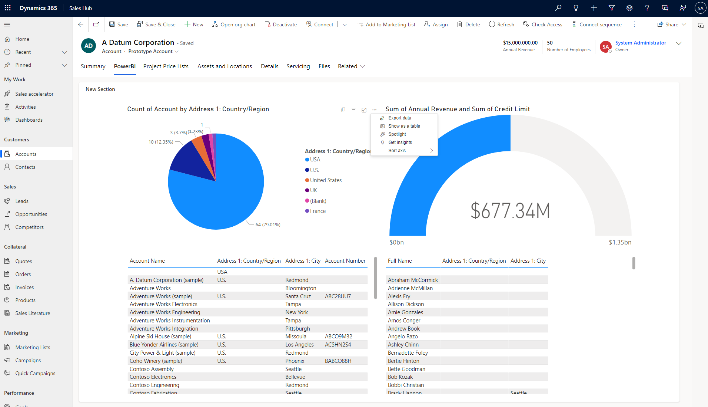

In [the last post](/post/powerbi/first-dashboard) of the PowerBI series, we added a Dashboard to Dynamics. I recently came across a shortcoming of this approach. It lacks the context menus. So for example the _Export data_ button is missing. Also. you will have to provide the filters within the visuals. So for example via the cross-filtering feature of PowerBI we were able to filter by country by clicking on it in the pie chart, but for example by city would have not been possible!

## Prerequisites
I suggest following [the post _PowerBI: Publishing a first Dashboard to Dynamics_](/post/powerbi/first-dashboard) because that already creates a Report from which the Dashboard is created. If you bring your own Report, make sure the PowerBI Embedding Feature is enabled on your environment under Settings -> Features -> Embedded Content.

 

## Add Report to Dynamics
If you already tried to add the Report to the form, but there were none available, that's because you need to add them to the solution first!

## Embedding the Report
Now the Report is available in the Form Editor. Select it from the Components -> PowerBI Section. And that's it.

 

## The Workspace
Then the experience wasn't so straight for me: The embedded report displayed weird errors about related data, but my Report in PowerBI did not! Turns out, Dataverse created its workspace and copied over the report and dataset. And that dataset needed a refreshing in my case to display correct data. So make the report work again in this new workspace and it should then also work in Dynamics. I can imagine other problems here like a broken data source connection that needs to be reauthenticated.

## The Result

Since the Dashboard from last time was pretty similar to the report, this embedding looks quite similar to the result of [the previous post](/post/powerbi/first-dashboard). But there are subtle differences. Notably for my use case, the _Export data_ button is present. But as we saw in the options in the Form Editor, we can also present the_Filter Pane_ to the user, opening more flexibility in using the report.

## Summary
I still see so much to discuss here: We need to talk about the _JSON filter string_ option. Likewise, we need to get some external data in to show how this can display data that we do not want to import to dynamics and that also does not comply with the requirements for displaying it as an [external table](/post/my-first-shot/externaltable). And finally, this post dug up the question "Is there anything I need to look out for when deploying this?"

But on the plus side: If you have a ready-made report and your user should see it in Dynamics, we now have 2 great options available. The embedded report seems to be the more powerful choice, but it may be more natural for the users to have a Dashboard if you are not working with a prefiltering. 